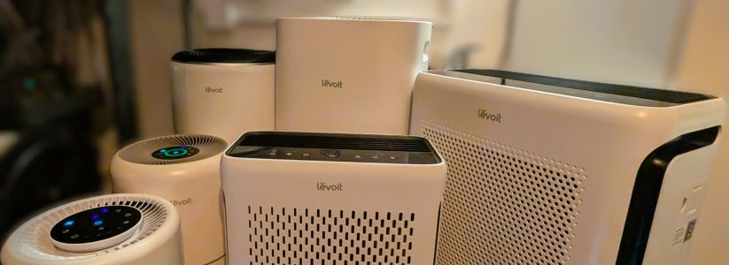
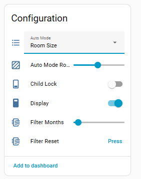

# Project - Free Levoit Air Purifiers

Collection of custom ESPHome firmware and hardware projects for Levoit air purifiers, eliminating cloud dependency and enabling native Home Assistant integration.

## [Esphome external component for Levoit Air Purifiers](./components/levoit/README.md)

The Core and Vital Series share quite a lot on the protocol level, while having some differences based on model and MCU version.
This is an external ESPHome component that supports all (WIP!) Core and Vital Air Purifiers.

Can be flashed to the original ESP32-SOLO-C1 or also installed on top (replace original), [check 'Installation'](./components/levoit/README.md)

**Requires:** ESPHome 2026.01.2+

### [Supported Models](./devices/README.md)

| Model | MCU Version | Status |
|-------|-------------|--------|
| [Levoit Core 200s](./devices/levoit-core200s) | 2.0.11 | ✅ Tested |
| [Levoit Core 300s](./devices/levoit-core300s) | 2.0.7, 2.0.11 | ✅ Tested  |
| [Levoit Core 400s](./devices/levoit-core400s) | 3.0.0 | ✅ Tested  |
| [Levoit Core 600s](./devices/levoit-core600s) | 2.0.1 | ✅ Tested |
| [Levoit Vital 100s](./devices/levoit-vital100s) | 1.0.5 | ✅ Tested |
| [Levoit Vital 200s (Pro)](./devices/levoit-vital200s) | 1.0.5 |  ✅ Tested |
| [Levoit Sprout](./devices/levoit-sprout) | 1.0.5 |  ✅ Tested (!) WIP |

### Other Models / Levoit Projects

* [Levoit LV PUR 131s](./devices/levoit-lv131s/) – Custom Firmware + MCU & sensor upgrade + hardware hack
* [Levoit Mini](./devices/levoit-mini) – Custom PCB, 3D parts, hardware hack

### Features

Core200s

Core300s - with Air Quality and Auto

#### Fan

Native Home Assistant Fan component, with preset support.
Available speed levels and presets are based on model.

| Model | Speed Levels | Preset Modes |
|---------|------------|-------------|
| C200S | 1–3 | Manual, Sleep |
| C300S | 1–3 | Auto, Manual, Sleep |
| C400S | 1–4 | Auto, Manual, Sleep |
| C600S | 1–4 | Auto, Manual, Sleep |
| V100S | 1–4 | Auto, Manual, Sleep, Pet |
| V200S | 1–4 | Auto, Manual, Sleep, Pet |
| Sprout | 1–4 | Auto, Manual |

#### Display / Light

| Feature | Type | Config Key | Description |
|---------|----|------------|-------------|
| Display | switch | `display` | Toggle the LED display on/off |
| Child Lock | switch | `child_lock` | Disable physical buttons on the device |
| Light Detect | switch | `light_detect` | Auto-dim display when ambient light is low **Vital Series + Core 600S** |
| Night Light | select | `nightlight` | Night light brightness: Off / Mid / Full **Only Core200S** |

#### Timer

| Feature | Type | Config Key | Description |
|---------|----|------------|-------------|
| Timer | number | `timer` | Run timer in minutes |
| Timer Set | text_sensor | `timer_duration_initial` | Originally set timer as readable string (e.g. "2h 30 min") |
| Timer Remaining | text_sensor | `timer_duration_remaining` | Time left on active timer (e.g. "1h 15 min") |

#### Filter Lifetime

| Feature | Type | Config Key | Description |
|---------|----|------------|-------------|
| Filter Lifetime | number | `filter_lifetime_months` | Expected filter lifespan in months (1–12); used to compute Filter Life % |
| Filter Life Left | sensor | `filter_life_left` | Remaining filter life as % ⁽¹⁾ |
| Filter Low | binary_sensor | `filter_low` | `on` when Filter Life % drops below 5% ⁽¹⁾ |
| Current CADR | sensor | `current_cadr` | Calculated Clean Air Delivery Rate at current fan speed in m³/h ⁽¹⁾ |
| Reset Filter Stats | button | `reset_filter_stats` | Reset cumulative CADR and runtime counters — restores Filter Life % to 100% ⁽¹⁾ |

> ⁽¹⁾ Computed by the component (not received from MCU), works on all models.

#### Auto Mode

| Feature | Type | Config Key | Description |
|---------|----|------------|-------------|
| Auto Mode | select | `auto_mode` | Auto mode type — options vary by model (see below) **Not for Core200S** |
| Auto Mode Room Size | number | `efficiency_room_size` | Target room area for efficient auto mode in m² **Not for Core200S** |
| Efficiency Counter | sensor | `efficiency_counter` | Seconds remaining at high fan speed in efficient auto mode **Vital only** |
| Auto Mode High Fan Time | text_sensor | `auto_mode_room_size_high_fan` | Time still running at high speed in efficient auto mode, human readable **Vital only** |

Auto mode options per model:

| Model | Options | Room Size Range |
|-------|---------|----------------|
| C200S | — | up to 40 m² (430 ft²) |
| C300S | Default / Quiet / Room Size | 9–50 m² (97–538 ft²) |
| C400S | Default / Quiet / Room Size | 9–83 m² (97–894 ft²) |
| C600S | Default / Quiet / Room Size / ECO | 9–147 m² (97–1,582 ft²) |
| V100S | Default / Quiet / Efficient | 9–52 m² (97–560 ft²) |
| V200S | Default / Quiet / Efficient | 9–87 m² (97–936 ft²) |
| Sprout| Default / Quiet / Efficient | 9–57 m² (97–936 ft²) |

#### Air Quality Sensors

| Feature | Type | Config Key | Description |
|---------|----|------------|-------------|
| PM2.5 | sensor | `pm25` | Particulate matter concentration in µg/m³ from built-in sensor **Not for Core200S** |
| AQI | sensor | `aqi` | Air Quality Index as reported by the MCU **Not for Core200S** |

#### Info and Debug

| Feature | Type | Config Key | Description |
|---------|----|------------|-------------|
| MCU Version | text_sensor | `mcu_version` | Firmware version string of the purifier MCU chip |
| ESP Version | text_sensor | `esp_version` | ESPHome component version string |
| Error | text_sensor | `error_message` | Device error status: "Ok" or "Sensor Error" **Not for Core200S** |

### Change Log

#### ESP Version: 1.4.0 - 2026.04

* Added Levoit Sprout support

#### ESP Version: 1.3.0 - 2026.03.28

* Added Core 600S support: 4 fan speeds, 4 auto modes (Default / Quiet / Room Size / ECO), Light Detect switch, CADR 641 m³/h
* Added Vital 200S (Pro) support: same protocol as Vital 100S, tested with original ESP
* Updated Auto Mode select to show model-specific options (3 for Core/Vital, 4 for Core 600S)

#### ESP Version: 1.2.0-esphome - 2026.03.22

* Added Core200s support and readme / example.
* Renamed/moved repo to tuct/levoit - for easier collaboration with pull requests, ...

#### 2026.03.21

* Works with ESPHome 2026.3+
* Sensors - added state class measurement -> allow statistics to be tracked

#### 2026.01.15 ESPHome 2025.12.5+ Compatibility

* The component has been updated for ESPHome 2025.12.5

## Contributing

### Adding a New Device or Firmware Version

If you have a Levoit model that isn't supported yet, or a newer MCU firmware on a supported model, a UART dump is the best way to contribute.

What's needed:
- A logic analyzer capture of the UART traffic between the ESP32 and the MCU (both directions)
- The MCU firmware version (visible in the Levoit app or via `mcu_version` sensor once flashed)
- A description of any features the device has (fan speeds, auto modes, sensors, lights, etc.)

Open an issue or pull request in the repo with the dump attached.

### Capturing a UART Dump

The ESP32 and MCU communicate over UART at **9600 baud, 8N1**. See [Levoit UART Protocol Details](./LEVOIT_UART.md) for a full description of the packet format. To capture traffic:

> Check the individual device README for teardown steps, PCB photos, and the exact solder points to use for your model.

1. Open the device and locate the correct solder points — see the individual device README for the exact pads
   > **Note:** The debug pin header RX/TX pins are used to flash the ESP32. They are **not** the UART line between the ESP32 and the MCU. You need to tap into the dedicated ESP↔MCU communication pads (test points or vias near the ESP32), not the header.
2. Connect a logic analyzer to both the **ESP TX** and **MCU TX** lines, with a shared GND
3. In **Saleae Logic 2**, add an **Async Serial** analyzer on each channel:
   - Baud rate: `9600`
   - Bits per frame: `8`
   - Stop bits: `1`
   - No parity
4. Power on the device and capture separate, clearly labelled dumps for each action — one action per capture makes it much easier to identify which bytes correspond to which command:

   | Dump | Action |
   |------|--------|
   | `bootup` | Power on → wait until Wi-Fi connected and app shows online |
   | `speed_1-4_app` | Switch through fan speeds 1 → 2 → 3 → 4 via the **app** |
   | `speed_1-4_device` | Switch through fan speeds 1 → 2 → 3 → 4 via the **physical buttons** |
   | `mode_app` | Switch through all modes (Manual / Auto / Sleep / Pet) via the **app** |
   | `mode_device` | Switch through all modes via the **physical buttons** |
   | `auto_mode` | Switch through all auto mode sub-options (Default / Quiet / Room Size / etc.) |
   | `display_on_off` | Toggle the display on and off |
   | `child_lock` | Enable and disable child lock |
   | `timer` | Set a timer via the app |
   | `filter_reset` | Reset filter stats |
   | *(model-specific)* | Any unique features: lights, white noise, CO₂ sensor, etc. |

   Label each file clearly (e.g. `core300s_2.0.11_speed_app.txt`).

   > **Example:** See [`devices/levoit-sprout/uart/uart_dumps`](./devices/levoit-sprout/uart/uart_dumps) for a real Sprout dump covering boot, speed switching, light modes, and white noise — each section labelled with the action performed.

5. In Logic 2, use **Export Data** → export the analyzer results as a text/CSV file (not the `.sal` session). A plain text file with the decoded HLA output is all that's needed.

### Decoding with the Logic 2 HLA

A High-Level Analyzer for the Levoit UART protocol is included in [`logic2/levoit_uart/`](./logic2/levoit_uart/).

**Install:**
1. Open Logic 2 → **Extensions** (puzzle icon) → **Load Existing Extension**
2. Select the `logic2/levoit_uart/` folder

**Use:**
1. Add an **Async Serial** analyzer on the **ESP TX** channel (9600 baud, 8N1) — this is ESP→MCU traffic
2. Add a second **Async Serial** analyzer on the **MCU TX** channel — this is MCU→ESP traffic
3. Add a **Levoit UART Extractor** HLA on top of the first Async Serial, set **Channel** to `ESP->MCU`
4. Add a second **Levoit UART Extractor** HLA on top of the second Async Serial, set **Channel** to `MCU->ESP`
5. Decoded packets appear as: `[MCU->ESP] RESP(0x52) |  CMD=01 40 41  |  PAY=00 01 ...`

Both HLAs run side by side so you can see the full request/response exchange in one view.

See [`logic2/levoit_uart/README.md`](./logic2/levoit_uart/README.md) for full details.

## Info
Not my projects, but worth checking out:
* [levoit-vital-200s + levoit-vital-200s pro, levoit-vital-100s?](https://github.com/targor/levoit_vital/?tab=readme-ov-file)
* https://github.com/mulcmu/esphome-levoit-core300s
* https://github.com/acvigue/esphome-levoit-air-purifier

## Helpful links
* [How to open Levoit's](https://www.youtube.com/watch?v=6wxHpUVcGFc)
* [How to open Levoit's smaller](https://www.youtube.com/watch?v=rAjLNR1jQkw)

## Details about generic protocol / etc
[Levoit UART Protocol Details](./LEVOIT_UART.md)
