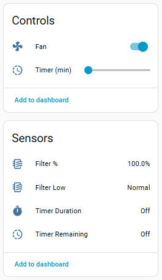
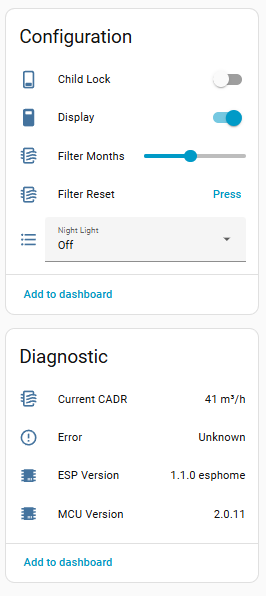
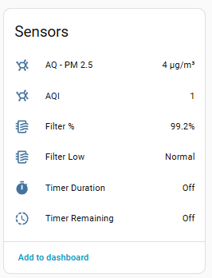

# Project - Free Levoit Air Purifiers

Collection of custom ESPHome firmware and hardware projects for Levoit air purifiers, eliminating cloud dependency and enabling native Home Assistant integration.

## [Esphome external component for Levoit Air Purifiers](./components/levoit/README.md)

The Core and Vital Series share quite a lot on the protocol level, while having some differences based on model and MCU version.
This is an external ESPHome component that supports all (WIP!) Core and Vital Air Purifiers.

Can be flashed to the original ESP32-SOLO-C1 or also installed on top (replace original), [check 'Installation'](./components/levoit/README.md)

**Requires:** ESPHome 2026.01.2+

### [Supported Models](./devices/README.md)

| Model | MCU Version | Status |
|-------|-------------|--------|
| [Levoit Core 200s](./devices/levoit-core200s) | 2.0.11 | ✅ Tested |
| [Levoit Core 300s](./devices/levoit-core300s) | 2.0.7, 2.0.11 | ✅ Tested (with new ESP) |
| [Levoit Core 400s](./devices/levoit-core400s) | 3.0.0 | ✅ Tested (with original ESP) |
| Levoit Core 600s | ?.?.? | ⚠️ WIP, not supported |
| [Levoit Vital 100s](./devices/levoit-vital100s) | 1.0.5 | ✅ Tested |
| Levoit Vital 200S | ?.?.? | ⚠️ WIP, not supported |
| Levoit Vital 200S PRO | 2.0.0 | ✅ Tested (with original ESP, thanks @dnsefe) |

### Features

Core200s  

Core300s - with Air Quality and Auto 

 
#### Fan

Native Home Assistant Fan component, with preset support.
Availiable speed levels and presets are based on model

| Model | Speed Levels | Preset Modes | 
|---------|------------|-------------|
| C200S | 1–3 | Manual, Sleep |
| C300S | 1–3 | Auto, Manual, Sleep |
| C400S | 1–4 | Auto, Manual, Sleep |
| V100S | 1–4 | Auto, Manual, Sleep, Pet |

#### Display / Light

| Feature |Type| Config Key | Description | 
|---------|----|------------|-------------|
| Display | switch | `display` | Toggle the LED display on/off |
| Child Lock | switch |`child_lock` | Disable physical buttons on the device | 
| Light Detect | switch | `light_detect` | Auto-dim display when ambient light is low **Only for Vital Series**| 
| Night Light | select|`nightlight` | Night light brightness: Off / Mid / Full **Only Core200s**| 

#### Timer

| Feature |Type| Config Key | Description | 
|---------|----|------------|-------------|
| Timer | number |`timer` | Run timer in minutes | 
| Timer Set | text_sensor | `timer_duration_initial` | Originally set timer as readable string (e.g. "2h 30 min") | 
| Timer Remaining | text_sensor | `timer_duration_remaining` | Time left on active timer (e.g. "1h 15 min") | 

#### Filter Lifetime

| Feature |Type| Config Key | Description | 
|---------|----|------------|-------------|
| Filter Lifetime | number | `filter_lifetime_months` | Expected filter lifespan in months (1–12); used to compute Filter Life % | 
| Filter Life Left | sensor | `filter_life_left` | Remaining filter life as % ⁽¹⁾ |
| Filter Low | binary_sensor|`filter_low` | `on` when Filter Life % drops below 5% ⁽¹⁾ | 
| Current CADR | sensor | `current_cadr` | Calculated Clean Air Delivery Rate at current fan speed in m³/h ⁽¹⁾ | 
| Reset Filter Stats | button|`reset_filter_stats` | Reset cumulative CADR and runtime counters — restores Filter Life % to 100% ⁽¹⁾ | 

> ⁽¹⁾ Computed by the component (not received from MCU), works on all models.

#### Auto Mode

| Feature |Type| Config Key | Description | 
|---------|----|------------|-------------|
| Auto Mode | select |`auto_mode` | Auto mode type: Default / Quiet / Efficient **Not for Core200S** |
| Auto Mode Room Size | number | `efficiency_room_size` | Target room area for efficient auto mode in m² (132–792) **Not for Core200S**|
| Efficiency Counter | sensor | `efficiency_counter` | Seconds remaining at high fan speed in efficient auto mode **Vital only**|
| Auto Mode High Fan Time | text_sensor| `auto_mode_room_size_high_fan` | Time still running at high speed in efficient auto mode, human readable format **Only Vital**| 

#### Air Quality Sensors

| Feature |Type| Config Key | Description | 
|---------|----|------------|-------------|
| PM2.5 | sensor |`pm25` | Particulate matter concentration in µg/m³ from built-in sensor **Not for Core200S**| 
| AQI | sensor |`aqi` | Air Quality Index as reported by the MCU **Not for Core200S** | 

#### Info and Debug

| Feature |Type| Config Key | Description | 
|---------|----|------------|-------------|
| MCU Version | `mcu_version` | Firmware version string of the purifier MCU chip | 
| ESP Version |text_sensor| `esp_version` | ESPHome component version string | 
| Error |text_sensor| `error_message` | Device error status: "Ok" or "Sensor Error" | 

### Change Log

#### ESP Version: 1.2.0-esphome - 2026.03.22

* Added Core200s support and readme / example.
* Renamed/moved repo to tuct/levoit - for easier collaboration with pull requests, ...

#### 2026.03.21

* Works with ESPHome 2026.3+
* Sensors - added state class measurement -> allow statistics to be tracked

#### 2026.01.15 ESPHome 2025.12.5+ Compatibility

This component has been updated for ESPHome 2025.12.5

## Other Models / Levoit Projects
* [Levoit LV PUR 131s](./devices/levoit-lv131s/) – Custom Firmware + MCU & sensor upgrade + hardware hack
* [Levoit Mini](./devices/levoit-mini) – Custom PCB, 3D parts, hardware hack

## Info
Not my projects, but worth checking out:
* [levoit-vital-200s + levoit-vital-200s pro, levoit-vital-100s?](https://github.com/targor/levoit_vital/?tab=readme-ov-file)
* https://github.com/mulcmu/esphome-levoit-core300s
* https://github.com/acvigue/esphome-levoit-air-purifier

## Helpful links
* [How to open Levoit's](https://www.youtube.com/watch?v=6wxHpUVcGFc) 
* [How to open Levoit's smaller](https://www.youtube.com/watch?v=rAjLNR1jQkw)

## Details about generic protocol / etc
[Detailed Info](./components/levoit/DETAILS.md)