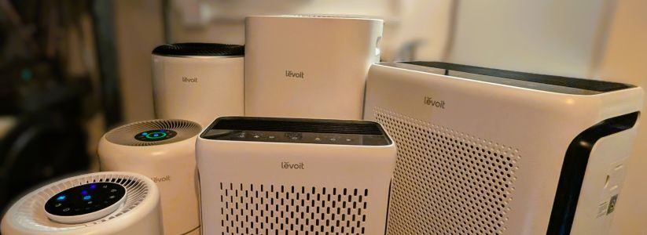
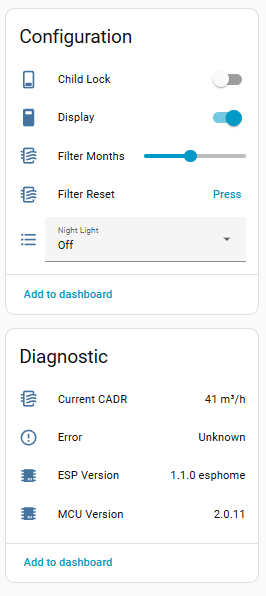
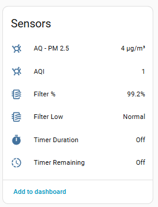
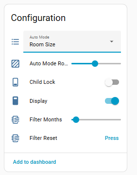

# Project - ESPHome hacked Air Purifiers for Home Assistant

- Collection of air purifiers that can be more or less easily hacked to run ESPHome instead of cloud-based firmware.
- Eliminating cloud dependency and enabling native Home Assistant integration for air purifiers.

I like Wi-Fi enabled air purifiers! But I hate the fact that they all depend on a cloud service.

I've run Home Assistant and custom-built ESPHome devices at home for quite some time, and found a project that let me flash custom, ESPHome-based firmware onto a Levoit Core 300S (which I already owned).
Wi-Fi enabled air purifiers often use an ESP32 for the Wi-Fi side plus a separate MCU to manage the purifier itself (speeds, air-quality sensor, auto mode, …), with a UART link between the two.

This started as a handful of custom ESPHome firmware and hardware projects for Levoit air purifiers, and is slowly growing into the broader collection you see here.

## Overview of existing / tested esphome-ified Air Purifiers

Every purifier that runs ESPHome at a glance — how it's converted, its specs, and how involved the teardown is. Click a model or its **Guide** for the full write-up.

Devices that *can't* run ESPHome but are still controllable locally on stock firmware are listed separately in [Cloud-free without ESPHome](#cloud-free-without-esphome--philips--versuni-over-local-coap) below.

| Model | Manufacturer | Support | Methods | CADR (spec) | Noise | Disassembly | Guide | Links | Comments |
|-------|--------------|---------|---------|-------------|-------|-------------|-------|-------|----------|
| [Core 200S](./devices/levoit-core200s) | Levoit | 🏠 [`levoit`](./components/levoit/README.md) | 🟢 Flash / 🔵 Add ESP | 167 m³/h | 24–48 dB | Easy | [Guide](./devices/levoit-core200s) | [Amazon](https://amzn.to/3SGH513) | ✅ Tested · 3 speeds, no air-quality sensor |
| [Core 300S](./devices/levoit-core300s) | Levoit | 🏠 [`levoit`](./components/levoit/README.md) | 🟢 Flash / 🔵 Add ESP | 214 m³/h | 24–50 dB | Easy | [Guide](./devices/levoit-core300s) | [Amazon](https://amzn.to/4aMVbnO) | ✅ Tested · PM2.5 + Auto mode |
| [Core 400S](./devices/levoit-core400s) | Levoit | 🏠 [`levoit`](./components/levoit/README.md) | 🟢 Flash / 🔵 Add ESP | 442 m³/h | 24–52 dB | Hard | [Guide](./devices/levoit-core400s) | [Amazon](https://amzn.to/4vOT9vt) | ✅ Tested · 4 speeds |
| [Core 600S](./devices/levoit-core600s) | Levoit | 🏠 [`levoit`](./components/levoit/README.md) | 🟢 Flash / 🔵 Add ESP | 641 m³/h | 26–54 dB | Hard | [Guide](./devices/levoit-core600s) | [Amazon](https://amzn.to/4opVx9z) | ✅ Tested · 4 auto modes |
| [Vital 100S](./devices/levoit-vital100s) | Levoit | 🏠 [`levoit`](./components/levoit/README.md) | 🟢 Flash / 🔵 Add ESP | 221 m³/h | 23–52 dB | Easy | [Guide](./devices/levoit-vital100s/README.md#teardown--disassembly) | [Amazon](https://amzn.to/3SaFron) | ✅ Tested · Pet mode; detailed teardown |
| [Vital 200S (Pro)](./devices/levoit-vital200s) | Levoit | 🏠 [`levoit`](./components/levoit/README.md) | 🟢 Flash / 🔵 Add ESP | 415 m³/h | 23–58 dB | Easy | [Guide](./devices/levoit-vital200s) | [Amazon](https://amzn.to/4xMiJn1) | ✅ Tested |
| [Everest Air](./devices/levoit-everest-air) | Levoit | 🏠 [`levoit`](./components/levoit/README.md) | 🟢 Flash / 🔵 Add ESP | 612 m³/h | 24–56 dB | Easy | [Guide](./devices/levoit-everest-air) | [Amazon](https://amzn.to/3Q1cMB) | ✅ Tested · vent louver, PM1.0/2.5/10, Turbo |
| [Sprout](./devices/levoit-sprout) | Levoit | 🏠 [`levoit`](./components/levoit/README.md) + [`levoit_audio`](./components/levoit_audio/README.md) | 🟢 Flash / 🔵 Add ESP | 145 m³/h | 22–47 dB | Easy | [Guide](./devices/levoit-sprout) | [Amazon](https://amzn.to/4oAJs1n) | 🚧 WIP · white-noise audio (I2S MP3) |
| [LV-PUR 131S](./devices/levoit-lv131s/) | Levoit | 🏠 Guide + YAML | 🔴 Custom HW | — | — | Medium | [Guide](./devices/levoit-lv131s/) | — | ESP12F → ESP32-C3, PM1003 → PM5003 |
| [LV-PUR 131](./devices/levoit-lv131/) | Levoit | 🏠 Guide + YAML | 🔴 Custom HW | — | — | Medium | [Guide](./devices/levoit-lv131/) | — | As above + temperature sensor |
| [Levoit Mini](./devices/levoit-mini) | Levoit | 🏠 Guide + YAML | 🔴 Custom HW | 78 m³/h | 41.8 – 53.6 dBA | Easy | [Guide](./devices/levoit-mini) | [Amazon](https://amzn.to/4acovEh) | Custom PCB + 3D parts; original PCB bypassed, reversible |
| [Core 300](https://www.reddit.com/r/homeassistant/comments/1rqz9gq/turned_a_broken_dumb_air_purifier_into_a_smart/) | Levoit | 🔗 External | 🔴 Custom HW | 214 m³/h | 24–50 dB | Easy | [Reddit ↗](https://www.reddit.com/r/homeassistant/comments/1rqz9gq/turned_a_broken_dumb_air_purifier_into_a_smart/) | — | **Non-smart Core 300** with broken PCB; ESP32 wired straight to the fan-speed lines → 3 interlocked GPIO switches (no MCU/UART, no sensors) |
| [AC0650](./devices/philips-600-series) | Philips / MUJI | 🏠 [`philips`](./components/philips/README.md) | 🔵 Add ESP | 170 m³/h | 19–49 dB | Easy | [Guide](./devices/philips-600-series) | [Amazon](https://amzn.to/4vS5Ohs) | ✅ Tested · secure boot → replace module; no AQ sensor |
| [AC0651](./devices/philips-600-series) | Philips / MUJI | 🏠 [`philips`](./components/philips/README.md) | 🔵 Add ESP | 170 m³/h | 19–49 dB | Easy | [Guide](./devices/philips-600-series) | [Amazon](https://amzn.to/4elkSyg) | ✅ Tested · adds PM2.5 (PM1003), allergen index, Auto mode |
| [AC0951](./devices/philips-900-series) | Philips | 🏠 [`philips`](./components/philips/README.md) | 🔵 Add ESP | — | — | Easy | [Guide](./devices/philips-900-series) | — | ✅ Tested · MXCHIP module parked, ESP32-C3 added; PM2.5, allergen index, child lock, beep, display brightness, sleep timer |
| [AC0950](./devices/philips-900-series) | Philips | 🏠 [`philips`](./components/philips/README.md) | 🔵 Add ESP | — | — | Easy | [Guide](./devices/philips-900-series) | — | ⚠️ Untested · same protocol assumed as the AC0951, minus the PM sensor |
| [Förnuftig](https://edvoncken.net/2024/04/ikea-fornuftig-with-esphome/) | IKEA | 🔗 External | 🔴 Custom HW | 120 m³/h | 28–60 dB | Easy | [Blog ↗](https://edvoncken.net/2024/04/ikea-fornuftig-with-esphome/) · [C6 ↗](https://github.com/horvathgergo/esp32c6-for-fornuftig) | — | Dumb 3-speed fan, ESP added for control |
| [Uppåtvind](https://github.com/jonathonlui/esphome-ikea-uppatvind) | IKEA | 🔗 External | 🔴 Custom HW | 95 m³/h | 42.5–53.8 dB | Easy | [GitHub ↗](https://github.com/jonathonlui/esphome-ikea-uppatvind) | — | Small desk purifier, ESP added for control |
| [Mi Air Purifier 3 / 3H / 3C · Pro H · Smart 4 / 4 Lite / 4 Pro / Elite](https://github.com/dhewg/esphome-miot) | Xiaomi | 🔗 External | 🟢 Flash | — | — | — | [GitHub ↗](https://github.com/dhewg/esphome-miot) | — | MIoT UART component; flashes the built-in ESP gateway. Also covers other Xiaomi MIoT devices |

**Support** — where the firmware/guide lives:
- 🏠 **This repo** — maintained here: an in-repo ESPHome component (`levoit`, `philips`) or a full build guide with YAML.
- 🔗 **External** — someone else's project; the Guide column links straight to it. Listed for completeness, not maintained here.

**Methods** — how the custom firmware ends up on the device:
- 🟢 **Flash** — flash ESPHome straight onto the device's own ESP32 (works where it isn't locked — most Levoits). Easiest; back up the stock firmware first.
- 🔵 **Add ESP** — wire in a separate ESP32 and disable the original (`EN`→GND). Needed when secure boot blocks reflashing, and fully reversible.
- 🔴 **Custom HW** — replace the controller board / build custom hardware.

**CADR** and **Noise** are manufacturer specs. **Disassembly** is a rough effort estimate (Easy / Medium / Hard) — check the linked **Guide** before you start.

> ### ➕ Add your own!
> Got another air purifier running ESPHome? Add it to the list — open a **[Pull Request](https://github.com/tuct/esphome-projects/pulls)** or share it in **[Discussions](https://github.com/tuct/esphome-projects/discussions)**.
> Two requirements: it has to be an **air purifier**, and it has to run (or be made to run) **ESPHome**. In-repo components or external projects (like the IKEA ones above) are both welcome.

## Cloud-free *without* ESPHome — Philips / Versuni over local CoAP

Not every Wi-Fi purifier has an ESP32 behind the antenna. **Philips / Versuni** models use an **MXCHIP** Wi-Fi module — ARM Cortex-M silicon (STM32 / Cypress class) running MiCO OS, not Espressif — which typically shows up on the network as hostname `mxchip…` with MAC prefixes such as `B0:F8:93` (Shanghai MXCHIP Information Technology). ESPHome and Tasmota cannot be flashed onto it by any standard means.

The consolation prize: the stock firmware speaks **encrypted CoAP on UDP port 5683 on your LAN** (software signature `AWS_Philips_AIR@…`), so these devices can be driven entirely locally — no cloud, no app — **without opening the case**. That is not "free" in the sense the rest of this repo is: vendor firmware stays on the device, and Philips can change or lock it down with an OTA update. Hence its own section right below the table above, rather than a row in it.

**Integration:** **[ruaan-deysel/ha-philips-airpurifier](https://github.com/ruaan-deysel/ha-philips-airpurifier)** — HACS custom component, auto-discovery via MAC/hostname plus manual IP. A maintained continuation of [kongo09/philips-airpurifier-coap](https://github.com/kongo09/philips-airpurifier-coap), built on [@rgerganov's reverse engineering](https://xakcop.com/post/ctrl-air-purifier/). Requires Home Assistant 2026.4.0+.

> ⚠️ **Caveats, straight from that project:**
> - The connection can work initially and go unresponsive over time — power-cycle the purifier and/or restart HA. Auto-reconnect exists but doesn't always succeed. This is a device-firmware limitation, not an integration bug.
> - **Some newer firmware versions disable local CoAP entirely.** If you're buying a device specifically for this, make sure you can return it.
> - Philips' newer cloud API (Google Home / Alexa) is not available for local integrations.

### Supported models

Extracted from the integration's `FanModel` enum and `device_models.py` — **63 firmware entries / 57 distinct model codes**. The five AC0850 combo variants appear twice because they ship two different firmware personalities (`AWS_Philips_AIR` vs `AWS_Philips_AIR_Combo`).

**Air purifiers** — 47 model codes across 22 series:

| Series | Variants | Class |
|--------|----------|-------|
| AC0650 | AC0650/10 | Compact |
| AC0850 | /11, /20, /31, /41, /70, /81, /85 | Compact |
| AC0950 | AC0950, AC0951 | Compact |
| AC1214 | AC1214 | Compact |
| AC1715 | AC1715 | Compact |
| AC2210 | AC2210, AC2221 | Mid-range |
| AC2729 | AC2729 | Mid-range |
| AC2889 | AC2889 | Mid-range |
| AC2936 | AC2936, AC2939, AC2958, AC2959 | Mid-range |
| AC3033 | AC3033, AC3036, AC3039 | Advanced |
| AC3055 | AC3055, AC3059 | Advanced |
| AC3210 | AC3210, AC3220, AC3221 | Advanced |
| AC3259 | AC3259 | Advanced |
| AC3420 | AC3420, AC3421 | Advanced |
| AC3737 | AC3737 | Advanced |
| AC3829 | AC3829, AC3836 | Advanced |
| AC3854 | AC3854/50, AC3854/51 | Advanced |
| AC3858 | AC3858/50, AC3858/51, AC3858/83, AC3858/86 | Advanced |
| AC4220 | AC4220, AC4221, AC4236 | Premium |
| AC4550 | AC4550, AC4558 | Premium |
| AC5659 | AC5659, AC5660 | Premium |

**2-in-1 purifier + humidifier combos:**

| Series | Variants | Notes |
|--------|----------|-------|
| AC0850 Combo | /11C, /20C, /31C, /41C, /70C | Same hardware as above, `AWS_Philips_AIR_Combo` firmware |
| AMF765 | AMF765 | Oscillation via angle number entity + `fan.oscillate` |
| AMF870 | AMF870 | As above |

**Humidifiers & fans:**

| Model | Type |
|-------|------|
| CX3120, CX3550 | Compact humidifier |
| CX5120 | Advanced humidifier |
| HU1509, HU1510 | Compact humidifier |
| HU4209/00 | Humidifier (in code, not yet in the upstream README table) |
| HU5710 | Premium humidifier |
| CX7550/01 | Oscillating fan — needs the Philips Air app once for Wi-Fi onboarding, then fully local |

`AC2210` / `AC2221` and `HU4209/00` are present in the integration's code but missing from its own README tables — treat them as supported-but-undocumented.

### 🔗 Overlap with this repo

**AC0650** shows up on both sides: the CoAP integration talks to its stock MXCHIP module, while [our Philips / MUJI 600-series component](./components/philips/README.md) replaces that module with an ESP32 and speaks the internal `FE FF` UART protocol instead. If you want an air-quality sensor on an AC0650, the ESP route is the one that gets you there — the stock unit has no AQ sensor at all.

### 🔬 Open question — can the MXCHIP models run ESPHome after all?

> 🔎 **Update — an AC0950 has now been opened.** The module in the Series 900 is an **MXCHIP `EMC6069-P`** (Wi-Fi + BLE, FCC ID [`P53-EMC6069`](https://fccid.io/P53-EMC6069)) — *not* an EMW3080, so the LibreTiny route below does not automatically apply. **The protocol is now decoded and an AC0951 is running ESPHome** via the
> [`philips`](./components/philips/README.md) component — teardown photos, the full
> protocol write-up, captures and a wiring guide: [**devices/philips-900-series**](./devices/philips-900-series).

**Unverified — nobody has opened one of these up.** No MXCHIP→ESP32 swap on a Philips purifier is documented anywhere: the community thread only ever establishes the vendor from MAC prefixes (`b0:f8:93`, `04:78:63`, one report of `e8:c1:d7`), and every Philips project out there is software-only over CoAP. There is no teardown, no UART capture, no replacement attempt to build on.

But the interesting lead isn't adding an ESP32 — it's that **the MXCHIP may be able to run ESPHome itself**:

* The common MXCHIP part, the **EMW3080** (marketed as **MX1290**), is a **relabeled Realtek RTL8710BN** — Ameba-Z, Cortex-M4F.
* `rtl8710b` is a **[LibreTiny](https://docs.libretiny.eu/) target**, and LibreTiny has been [part of ESPHome since 2023.9.0](https://esphome.io/components/libretiny/).
* So on an EMW3080-family module the move is not 🔵 *Add ESP* but a straight **reflash of the existing module** — no extra hardware, no reset pin to hold down.

There is a working precedent on exactly this silicon: **[hn/ginlong-solis](https://github.com/hn/ginlong-solis#replacing-the-main-application)** flashes ESPHome onto the EMW3080-E in a Solis S3 Wi-Fi stick. The stock AliOS-Things image is dumped with **[ltchiptool](https://github.com/libretiny-eu/ltchiptool)**, the module is put into UART boot mode by **pulling TX low during boot** (jumper wires, no soldering), and ESPHome is then written over the stock bootloader and app, with OTA updates from then on. That project also found 8 MB of flash where the datasheets claim 2 MB.

**What has to be verified on an actual board first:**

1. **Which MXCHIP part is in there.** This is the whole question, and it needs the marking read off the can. EMW3080 / MX1290 → RTL8710BN → LibreTiny works. **EMC3080** is a Cortex-M33 and **EMW3060 / EMW3162** are STM32 + Broadcom — neither is a LibreTiny target.
2. **How the module attaches** — UART, SPI or SDIO to the purifier's MCU, and whether the MXCHIP runs the CoAP stack itself. ESPHome on the module still has to speak whatever the main MCU expects, so this protocol needs decoding either way.
3. **A logic-analyzer capture of both UART directions** during app interaction, to see whether it's a Levoit/Philips-style framed binary protocol.
4. **A full stock-firmware dump before anything is written** — as in the Solis project, this is the only way back.

**Free reconnaissance:** the AC2889 FCC filing ([2AICSAC2889](https://fccid.io/2AICSAC2889)) keeps its schematics and block diagram under long-term confidentiality, but the **AC5659 filing ([2ANX9-AC5659](https://fccid.io/2ANX9-AC5659/Internal-Photos/internal-Rev1-3693431)) has public internal photos** — same protocol family, and the cheapest way to identify the module without opening anything.

If you have one of these open on the bench, a photo of the Wi-Fi module and a UART dump in [Discussions](https://github.com/tuct/esphome-projects/discussions) would be very welcome — see [Capturing a UART Dump](#capturing-a-uart-dump) below.

## Change Log 

### 2026.09.09

* Added a [Philips Series 900](./devices/philips-900-series) research folder — AC0950 / AC0951: teardown notes, board observations, a reverse-engineering log and a passive both-direction UART sniffer config
* **Module identified: the Series 900 uses an MXCHIP `EMC6069-P`** (Wi-Fi + BLE, FCC ID [`P53-EMC6069`](https://fccid.io/P53-EMC6069)) — *not* an EMW3080, so the LibreTiny reflash route does not carry over. The working plan there is 🔵 *Add ESP*; the MCU protocol is still undecoded

### 2026.09.08

* Levoit component **1.4.1** — compiler-warning cleanup for the ESP-IDF build, plus a `total_runtime` log-label fix (@EdenNelson, #59; details in the [component change log](#change-log---levoit-component))

### 2026.09.07

* Levoit component **1.4.1** — `fan_operating_mode` select, coherent fan mode commands, Core room size round-trip fix, fan-speed fix when leaving a preset, and `auto_profile_room_size_input` (details in the [component change log](#change-log---levoit-component))
* Added "Cloud-free without ESPHome" section — Philips / Versuni MXCHIP models controllable locally over CoAP
* Research note: the MXCHIP EMW3080 is a relabelled Realtek RTL8710BN, a LibreTiny/ESPHome target — so those Philips models may be reflashable rather than needing an added ESP32 (unverified, needs a teardown)
* Overview table reworked: new **Support** column separating in-repo components from external projects, rows grouped by manufacturer
* Removed the `clock_clock` and `lvgl_clock` components — split out into their own repo

### 2026.08.29

* Added MIT License

### 2026.08.13

* Fixed fan speed not being sent when leaving a preset at an unchanged level (@Bleialf, #53)

### 2026.07.20

* LV-PUR 131: added PMS5003 and DHT22 support (@X3NOOO, #52)
* Added `fan_operating_mode` select for dashboards that don't render fan presets (@EdenNelson, #50)

### 2026.07.04

* Added Levoit LV-PUR 131 support (@X3NOOO, #51)
* Fixed Core room size round trip (@EdenNelson, #46)
* Made Manual/Auto fan mode commands coherent (@EdenNelson, #48)

### 2026.06.20 

* Added Philips Series 600 Support
* Rework started to esphome hacked air purifiers from free levoit project
* added Links to Ikea hacks

### 2026.06.14

* Added Levoit Everest Air via Levoit component 

# Components 

These external ESPHome components expose each purifier natively to Home Assistant — no cloud, no custom Lovelace hacks. The exact entities depend on the model and its MCU firmware, but across the supported devices the components provide:

- **Fan** — native Home Assistant fan with model-based speed levels (1–3 / 1–4) and preset modes (Manual, Auto, Sleep, Pet, Turbo, …).
- **Auto Mode** — model-specific auto modes (Default / Quiet / Room Size / Eco / Efficient) with a configurable target room size where supported.
- **Air Quality** — PM2.5, plus PM1.0 / PM10 and an AQI value on models with the sensors for it.
- **Filter Lifetime** — computed filter life %, low-filter warning, current CADR, configurable lifespan, and a reset button (calculated by the component, works on every model).
- **Display & Light** — display on/off, child lock, ambient light auto-dim, and night-light control where present.
- **Timer** — run timer plus readable initial and remaining-time sensors.
- **Info & Debug** — MCU firmware version, ESP component version, and device error status.
- **Model extras** — e.g. the Everest Air's motorized vent louver and the Sprout / Everest Air cover-door sensor.

See the per-feature tables further down for exactly which entity each model exposes.

## [ESPHome external component for Philips / MUJI Air Purifiers](./components/philips/README.md)

Supports the Philips-made (Versuni) **600 Series** sold under the MUJI brand — **AC0650/10** and **AC0651/10** — for now. It works much like the Levoit component, just speaking Philips' slightly different `FE FF` binary UART protocol. These units are secure-boot locked, so the approach is to add your own ESP32 and disable the original module.

**Requires:** ESPHome 2026.05.3+

### [Supported Models](./devices/philips-600-series)

| Model | MCU Version | Status | Notes | Amazon Link |
|-------|-------------|--------|-------|------|
| [Philips / MUJI AC0650](./devices/philips-600-series) | 0.1.9 | ✅ Tested | Fan, filters | [Amazon](https://amzn.to/4vS5Ohs) |
| [Philips / MUJI AC0651](./devices/philips-600-series) | 0.2.1 | ✅ Tested | Adds PM2.5 (PM1003), allergen index, Auto mode, standby sensor | [Amazon](https://amzn.to/4elkSyg) |

## [Esphome external component for Levoit Air Purifiers](./components/levoit/README.md)

The Core and Vital Series share quite a lot on the protocol level, while having some differences based on model and MCU version.
This is an external ESPHome component that supports all (WIP!) Core and Vital Air Purifiers.

Can be flashed to the original ESP32-SOLO-C1 or also installed on top (replace original), [check 'Installation'](./components/levoit/README.md)

The Levoit Sprout additionally uses the [levoit_audio component](./components/levoit_audio/README.md) for white noise playback (MP3 from SPIFFS via I2S) — note its vendored `dr_mp3.h` build dependency.

**Requires:** ESPHome 2026.05.3+

### [Supported Models](./devices/README.md)

| Model | MCU Version | Status | Amazon Link |
|-------|-------------|--------|------|
| [Levoit Core 200s](./devices/levoit-core200s) | 2.0.11 | ✅ Tested |[Amazon](https://amzn.to/3SGH513)|
| [Levoit Core 300s](./devices/levoit-core300s) | 2.0.7, 2.0.11 | ✅ Tested  |[Amazon](https://amzn.to/4aMVbnO)|
| [Levoit Core 400s](./devices/levoit-core400s) | 3.0.0 | ✅ Tested  |[Amazon](https://amzn.to/4vOT9vt)|
| [Levoit Core 600s](./devices/levoit-core600s) | 2.0.1 | ✅ Tested |[Amazon](https://amzn.to/4opVx9z)|
| [Levoit Vital 100s](./devices/levoit-vital100s) | 1.0.5, 2.0.0(?) | ✅ Tested |[Amazon](https://amzn.to/3SaFron)|
| [Levoit Vital 200s (Pro)](./devices/levoit-vital200s) | 1.0.5, 2.0.0 Thanks @TheDave94 !|  ✅ Tested |[Amazon](https://amzn.to/4xMiJn1)|
| [Levoit Everest Air](./devices/levoit-everest-air) | 1.0.2 | ✅ Tested  |[Amazon](https://amzn.to/3Q1cMB)|

#### Missing /WIP

| Model | MCU Version | Status |
|-------|-------------|--------|
| [Levoit Sprout](./devices/levoit-sprout) | 1.0.5 |  🚧 WIP - Vital like + more| 
| Levoit Core 400S-P Plasma Pro | ??? | ❓ Not started |

### Other Models / Levoit Projects

* [Levoit LV-PUR 131S](./devices/levoit-lv131s/) – Custom Firmware + MCU & sensor upgrade + hardware hack
* [Levoit LV-PUR 131](./devices/levoit-lv131/) – Custom Firmware + temperature sensor + MCU & sensor upgrade + hardware hack
* [Levoit Mini](./devices/levoit-mini) – Custom PCB, 3D parts, hardware hack

### Features

Core200s

Core300s - with Air Quality and Auto

#### Fan

Native Home Assistant Fan component, with preset support.
Available speed levels and presets are based on model.

| Model | Speed Levels | Preset Modes |
|---------|------------|-------------|
| C200S | 1–3 | Manual, Sleep |
| C300S | 1–3 | Auto, Manual, Sleep |
| C400S | 1–4 | Auto, Manual, Sleep |
| C600S | 1–4 | Auto, Manual, Sleep |
| V100S | 1–4 | Auto, Manual, Sleep, Pet |
| V200S | 1–4 | Auto, Manual, Sleep, Pet |
| Sprout | 1–4 | Auto, Manual |
| EverestAir | 1–3 | Auto, Turbo, Manual |

The `fan_operating_mode` select exposes the active fan mode as a normal ESPHome select for dashboards that do not render fan presets directly. It stays synchronized with MCU fan-mode status and uses the same Manual / Sleep / Auto / Pet / Turbo model-specific modes as the fan preset path.

#### Vent Angle & Cover (EverestAir)

The Everest Air adds a **motorized vent louver** and a **cover/door sensor** not present on the other models:

| Feature | Type | Config Key | Description |
|---------|----|------------|-------------|
| Vent Angle | number | `vent_angle` | Motorized louver angle, 45–90° (CMD `02 12 55`, status TLV `0x14`) **EverestAir only** |
| Cover Open | binary_sensor | `cover_open` | Back/filter door open — the unit powers itself off while open (TLV `0x15`) **Sprout + EverestAir** |

The vent angle is set as a number entity (45° = nearly closed/upward, 90° = fully open/forward). The MCU echoes the current angle back in status tag `0x14`, and it reads `0` while the unit is powered off.

#### Display / Light

| Feature | Type | Config Key | Description |
|---------|----|------------|-------------|
| Display | switch | `display` | Toggle the LED display on/off |
| Child Lock | switch | `child_lock` | Disable physical buttons on the device |
| Light Detect | switch | `light_detect` | Auto-dim display when ambient light is low **Vital Series + Core 600S + EverestAir** |
| Night Light | select | `nightlight` | Night light brightness: Off / Mid / Full **Only Core200S** |

#### Timer

| Feature | Type | Config Key | Description |
|---------|----|------------|-------------|
| Timer | number | `timer` | Run timer in minutes |
| Timer Set | text_sensor | `timer_duration_initial` | Originally set timer as readable string (e.g. "2h 30 min") |
| Timer Remaining | text_sensor | `timer_duration_remaining` | Time left on active timer (e.g. "1h 15 min") |

#### Filter Lifetime

| Feature | Type | Config Key | Description |
|---------|----|------------|-------------|
| Filter Lifetime | number | `filter_lifetime_months` | Expected filter lifespan in months (1–12); used to compute Filter Life % |
| Filter Life Left | sensor | `filter_life_left` | Remaining filter life as % ⁽¹⁾ |
| Filter Low | binary_sensor | `filter_low` | `on` when Filter Life % drops below 5% ⁽¹⁾ |
| Current CADR | sensor | `current_cadr` | Calculated Clean Air Delivery Rate at current fan speed in m³/h ⁽¹⁾ |
| Reset Filter Stats | button | `reset_filter_stats` | Reset cumulative CADR and runtime counters — restores Filter Life % to 100% ⁽¹⁾ |

> ⁽¹⁾ Computed by the component (not received from MCU), works on all models.

#### Auto Mode

| Feature | Type | Config Key | Description |
|---------|----|------------|-------------|
| Auto Mode | select | `auto_mode` | Auto mode type — options vary by model (see below) **Not for Core200S** |
| Auto Mode Room Size | number | `efficiency_room_size` | MCU-reported room area for efficient auto mode in m² — reflects device status **Not for Core200S / EverestAir** |
| Auto Mode Room Size Preset | number | `auto_profile_room_size_input` | Remembered Room Size target, automatically sent when selecting Room Size/Efficient auto profile. Persists across reboots so Default/Quiet status resets don't wipe the target. **Not for Core200S / EverestAir** |
| Efficiency Counter | sensor | `efficiency_counter` | Seconds remaining at high fan speed in efficient auto mode **Vital only** |
| Auto Mode High Fan Time | text_sensor | `auto_mode_room_size_high_fan` | Time still running at high speed in efficient auto mode, human readable **Vital only** |

Auto Mode configures the purifier's automatic behavior and is distinct from the active fan preset/mode. On models with fan Auto support, changing Auto Mode enters the fan's Auto preset; direct fan speed changes switch the fan preset to Manual.

When Room Size/Efficient is selected, the purifier uses **Auto Mode Room Size Preset** (`auto_profile_room_size_input`) as the coverage target and sends it to the MCU automatically. The **Auto Mode Room Size** number (`efficiency_room_size`) still reflects what the MCU reports back in status payloads — Default and Quiet profiles report `0`, which is normal.

Auto mode options per model:

| Model | Options | Room Size Range |
|-------|---------|----------------|
| C200S | — | up to 40 m² (430 ft²) |
| C300S | Default / Quiet / Room Size | 9–50 m² (97–538 ft²) |
| C400S | Default / Quiet / Room Size | 9–38 m² (97–409 ft²) |
| C600S | Default / Quiet / Room Size / ECO | 9–147 m² (97–1,582 ft²) |
| V100S | Default / Quiet / Efficient | 9–52 m² (97–560 ft²) |
| V200S | Default / Quiet / Efficient | 9–87 m² (97–936 ft²) |
| Sprout| Default / Quiet / Efficient | 9–57 m² (97–936 ft²) |
| EverestAir| Default / Eco | — (no room-size setting) |

#### Air Quality Sensors

| Feature | Type | Config Key | Description |
|---------|----|------------|-------------|
| PM2.5 | sensor | `pm25` | Particulate matter concentration in µg/m³ from built-in sensor **Not for Core200S** |
| PM1.0 | sensor | `pm1_0` | Particulate matter concentration in µg/m³ from built-in sensor **only Sprout and EverestAir** |
| PM10 | sensor | `pm10` | Particulate matter concentration in µg/m³ from built-in sensor **only Sprout and EverestAir** |
| AQI | sensor | `aqi` | Air Quality Index as reported by the MCU **Not for Core200S** |

#### Info and Debug

| Feature | Type | Config Key | Description |
|---------|----|------------|-------------|
| MCU Version | text_sensor | `mcu_version` | Firmware version string of the purifier MCU chip |
| ESP Version | text_sensor | `esp_version` | ESPHome component version string |
| Error | text_sensor | `error_message` | Device error status: "Ok" or "Sensor Error" **Not for Core200S** |

### Change Log - Levoit Component

#### ESP Version: 1.4.1 - 2026.09.08

* Add `fan_operating_mode` select: the active fan mode as a normal ESPHome select, for dashboards that don't render fan presets (@EdenNelson, #50)
  * Stays in sync with MCU fan-mode status and with changes made through the fan entity
* Make fan mode commands coherent between the Manual and Auto paths (@EdenNelson, #48)
* Fix Core room size round trip — value written and value read back now match (@EdenNelson, #46)
* Fix: setting the same fan level while Sleep/Auto was active sent no UART command, so the device stayed in the preset. A speed call that leaves a non-Manual preset now counts as a change (@Bleialf, #53)
* Add `auto_profile_room_size_input` number: persisted Room Size target for Room Size/Efficient auto profile (@EdenNelson, #56)
  * Automatically sent to the MCU when Room Size/Efficient is selected — no manual "Apply" step needed
  * Survives Default/Quiet status resets that report room size as `0`
  * Restores saved target on reboot, clamped to model-specific min/max
  * Model ranges: C300S 9–50 m², C400S 9–38 m², C600S 9–147 m², V100S 9–52 m², V200S 9–87 m²
  * Sprout: Room Size/Efficient mode is protocol-inherited from Vital but unverified on hardware — `auto_profile_room_size_input` not included for Sprout
* Clear the compiler warnings the component emits during an ESP-IDF build (@EdenNelson, #59)
  * `types.h`: `command_type_to_string` is now `inline` instead of `static` — as a static function in a header it was reported unused by each of the nine translation units that include `types.h` without calling it, which accounted for most of the warning output
  * Cast `uint32_t` log arguments to `unsigned` in the `ESP_LOGx` calls that mismatched `%u` (`uint32_t` is `unsigned long` on xtensa), including the VERBOSE-only sites in `core_commands.cpp`, `vital_commands.cpp` and `core_status.cpp`
  * `decoder.cpp`: parenthesize the `&&` operands inside the `||` in the Core300S/400S status ptype test — grouping unchanged, only stated explicitly
  * Fix the restore log labelling `total_runtime` as hours when the counter is incremented once per minute — 60× overstated, and disagreeing with the sibling line that already says "min". Log text only
  * No behaviour change. The one warning left is the `-Wswitch` in `on_number_command`, which needs a decision on whether `white_noise_min` should reach the MCU

#### ESP Version: 1.4.0 - 2026.06.14

* Added Levoit Everest Air support 
* Everest Air motorized vent louver as a number (45–90°, `vent_angle`, CMD `02 12 55`)
* Everest Air back/cover door sensor as a binary_sensor (`cover_open`, status tag `0x15`) — unit powers off while open

#### ESP Version: 1.3.1 - 2026.06.09

* ESPHome min version updated to **2026.5.3**
* Correct Core400S CADR and Room Size limits (@EdenNelson)
* Fix fan preset modes for newer ESPHome (`set_supported_preset_modes` moved to `FanTraits`) (@EdenNelson)
* Fix Core300S/400S falsely reporting "Sensor error" (removed incorrect status byte mapping)
* Add Vital 200S Pro support for MCU FW 2.0.0 with bulk-prefs SET (@TheDave94)
* LevoitSwitch: set has_state on publish to match Select/Number behavior (@TheDave94)
* Fix race condition where the led stays blinking even after conenction is restored (@Ahmed-max)

#### ESP Version: 1.3.0 - 2026.03.28

* Added Core 600S support: 4 fan speeds, 4 auto modes (Default / Quiet / Room Size / ECO), Light Detect switch, CADR 641 m³/h
* Added Vital 200S (Pro) support: same protocol as Vital 100S, tested with original ESP
* Updated Auto Mode select to show model-specific options (3 for Core/Vital, 4 for Core 600S)

#### ESP Version: 1.2.0-esphome - 2026.03.22

* Added Core200s support and readme / example.
* Renamed/moved repo to tuct/levoit - for easier collaboration with pull requests, ...

#### 2026.03.21

* Works with ESPHome 2026.3+
* Sensors - added state class measurement -> allow statistics to be tracked

#### 2026.01.15 ESPHome 2025.12.5+ Compatibility

* The component has been updated for ESPHome 2025.12.5

## Related external components

Not part of this repo, but built on the same idea — an ESPHome component talking the vendor's UART protocol to the purifier's MCU:

* **[dhewg/esphome-miot](https://github.com/dhewg/esphome-miot)** — Xiaomi **MIoT** serial protocol. Flashes the device's built-in ESP gateway (no extra hardware) and covers a range of Xiaomi/Mi air purifiers: Mi Air Purifier 3 / 3H / 3C, Pro H, and Smart 4 / 4 Lite / 4 Pro / Elite. Also supports other Xiaomi MIoT devices (humidifiers, fans, …).

## Contributing

### Adding a New Device or Firmware Version

If you have a Levoit model that isn't supported yet, or a newer MCU firmware on a supported model, a UART dump is the best way to contribute.

What's needed:
- A logic analyzer capture of the UART traffic between the ESP32 and the MCU (both directions)
- The MCU firmware version (visible in the Levoit app or via `mcu_version` sensor once flashed)
- A description of any features the device has (fan speeds, auto modes, sensors, lights, etc.)

Open an issue or pull request in the repo with the dump attached.

### Capturing a UART Dump

The ESP32 and MCU communicate over UART at **115200 baud, 8N1**. See [Levoit UART Protocol Details](./LEVOIT_UART.md) for a full description of the packet format. To capture traffic:

> Check the individual device README for teardown steps, PCB photos, and the exact solder points to use for your model.

1. Open the device and locate the correct solder points — see the individual device README for the exact pads
   > **Note:** The debug pin header RX/TX pins are used to flash the ESP32. They are **not** the UART line between the ESP32 and the MCU. You need to tap into the dedicated ESP↔MCU communication pads (test points or vias near the ESP32), not the header.
2. Connect a logic analyzer to both the **ESP TX** and **MCU TX** lines, with a shared GND
3. In **Saleae Logic 2**, add an **Async Serial** analyzer on each channel:
   - Baud rate: `115200`
   - Bits per frame: `8`
   - Stop bits: `1`
   - No parity
4. Power on the device and capture separate, clearly labelled dumps for each action — one action per capture makes it much easier to identify which bytes correspond to which command:

   | Dump | Action |
   |------|--------|
   | `bootup` | Power on → wait until Wi-Fi connected and app shows online |
   | `speed_1-4_app` | Switch through fan speeds 1 → 2 → 3 → 4 via the **app** |
   | `speed_1-4_device` | Switch through fan speeds 1 → 2 → 3 → 4 via the **physical buttons** |
   | `mode_app` | Switch through all modes (Manual / Auto / Sleep / Pet) via the **app** |
   | `mode_device` | Switch through all modes via the **physical buttons** |
   | `auto_mode` | Switch through all auto mode sub-options (Default / Quiet / Room Size / etc.) |
   | `display_on_off` | Toggle the display on and off |
   | `child_lock` | Enable and disable child lock |
   | `timer` | Set a timer via the app |
   | `filter_reset` | Reset filter stats |
   | *(model-specific)* | Any unique features: lights, white noise, CO₂ sensor, etc. |

   Label each file clearly (e.g. `core300s_2.0.11_speed_app.txt`).

   > **Example:** See [`devices/levoit-sprout/uart/uart_dumps`](./devices/levoit-sprout/uart/uart_dumps) for a real Sprout dump covering boot, speed switching, light modes, and white noise — each section labelled with the action performed.

5. In Logic 2, use **Export Data** → export the analyzer results as a text/CSV file (not the `.sal` session). A plain text file with the decoded HLA output is all that's needed.

### Decoding with the Logic 2 HLA

A High-Level Analyzer for the Levoit UART protocol is included in [`logic2/levoit_uart/`](./logic2/levoit_uart/).

**Install:**
1. Open Logic 2 → **Extensions** (puzzle icon) → **Load Existing Extension**
2. Select the `logic2/levoit_uart/` folder

**Use:**
1. Add an **Async Serial** analyzer on the **ESP TX** channel (115200 baud, 8N1) — this is ESP→MCU traffic
2. Add a second **Async Serial** analyzer on the **MCU TX** channel — this is MCU→ESP traffic
3. Add a **Levoit UART Extractor** HLA on top of the first Async Serial, set **Channel** to `ESP->MCU`
4. Add a second **Levoit UART Extractor** HLA on top of the second Async Serial, set **Channel** to `MCU->ESP`
5. Decoded packets appear as: `[MCU->ESP] RESP(0x52) |  CMD=01 40 41  |  PAY=00 01 ...`

Both HLAs run side by side so you can see the full request/response exchange in one view.

See [`logic2/levoit_uart/README.md`](./logic2/levoit_uart/README.md) for full details.

## Info
Not my projects, but worth checking out:
* [levoit-vital-200s + levoit-vital-200s pro, levoit-vital-100s?](https://github.com/targor/levoit_vital/?tab=readme-ov-file)
* https://github.com/mulcmu/esphome-levoit-core300s
* https://github.com/acvigue/esphome-levoit-air-purifier

## Helpful links
* [How to open Levoit's](https://www.youtube.com/watch?v=6wxHpUVcGFc)
* [How to open Levoit's smaller](https://www.youtube.com/watch?v=rAjLNR1jQkw)

## Details about generic protocol / etc
[Levoit UART Protocol Details](./LEVOIT_UART.md)
