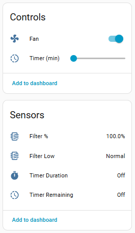
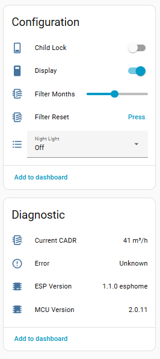
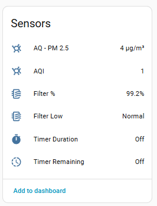
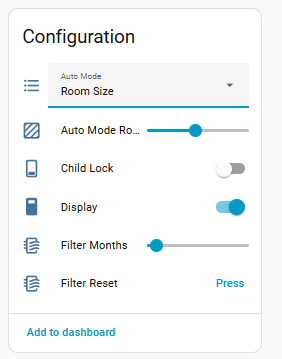

[← Back to Components](../README.md)

# Levoit ESPHome Component

Custom ESPHome component for Levoit air purifiers (Core and Vital series) and
humidifiers (Superior 6000S), enabling local control without cloud dependency.

> The **Superior 6000S** is a humidifier rather than a purifier, but it speaks
> the same MCU protocol, so it is just another `model:` here. It is ported from
> [Jyers/esphome-projects](https://github.com/Jyers/esphome-projects) and
> **has not been verified on hardware** — see
> [devices/levoit-superior-6000s](../../devices/levoit-superior-6000s).

[See Supported Models and Feature Matrix and Changelog](../../README.md)


## Installation

### Hardware Setup

- ⚠️ Requires disassembly and serial access (TX, RX, GND, EN, GPIO0) initially
- 💡 Before opening anything, the FCC filing for most Levoit models includes
  **internal photos of the bare PCB** — browse grantee
  [`2ARBY`](https://fccid.io/2ARBY) (Arovast Corporation) to find yours and
  see the module and test pads in advance


#### Option 1: Flash Original ESP32 Directly
Flash ESPHome directly onto the factory ESP32-Solo-1 module using serial connection.

#### Option 2: Dual ESP Setup (Preserve Original)
Keep the original ESP32 functional while adding a custom ESP32 for ESPHome control. This approach allows switching between firmware versions and enables MCU firmware updates.

**Hardware Setup:**
1. Install a **2-position switch** to select which ESP32 is active, only use during power down!
2. Wire the switch:
   - **Common (middle)**: Connect to GND
   - **Position A**: Connect to EN pin of original ESP32
   - **Position B**: Connect to EN pin of new ESP32

3. Connect new ESP32:
   - Power (3.3V) and GND from purifier PCB
   - TX/RX to MCU UART pins (parallel to original ESP32)

**Benefits:**
- ✅ Revert to factory firmware anytime
- ✅ Perform official MCU firmware updates when needed
- ✅ Test ESPHome changes without risk
- ⚠️ **Note**: New MCU firmware may require protocol updates in this component


**Recommended modules:**
- **XIAO Seeed ESP32-S3** - Compact form factor, easy to integrate
- **XIAO Seeed ESP32-C3** - Budget-friendly alternative
- Any ESP32 module with UART and sufficient GPIO pins

### Hardware Access

Each model requires different disassembly procedures. See model-specific guides in [projects/free-levoit](../../projects/free-levoit/) for:
- PCB pinout diagrams
- Disassembly instructions
- UART pin locations
- Photos and wiring diagrams


### Software Installation

#### Step 1: Add External Component
In your ESPHome YAML configuration:

**Local Development:**
```yaml
external_components:
  - source:
      type: local
      path: ../../../components  # Relative to your YAML file
    components: [levoit]
```

**Production (GitHub):**
```yaml
external_components:
  - source:
      type: git
      url: https://github.com/tuct/esphome-projects
      ref: main
    components: [levoit]
```

#### Step 2: Set esp32 variant

For Core 300/400s and Levoit 100s/200s:

esp32:
  board: esp32dev
  framework:
    type: esp-idf
    sdkconfig_options:
      CONFIG_FREERTOS_UNICORE: y

for custom esp, set accordingly 


#### Step 3: Configure UART
Match your hardware connections:
```yaml
uart:
  tx_pin: GPIO17   # ESP TX → MCU RX for original ESP32!
  rx_pin: GPIO16   # ESP RX → MCU TX for original ESP32!
  baud_rate: 115200
```

#### Step 4: Add Levoit Component
Specify your model (must match device):
```yaml
levoit:
  id: air_purifier
  model: CORE300S  # Options: VITAL100S, VITAL200S, CORE200S, CORE300S, CORE400S,
                   #          CORE600S, SPROUT, EVERESTAIR, SUPERIOR6000S
```

#### Step 5: Compile and Flash
```bash
# Compile only (check for errors)
esphome compile your-config.yaml

# Compile and upload via serial
esphome run your-config.yaml

# Upload via OTA (after initial flash)
esphome upload your-config.yaml --device your-device.local
```

For complete working examples, see the [free-levoit project configurations](../../projects/free-levoit/).

### Troubleshooting Installation

**No communication with MCU:**
- Verify TX/RX are not swapped (common mistake)
- Check 3.3V power supply voltage under load
- Enable UART debugging: `uart: debug: { direction: BOTH }`
- Confirm baud rate is 115200

**Boot loops or crashes:**
- Check `model:` matches your actual device
- Verify GPIO pins don't conflict with ESP32 bootstrap pins
- Try disabling PSRAM if using ESP32-S3: `psram_mode: disabled`

**Device not responding in Home Assistant:**
- Confirm ESPHome API is enabled
- Check WiFi credentials and network connectivity
- Review logs: `esphome logs your-config.yaml`
- Verify model detection: Look for "Model set to: CORE300S (ModelType=2)" in logs


## Architecture

### Component Structure
```
levoit/
├── levoit.cpp/.h           # Main component, UART handling, message routing
├── levoit_message.h/.cpp   # Message building and frame construction utilities
├── decoder.cpp/.h          # Frame parsing and message dispatch
├── types.h                 # Enum definitions for commands and entity types
├── core_status.cpp/.h      # Core series status/timer payload decoders
├── vital_status.cpp/.h     # Vital series status payload decoders
├── core_commands.cpp/.h    # Core series command builders (300S/400S)
├── vital_commands.cpp/.h   # Vital series command builders (100S/200S)
├── decoder_helpers.h       # Shared utility functions
├── tlv.cpp/.h             # TLV encoding for complex payloads
└── [platform]/            # ESPHome platform integrations
    ├── fan/               # Fan entity
    ├── switch/            # Switch entities (display, lock, etc.)
    ├── number/            # Number entities (timer, room size)
    ├── select/            # Select entities (auto mode)
    ├── sensor/            # Sensor entities (PM2.5, CADR, filter life)
    ├── binary_sensor/     # Binary sensor entities (filter low status)
    ├── button/            # Button entities (filter reset)
    └── text_sensor/       # Text sensor entities (timer display)
```

### Protocol Details
- **Interface**: UART at 115200 baud
- **Frame Format**: `A5 [type:3] [seq:1] [len:1] [reserved:1] [chk:1] [cmd:1] [payload:N]`
- **Byte Order**: Little-endian for multi-byte values
- **Message Counter**: Global sequence number (`messageUpCounter`) tracks outgoing messages
- **Model Detection**: Automatic based on initial handshake (TODO)
- **Checksum**: Sum of all bytes excluding checksum byte itself


## Configuration Example

```yaml
external_components:
  - source:
      type: local
      path: ../../../components  # or use git source
    components: [levoit]

uart:
  tx_pin: GPIO4
  rx_pin: GPIO5
  baud_rate: 115200

levoit:
  id: air_purifier
  model: CORE300S  # or VITAL100S, VITAL200S, CORE200S, CORE400S, CORE600S,
                   #    SPROUT, EVERESTAIR, SUPERIOR6000S (humidifier)

fan:
  - platform: levoit
    levoit: air_purifier
    name: "Air Purifier"

switch:
  - platform: levoit
    levoit: air_purifier
    name: "Display"
    type: display
  - platform: levoit
    levoit: air_purifier
    name: "Child Lock"
    type: child_lock

number:
  - platform: levoit
    levoit: air_purifier
    name: "Timer"
    type: timer
  - platform: levoit
    levoit: air_purifier
    name: "Filter Lifetime (months)"
    type: filter_lifetime_months

sensor:
  - platform: levoit
    levoit: air_purifier
    name: "Current CADR"
    type: current_cadr
  - platform: levoit
    levoit: air_purifier
    name: "Filter Life Left"
    type: filter_life_left

binary_sensor:
  - platform: levoit
    levoit: air_purifier
    name: "Filter Low"
    type: filter_low

button:
  - platform: levoit
    levoit: air_purifier
    name: "Reset Filter Stats"
    type: reset_filter_stats

text_sensor:
  - platform: levoit
    levoit: air_purifier
    name: "Timer Remaining"
    type: timer_duration_remaining
  - platform: levoit
    levoit: air_purifier
    name: "MCU Version"
    type: mcu_version

select:
  - platform: levoit
    levoit: air_purifier
    name: "Night Light"
    type: nightlight  # Core200S only
```

For complete configuration examples, see the [free-levoit project](../../projects/free-levoit/).

## Filter Life Calculation

The **Filter Life Left** sensor tracks filter usage as a percentage (0-100%) based on cumulative CADR consumption.

### How It Works

1. **Baseline Capacity**:
   - Model CADR (e.g., 214 m³/h for Core300S) multiplied by filter lifetime (default 12 months)
   - Formula: `Total Capacity = CADR × 24 hours × 30 days × Filter Lifetime (months)`
   - Example: `214 × 24 × 30 × 12 = 1,844,160 m³` for Core300S at 12 months

2. **Real-Time Tracking**:
   - Every minute, the component accumulates CADR based on current fan speed
   - Tracks `used_cadr_` (total m³ processed) persisted to device preferences
   - Updates `total_runtime_` (minutes fan has been on)

3. **Speed-Dependent CADR**:
   - Level 1: `CADR × 1 ÷ max_speed` (derates to ~63% in Sleep mode)
   - Level 2: `CADR × 2 ÷ max_speed`
   - Level 3: `CADR × 3 ÷ max_speed`
   - Level 4: `CADR × 4 ÷ max_speed` (Core400S/Vital series only)

4. **Percentage Calculation**:
   ```
   Filter Life % = 100 - (used_cadr ÷ Total Capacity × 100)
   ```
   - Clamped to 0-100% range
   - Published every 10 seconds as a float with one decimal place

5. **Binary Sensor Threshold**:
   - **Filter Low** binary sensor activates when `Filter Life % < 5%`
   - Useful for automations (e.g., order replacement reminders)

### Resetting Filter Stats

- Use the **Reset Filter Stats** button to reset `used_cadr` and `total_runtime` to 0
- This resets the filter life percentage back to 100%
- Persists immediately to device storage

### Configuration

Adjust filter lifetime expectancy via the **Filter Lifetime (months)** number entity:
```yaml
number:
  - platform: levoit
    levoit: air_purifier
    name: "Filter Lifetime (months)"
    type: filter_lifetime_months
    min_value: 1
    max_value: 24
    step: 1
```

Default: 12 months. Adjust based on your filter's actual rated lifespan or usage pattern.

## Development Notes

### Code Organization
- **Message Building**: Centralized in `levoit_message.h/.cpp` with inline functions for efficiency
- **Command Builders**: Separated into `core_commands.cpp` and `vital_commands.cpp` for model-specific logic
- **Global Counter**: `messageUpCounter` tracks outgoing message sequence (inline variable in `levoit_message.h`)

### Adding New Commands
1. Add enum to `CommandType` in [types.h](types.h)
2. Implement in `build_core_command()` or `build_vital_command()` depending on model series
3. Pattern: Define `msg_type` and `payload` vectors, return `build_levoit_message(msg_type, payload, messageUpCounter)`
4. The `build_levoit_message()` function handles frame construction, counter insertion, and checksum calculation

### Debugging
Enable verbose logging in your YAML:
```yaml
logger:
  level: VERBOSE
  
uart:
  debug:
    direction: BOTH  # Monitor raw UART traffic
```


## Known Issues & TODO
- [ ] Implement custom sleep mode settings for Vital series
- [ ] Model-specific room size validation based on CADR ratings
- [x] Verify Core 300S/400S protocol differences (MCU version dependency)
- [x] WiFi LED control and status indication after connection
- [x] Add filter life time and current CADR sensors
- [x] Add filter low binary sensor (< 5% threshold)
- [x] Add reset filter stats button
- [x] Enable filter reset from Home Assistant
- [x] Enable filter reset from Device (Long press sleep)
- [x] Add appropriate icons for entities
- [x] Test compatibility with ESPHome 2025.12+ (preset mode API changes)
- [x] Update to ESPHome 2025.12.5 (completed)


## Credits

Special thanks to the original developers who reverse-engineered the Levoit protocols:
- [targor](https://github.com/targor/) - [Levoit Vital integration](https://github.com/targor/levoit_vital/)
- [mulcmu](https://github.com/mulcmu/) - [Levoit Core 300S](https://github.com/mulcmu/esphome-levoit-core300s)
- [acvigue](https://github.com/acvigue/) - [Levoit Core integration](https://github.com/acvigue/esphome-levoit-air-purifier)
- [Jyers](https://github.com/Jyers/) - [Superior 6000S humidifier support](https://github.com/Jyers/esphome-projects)

## License

This component is provided as-is for educational and personal use. Levoit and related trademarks are property of their respective owners.

## Features

Core200s




Core300s - with Air Quality and Auto




#### Fan

Native Home Assistant Fan component, with preset support.
Available speed levels and presets are based on model.

| Model | Speed Levels | Preset Modes |
|---------|------------|-------------|
| C200S | 1–3 | Manual, Sleep |
| C300S | 1–3 | Auto, Manual, Sleep |
| C400S | 1–4 | Auto, Manual, Sleep |
| C600S | 1–4 | Auto, Manual, Sleep |
| V100S | 1–4 | Auto, Manual, Sleep, Pet |
| V200S | 1–4 | Auto, Manual, Sleep, Pet |
| Sprout | 1–4 | Auto, Manual |
| EverestAir | 1–3 | Auto, Turbo, Manual |

The `fan_operating_mode` select exposes the active fan mode as a normal ESPHome select for dashboards that do not render fan presets directly. It stays synchronized with MCU fan-mode status and uses the same Manual / Sleep / Auto / Pet / Turbo model-specific modes as the fan preset path.


#### Vent Angle & Cover (EverestAir)

The Everest Air adds a **motorized vent louver** and a **cover/door sensor** not present on the other models:

| Feature | Type | Config Key | Description |
|---------|----|------------|-------------|
| Vent Angle | number | `vent_angle` | Motorized louver angle, 45–90° (CMD `02 12 55`, status TLV `0x14`) **EverestAir only** |
| Cover Open | binary_sensor | `cover_open` | Back/filter door open — the unit powers itself off while open (TLV `0x15`) **Sprout + EverestAir** |

The vent angle is set as a number entity (45° = nearly closed/upward, 90° = fully open/forward). The MCU echoes the current angle back in status tag `0x14`, and it reads `0` while the unit is powered off.


#### Display / Light

| Feature | Type | Config Key | Description |
|---------|----|------------|-------------|
| Display | switch | `display` | Toggle the LED display on/off |
| Child Lock | switch | `child_lock` | Disable physical buttons on the device |
| Light Detect | switch | `light_detect` | Auto-dim display when ambient light is low **Vital Series + Core 600S + EverestAir** |
| Night Light | select | `nightlight` | Night light brightness: Off / Mid / Full **Only Core200S** |

#### Timer

| Feature | Type | Config Key | Description |
|---------|----|------------|-------------|
| Timer | number | `timer` | Run timer in minutes |
| Timer Set | text_sensor | `timer_duration_initial` | Originally set timer as readable string (e.g. "2h 30 min") |
| Timer Remaining | text_sensor | `timer_duration_remaining` | Time left on active timer (e.g. "1h 15 min") |

#### Filter Lifetime

| Feature | Type | Config Key | Description |
|---------|----|------------|-------------|
| Filter Lifetime | number | `filter_lifetime_months` | Expected filter lifespan in months (1–12); used to compute Filter Life % |
| Filter Life Left | sensor | `filter_life_left` | Remaining filter life as %, computed by the component from accumulated CADR |
| Filter Low | binary_sensor | `filter_low` | `on` when Filter Life % drops below 5% ⁽¹⁾ |
| Current CADR | sensor | `current_cadr` | Calculated Clean Air Delivery Rate at current fan speed in m³/h ⁽¹⁾ |
| Reset Filter Stats | button | `reset_filter_stats` | Reset cumulative CADR and runtime counters — restores Filter Life % to 100%. On Core200S it additionally sends the MCU its own filter reset |

> On every model the filter percentage is computed by the component from
> accumulated CADR — no Levoit MCU reports it. The Core200S MCU keeps a
> counter of its own that the stock app resets, so the button clears that as
> well, but it is not what feeds the sensor.

#### Auto Mode

| Feature | Type | Config Key | Description |
|---------|----|------------|-------------|
| Auto Mode | select | `auto_mode` | Auto mode type — options vary by model (see below) **Not for Core200S** |
| Auto Mode Room Size | number | `efficiency_room_size` | MCU-reported room area for efficient auto mode in m² — reflects device status **Not for Core200S / EverestAir** |
| Auto Mode Room Size Preset | number | `auto_profile_room_size_input` | Remembered Room Size target, automatically sent when selecting Room Size/Efficient auto profile. Persists across reboots so Default/Quiet status resets don't wipe the target. **Not for Core200S / EverestAir** |
| Efficiency Counter | sensor | `efficiency_counter` | Seconds remaining at high fan speed in efficient auto mode **Vital only** |
| Auto Mode High Fan Time | text_sensor | `auto_mode_room_size_high_fan` | Time still running at high speed in efficient auto mode, human readable **Vital only** |

Auto Mode configures the purifier's automatic behavior and is distinct from the active fan preset/mode. On models with fan Auto support, changing Auto Mode enters the fan's Auto preset; direct fan speed changes switch the fan preset to Manual.

When Room Size/Efficient is selected, the purifier uses **Auto Mode Room Size Preset** (`auto_profile_room_size_input`) as the coverage target and sends it to the MCU automatically. The **Auto Mode Room Size** number (`efficiency_room_size`) still reflects what the MCU reports back in status payloads — Default and Quiet profiles report `0`, which is normal.

Auto mode options per model:

| Model | Options | Room Size Range |
|-------|---------|----------------|
| C200S | — | up to 40 m² (430 ft²) |
| C300S | Default / Quiet / Room Size | 9–50 m² (97–538 ft²) |
| C400S | Default / Quiet / Room Size | 9–38 m² (97–409 ft²) |
| C600S | Default / Quiet / Room Size / ECO | 9–147 m² (97–1,582 ft²) |
| V100S | Default / Quiet / Efficient | 9–52 m² (97–560 ft²) |
| V200S | Default / Quiet / Efficient | 9–87 m² (97–936 ft²) |
| Sprout| Default / Quiet / Efficient | 9–57 m² (97–936 ft²) |
| EverestAir| Default / Eco | — (no room-size setting) |

#### Air Quality Sensors

| Feature | Type | Config Key | Description |
|---------|----|------------|-------------|
| PM2.5 | sensor | `pm25` | Particulate matter concentration in µg/m³ from built-in sensor **Not for Core200S** |
| PM1.0 | sensor | `pm1_0` | Particulate matter concentration in µg/m³ from built-in sensor **only Sprout and EverestAir** |
| PM10 | sensor | `pm10` | Particulate matter concentration in µg/m³ from built-in sensor **only Sprout and EverestAir** |
| AQI | sensor | `aqi` | Air Quality Index as reported by the MCU **Not for Core200S** |

#### Info and Debug

| Feature | Type | Config Key | Description |
|---------|----|------------|-------------|
| MCU Version | text_sensor | `mcu_version` | Firmware version string of the purifier MCU chip |
| ESP Version | text_sensor | `esp_version` | ESPHome component version string |
| Error | text_sensor | `error_message` | Device error status: "Ok" or "Sensor Error" **Not for Core200S** |

## Change Log

#### ESP Version: 1.5.0 - 2026.09.26

* **Core 200S: the status frame is now fully decoded**, byte by byte, against
  stock-firmware UART captures in
  [`devices/levoit-core200s/uart`](../../devices/levoit-core200s/uart). Each
  mapping below was confirmed by matching a command sent by the stock app
  against the status frame it produced — see the
  [byte map](../../devices/levoit-core200s/README.md#status-frame-byte-map)
  * **Fixes the filter life estimate never moving off 100%.** The per-minute
    accumulation did `cadr_per_hour / 60` in integer arithmetic, which
    truncates to **zero** for any model under 60 m³/h at the current speed — a
    Core 200S on speed 1 (55 m³/h) or in Sleep (34 m³/h), and a Sprout on
    speed 1 (36 m³/h), accumulated nothing at all, so the sensor sat at exactly
    100% indefinitely. Higher speeds lost 28–46% to the same truncation. The
    remainder is now carried between minutes
  * **Fixes the estimate decaying 25% too slowly on top of that.** The CADR
    calculation used a 4-speed divisor for the Core 200S, which has 3 speeds,
    so every level accumulated only three quarters of the air it should have
  * Fixes the Superior 6000S losing **speeds 5–9** entirely: the accumulator was
    gated on `speed <= 4`, while its fan has 9
  * **Filter Reset now also resets the MCU's own counter** (`01 E4 A5`,
    captured from the stock firmware). Previously there was no core
    implementation of `resetFilter` at all. The sensor itself is still driven by
    the ESP-side estimate
  * **A filter reset done with the button on the unit now resets the sensor
    too.** `01 E4 A5` turns out to be bidirectional: the MCU pushes it back with
    payload `0x01` when the panel button is used, and the component now clears
    its CADR counters on that. Handled ahead of the payload-dedup cache, so two
    panel resets in a row both take effect
  * Confirmed unchanged: display at byte 6 (brightness, `0x00`/`0x64`), child
    lock at byte 10, nightlight at byte 11. Bytes 8 and 9 are `0x00` in every
    frame of every capture
  * **Filter life is not on the wire.** A capture taken while the stock app
    displayed 99% reports byte 6 as `0x64` (100), and no message in any capture
    carries 99 or a runtime counter — the Core 200S filter percentage is kept
    by the stock Wi-Fi module and the cloud, not the MCU. An earlier 1.5.0
    pre-release read byte 6 as MCU filter life and moved display to byte 7;
    both were wrong and are reverted here
* Fix `filter_low` device class — it is a `problem` binary sensor, not a
  `battery` one, so a low filter now shows as a problem in Home Assistant

* Add **Levoit Superior 6000S** (`model: SUPERIOR6000S`) — an evaporative
  humidifier on the same MCU protocol as the purifiers. Ported from
  [Jyers/esphome-projects](https://github.com/Jyers/esphome-projects)
  * New entities: `auto_dry_power_off` / `auto_dry_water_empty` switches,
    `humidity_target` and `timer` numbers, `humidity` / `temperature` /
    `filter_life_mcu` / `timer_remaining` sensors, `auto_profile` /
    `humidity_subtype` / `dry_level` selects, and `water_tank_empty` /
    `humidifying` / `dry_active` binary sensors
  * `select` and `number` gained Superior types; the fan now supports 9 speeds
    and the Humidity / Dry modes
  * **The timer runs on the ESP**, not the MCU: this MCU only stores a
    "remaining" value pushed to it, so the component owns the countdown and
    refreshes it once a minute. The `timer` number is in **hours** here, where
    the purifiers use minutes
  * **`dry_level` does not act on its own** — the select records Low/High and
    the value is applied when Dry is picked on the fan entity
* **Fix two build failures around optional platforms.** A levoit config with
  only a fan did not build at all, and one with an unrelated `template` switch
  (or select, number, …) failed the same way: several sources included
  `number/levoit_number.h` and friends either unguarded or guarded on the
  *generic* `USE_SWITCH` / `USE_NUMBER` macros, which any component defines,
  while ESPHome only copies `levoit/<platform>/` when a **levoit** entity of
  that platform is configured
  * Each platform now defines its own `USE_LEVOIT_*` macro, and the entity
    classes are confined to `levoit.cpp` behind new value accessors
    (`try_get_number_state()`, `try_get_select_index()`,
    `try_get_switch_state()`, `apply_fan_status()`), so the other sources no
    longer need those headers at all
  * Added compile tests in [`tests/`](./tests) covering every entity type and
    both of the above cases, run by GitHub Actions on every PR
* `publish_sensor` widened `uint32_t` → `float` so the humidifier can report
  fractional temperature and humidity (it already converted internally)
* ⚠️ Superior 6000S not verified on hardware — see
  [the device README](../../devices/levoit-superior-6000s)

#### ESP Version: 1.4.1 - 2026.09.08

* Add `fan_operating_mode` select: the active fan mode as a normal ESPHome select, for dashboards that don't render fan presets (@EdenNelson, #50)
  * Stays in sync with MCU fan-mode status and with changes made through the fan entity
* Make fan mode commands coherent between the Manual and Auto paths (@EdenNelson, #48)
* Fix Core room size round trip — value written and value read back now match (@EdenNelson, #46)
* Fix: setting the same fan level while Sleep/Auto was active sent no UART command, so the device stayed in the preset. A speed call that leaves a non-Manual preset now counts as a change (@Bleialf, #53)
* Add `auto_profile_room_size_input` number: persisted Room Size target for Room Size/Efficient auto profile (@EdenNelson, #56)
  * Automatically sent to the MCU when Room Size/Efficient is selected — no manual "Apply" step needed
  * Survives Default/Quiet status resets that report room size as `0`
  * Restores saved target on reboot, clamped to model-specific min/max
  * Model ranges: C300S 9–50 m², C400S 9–38 m², C600S 9–147 m², V100S 9–52 m², V200S 9–87 m²
  * Sprout: Room Size/Efficient mode is protocol-inherited from Vital but unverified on hardware — `auto_profile_room_size_input` not included for Sprout
* Clear the compiler warnings the component emits during an ESP-IDF build (@EdenNelson, #59)
  * `types.h`: `command_type_to_string` is now `inline` instead of `static` — as a static function in a header it was reported unused by each of the nine translation units that include `types.h` without calling it, which accounted for most of the warning output
  * Cast `uint32_t` log arguments to `unsigned` in the `ESP_LOGx` calls that mismatched `%u` (`uint32_t` is `unsigned long` on xtensa), including the VERBOSE-only sites in `core_commands.cpp`, `vital_commands.cpp` and `core_status.cpp`
  * `decoder.cpp`: parenthesize the `&&` operands inside the `||` in the Core300S/400S status ptype test — grouping unchanged, only stated explicitly
  * Fix the restore log labelling `total_runtime` as hours when the counter is incremented once per minute — 60× overstated, and disagreeing with the sibling line that already says "min". Log text only
  * No behaviour change. The one warning left is the `-Wswitch` in `on_number_command`, which needs a decision on whether `white_noise_min` should reach the MCU

#### ESP Version: 1.4.0 - 2026.06.14

* Added Levoit Everest Air support 
* Everest Air motorized vent louver as a number (45–90°, `vent_angle`, CMD `02 12 55`)
* Everest Air back/cover door sensor as a binary_sensor (`cover_open`, status tag `0x15`) — unit powers off while open


#### ESP Version: 1.3.1 - 2026.06.09

* ESPHome min version updated to **2026.5.3**
* Correct Core400S CADR and Room Size limits (@EdenNelson)
* Fix fan preset modes for newer ESPHome (`set_supported_preset_modes` moved to `FanTraits`) (@EdenNelson)
* Fix Core300S/400S falsely reporting "Sensor error" (removed incorrect status byte mapping)
* Add Vital 200S Pro support for MCU FW 2.0.0 with bulk-prefs SET (@TheDave94)
* LevoitSwitch: set has_state on publish to match Select/Number behavior (@TheDave94)
* Fix race condition where the led stays blinking even after conenction is restored (@Ahmed-max)


#### ESP Version: 1.3.0 - 2026.03.28

* Added Core 600S support: 4 fan speeds, 4 auto modes (Default / Quiet / Room Size / ECO), Light Detect switch, CADR 641 m³/h
* Added Vital 200S (Pro) support: same protocol as Vital 100S, tested with original ESP
* Updated Auto Mode select to show model-specific options (3 for Core/Vital, 4 for Core 600S)


#### ESP Version: 1.2.0-esphome - 2026.03.22

* Added Core200s support and readme / example.
* Renamed/moved repo to tuct/levoit - for easier collaboration with pull requests, ...

#### 2026.03.21

* Works with ESPHome 2026.3+
* Sensors - added state class measurement -> allow statistics to be tracked

#### 2026.01.15 ESPHome 2025.12.5+ Compatibility

* The component has been updated for ESPHome 2025.12.5
