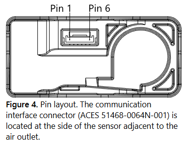

[← Back to Components](../README.md)

# Sensirion SEN6x ESPHome Component


Integration for Sensirion SEN6x air quality sensors (I²C only; SEN6x does not support UART).

## Buy info
Don’t buy from AliExpress at the moment; prices from specialist stores like Mouser (EU) or DigiKey, Newark (US) are way
cheaper. SEN66 are now about at ~€60 / 60USD.

## Highlights
- PM, RH & T, VOC, NOx, CO2/HCHO sensing platform
- Fast & easy integration
- 10 years dust resistant – Patented Sheath Flow technology
- Fully calibrated digital output
- One node for up to 9 data signals
- Integrated compensation algorithms
- Ready for California Title 24, RESET®2 and WELL Building Standard™3

The SEN6x sensor module family is an air quality platform that combines critical parameters such as particulate
matter, relative humidity, temperature, VOC, NOx and either CO2 or formaldehyde, all in one compact package.
The modules are a result of Sensirion’s extensive experience in environmental sensing and offer the best
possible performance for each parameter, a superior lifetime and an unrivaled form factor. The combination of
all measurement parameters, together with all relevant algorithms in one device simplifies the integration,
streamlines the supply chain, and allows for a fast time to market with the best performance.

## Supported variants
| Product Variant | Sensor Signals |
| --- | --- |
| [SEN62](https://sensirion.com/de/produkte/katalog/SEN62) | PM, RH & T |
| [SEN63C](https://sensirion.com/de/produkte/katalog/SEN63C) | PM, RH & T, CO2 |
| [SEN65](https://sensirion.com/de/produkte/katalog/SEN65) | PM, RH & T, VOC, NOx |
| [SEN66](https://sensirion.com/de/produkte/katalog/SEN66) | PM, RH & T, VOC, NOx, CO2 |
| [SEN68](https://sensirion.com/de/produkte/katalog/SEN68) | PM, RH & T, VOC, NOx, HCHO |
| [SEN69C](https://sensirion.com/de/produkte/katalog/SEN69C) | PM, RH & T, VOC, NOx, HCHO, CO2 |


## Connection / pinout
| Pin | Name | Description | Comments |
| --- | --- | --- | --- |
| 1 | VDD | Supply voltage | 3.3V |
| 2 | GND | Ground | — |
| 3 | SDA | Serial data input/output | TTL 5V compatible |
| 4 | SCL | Serial clock input | TTL 5V compatible |
| 5 | GND | Ground or NC | Pins 2 and 5 are connected internally |
| 6 | VDD | Supply voltage or NC | Pins 1 and 6 are connected internally |




## Configuration variables
All sensor options are optional and follow ESPHome Sensor schema unless noted.

### Sensors
- `pm_1_0`, `pm_2_5`, `pm_4_0`, `pm_10_0`
- `temperature`, `humidity`
- `voc` (optional `algorithm_tuning`)
- `nox` (optional `algorithm_tuning`)
- `co2`
- `hcho`

### Binary sensors
- `measurement_running` (binary sensor platform)

### Algorithm tuning
Under `voc:` and `nox:`
- `algorithm_tuning:`
	- `index_offset`
	- `learning_time_offset_hours`
	- `learning_time_gain_hours`
	- `gating_max_duration_minutes`
	- `std_initial`
	- `gain_factor`

### Temperature compensation
```
temperature_compensation:
	offset: 0
	normalized_offset_slope: 0
	time_constant: 0
	slot: 0
```
Valid ranges:
- `offset`: −163.84 … 163.835 °C
- `normalized_offset_slope`: −3.2768 … 3.2767
- `time_constant`: 0 … 65535 s
- `slot`: 0 … 4

### Temperature acceleration
```
temperature_acceleration:
	k: 0
	p: 0
	t1: 0
	t2: 0
```
Valid ranges: 0 … 6553.5 (each is scaled by 10 internally).

### CO₂ compensation settings
- `ambient_pressure`: 700 … 1200 (hPa)
- `sensor_altitude`: 0 … 3000 (m)
- `co2_automatic_self_calibration`: true/false

### Other
- `store_baseline`: true/false (default true)
- `update_interval`: standard ESPHome polling interval
- `startup_delay`: time to wait after each start before publishing values (default 60s)
- `address`: I²C address (default 0x6B)
- `auto_cleaning`:
	- `enabled`: true/false (default true)
	- `interval`: default 1 week
	- Note: implemented in ESPHome (SEN6x has no auto-cleaning interval command)

## Actions
- `sen6x.start_fan_autoclean`
- `sen6x.perform_forced_co2_recalibration`
- `sen6x.co2_sensor_factory_reset`
- `sen6x.activate_sht_heater`
- `sen6x.get_sht_heater_measurements`
- `sen6x.start_measurement`
- `sen6x.stop_measurement`

Note: Actions that require idle mode will stop measurement internally. Call `sen6x.start_measurement` again after running them.

## Current consumption summary (SEN62/63C/65/66/68/69C)
Approximate typical values (single-value summary).

| Mode | Conditions | SEN62 | SEN63C | SEN65 | SEN66 | SEN68 | SEN69C | Unit |
| --- | --- | --- | --- | --- | --- | --- | --- | --- |
| Average current | Idle, first 10 s | ~3.3 | ~3.3 | ~4.6 | ~4.6 | ~4.6 | ~4.6 | mA |
| Average current | Idle, after 10 s | ~3.3 | ~3.3 | ~3.3 | ~3.3 | ~3.3 | ~3.3 | mA |
| Average current | Measurement, after 60 s | ~90.0 | ~100.0 | ~100.0 | ~110.0 | ~100.0 | ~100.0 | mA |
| Peak current | Measurement pulse (~2 ms) | ~190.0 | ~200.0 | ~200.0 | ~350.0 | ~200.0 | ~210.0 | mA |

### Action examples
```
on_boot:
	then:
		- sen6x.perform_forced_co2_recalibration:
				id: sen6x_1
				reference_co2: 400
		- sen6x.co2_sensor_factory_reset:
				id: sen6x_1
		- sen6x.activate_sht_heater:
				id: sen6x_1
		- sen6x.get_sht_heater_measurements:
				id: sen6x_1
		- sen6x.start_measurement:
				id: sen6x_1
		- sen6x.stop_measurement:
				id: sen6x_1
```

### Energy-saving example (deep sleep: wake twice a day, run 5 min)
Stop measurement before deep sleep to avoid I2C errors on shutdown.
```
deep_sleep:
	run_duration: 5min
	sleep_duration: 12h

on_shutdown:
	then:
		- sen6x.stop_measurement:
				id: sen6x_1
```
Note: VOC values need at least ~2 minutes of continuous measurement to stabilize, so very short wake windows may yield unreliable VOC readings.

SEN66 daily energy example (approx): sensor ~60 mA during measurement (measured, ~30% lower than datasheet), ESP32 ~50 mA during runtime,

sensor idle ~3.3 mA during sleep, and ESP deep sleep ~20 µA.

2 min/day → average current

$I_{avg}=(60+50)\cdot\frac{2}{1440}+3.3\cdot\frac{1438}{1440}+0.02\cdot\frac{1438}{1440}\approx3.47\text{ mA}$.

That’s about $3.47\text{ mA}\times24\text{ h}\approx83\text{ mAh}$ per day, or

$3.3\text{ V}\times3.47\text{ mA}\times24\text{ h}\approx0.28\text{ Wh/day}$.

With a 3.7 Wh battery, that’s about $3.7/0.28\approx13$ days.

If waking every hour for 2 minutes (48 min/day):

$I_{avg}=(60+50)\cdot\frac{48}{1440}+3.3\cdot\frac{1392}{1440}+0.02\cdot\frac{1392}{1440}\approx6.88\text{ mA}$,

so about $6.88\text{ mA}\times24\text{ h}\approx165\text{ mAh}$ per day, or

$3.3\text{ V}\times6.88\text{ mA}\times24\text{ h}\approx0.55\text{ Wh/day}$.

That yields $3.7/0.55\approx6.7$ days.

## Example configuration
```
sensor:
	- platform: sen6x
		id: sen6x_1
		pm_1_0:
			name: PM1.0
		pm_2_5:
			name: PM2.5
		pm_4_0:
			name: PM4.0
		pm_10_0:
			name: PM10.0
		temperature:
			name: Temperature
		humidity:
			name: Humidity
		voc:
			name: VOC
			algorithm_tuning:
				index_offset: 100
				learning_time_offset_hours: 12
				learning_time_gain_hours: 12
				gating_max_duration_minutes: 180
				std_initial: 50
				gain_factor: 230
		nox:
			name: NOx
		co2:
			name: CO2
		hcho:
			name: HCHO
		temperature_compensation:
			offset: 0
			normalized_offset_slope: 0
			time_constant: 0
			slot: 0
		temperature_acceleration:
			k: 0
			p: 0
			t1: 0
			t2: 0
		ambient_pressure: 1013
		sensor_altitude: 0
		co2_automatic_self_calibration: true
		startup_delay: 1min
		auto_cleaning:
			enabled: true
			interval: 1week
		store_baseline: true
		update_interval: 15s

binary_sensor:
	- platform: sen6x
		sen6x_id: sen6x_1
		id: sen6x_running
		name: "SEN6x Measurement Running"

switch:
	- platform: template
		name: "SEN6x Measurement"
		lambda: |-
			return id(sen6x_running).state;
		turn_on_action:
			- sen6x.start_measurement:
					id: sen6x_1
			turn_off_action:
				- sen6x.stop_measurement:
					id: sen6x_1
```
