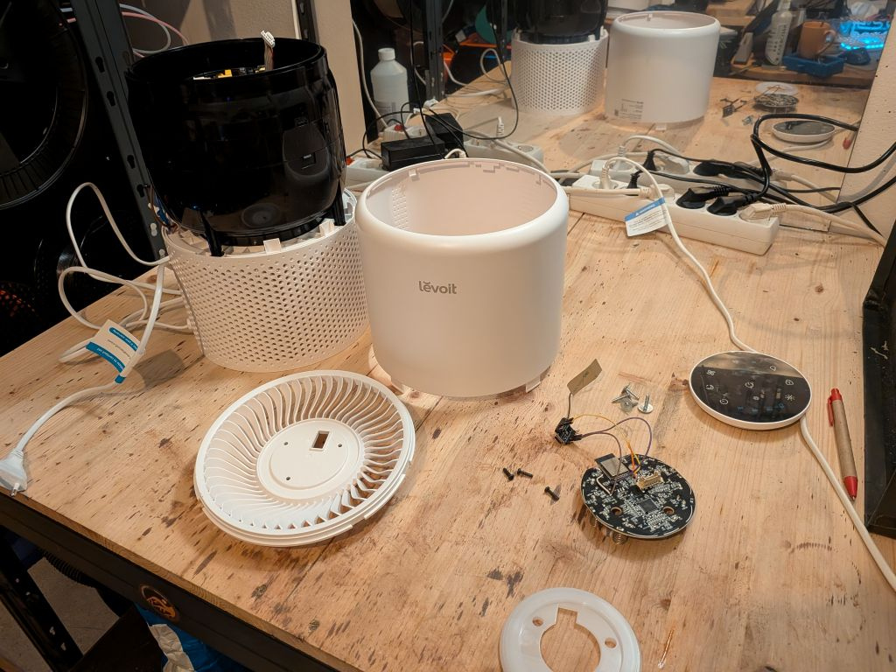
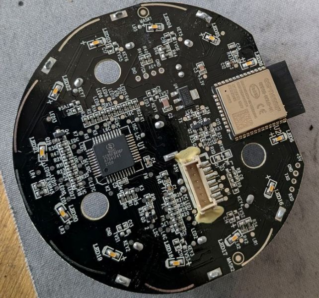
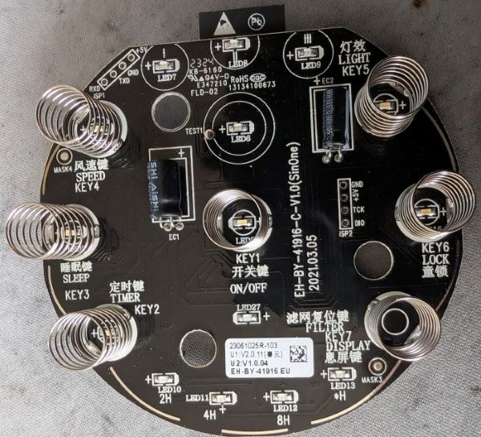
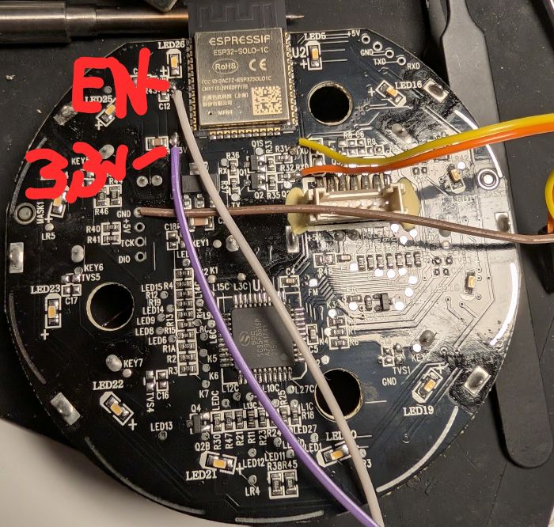
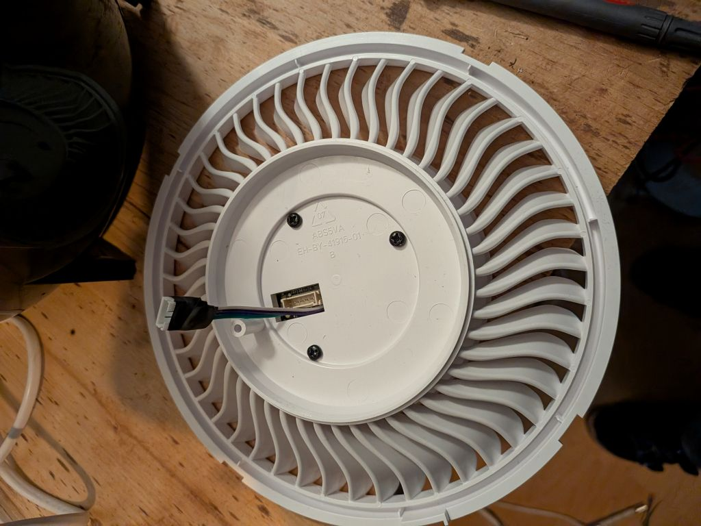
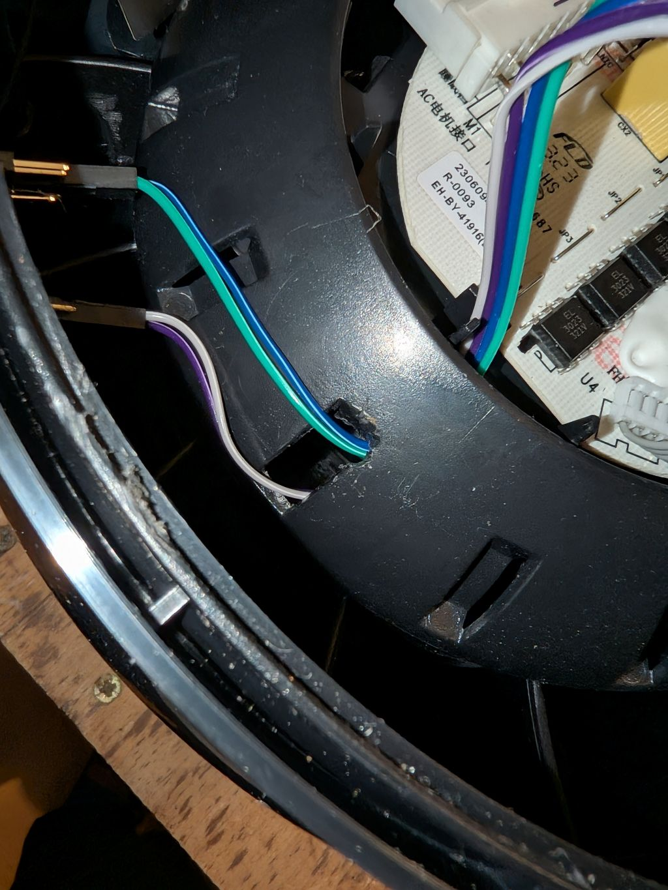
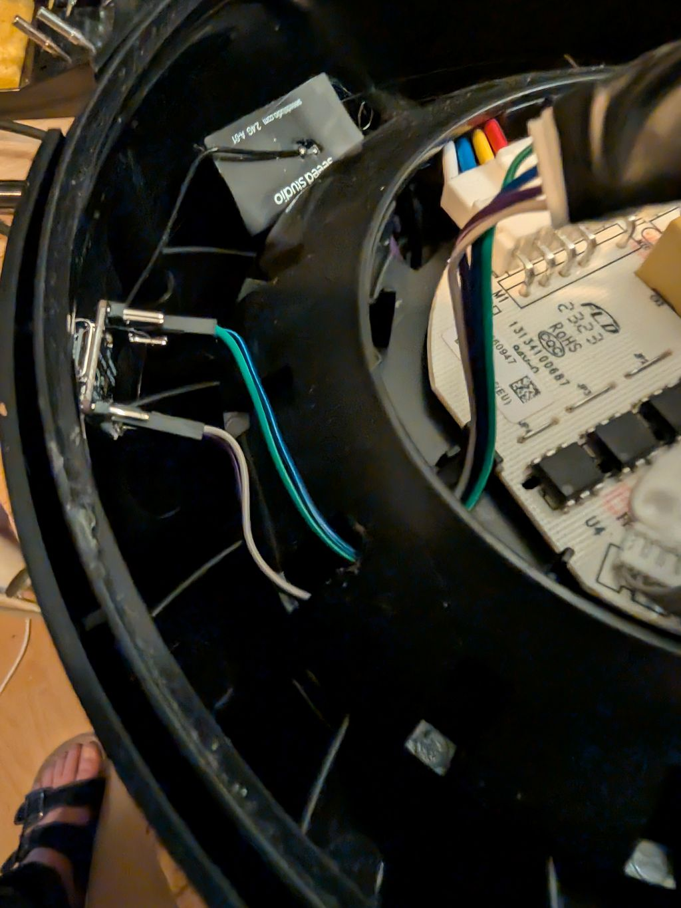
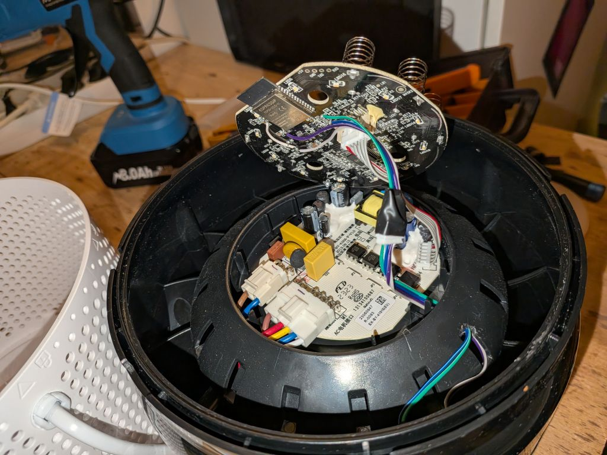
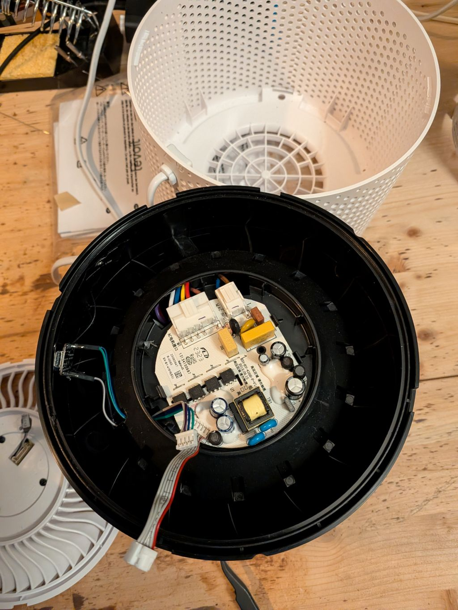
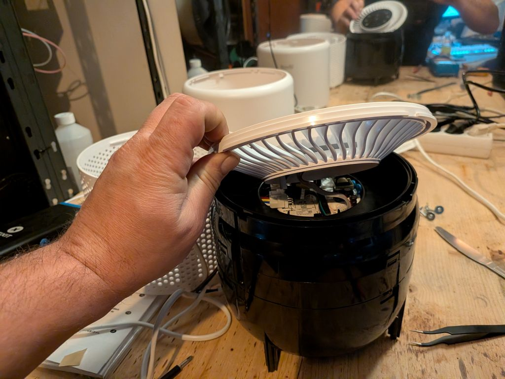

[← Back](../../README.md)

# Levoit Core 200S - Custom Firmware (ESPHome)

## Quick Facts

| Item | Value |
|------|-------|
| Model | Core 200S |
| Tested MCU FW | 2.0.11 |
| ESP Module | ESP32-SOLO-1C |
| Board | EH-BY-41916-C-V1.0 (SinOne) |
| Fan Speeds | 3 |
| CADR (spec) | 167 m³/h |
| Room Size | up to 40 m² (430 ft²) |
| ESPHome | 2026.1.2+ |
| PM Sensor | None  |

## Features

| Feature | Type | Notes |
|---------|------|-------|
| Fan | fan | 3 speeds, presets: Manual / Sleep |
| Display | switch | Toggle LED display |
| Child Lock | switch | |
| Night Light | select | Off / Mid / Full |
| Current CADR | sensor | m³/h, updated every 5s |
| Filter Life Left | sensor | % remaining |
| Filter Low | binary_sensor | On when < 5% |
| Filter Lifetime | number | Configurable in months |
| Reset Filter Stats | button | Resets CADR/runtime counters |
| Timer | number | Run timer in minutes |
| MCU Version | text_sensor | |

> No PM2.5 / AQI sensor on this model. No Auto mode.

## Teardown / Disassembly


* Place upside down, remove base cover and filter to expose screws 
* Remove all screws — they are soft metal, do not overtighten when reassembling
* Slide a pry tool between the tabs to separate base and top sleeve, the top should go inside
* Unscrew the logic board / top module 
* Unplug the logic board



## PCB





## Install New ESP32 (Recommended)

Replacing the original ESP32 lets you keep the original firmware intact and switch back easily.

**Wiring (ESP32-S3 example):**

| PCB | ESP32-S3 |
|-----|----------|
| EN | GND |
| 3.3V | 3.3V |
| GND | GND |
| RX | GPIO05 |
| TX | GPIO04 |



> Pull the `EN` pin of the original ESP32 to GND to disable it.

**Recommended modules:**
- Seeed XIAO ESP32-C3
- Seeed XIAO ESP32-S3

**Placement of new ESP**

No room to fit the esp32! i placed mine outside in the airstream. I had to break out a small part to get the wires through.














## Flash Original ESP32

### Prerequisites

Solder wires to **TXD0, RXD0, IO0, +3V3, GND** near the ESP32 on the logic board and connect to a USB-UART converter (3.3V TTL).

Connect **IO0 to GND before powering on** to enter bootloader mode.

### Backup Existing Firmware

```bash
esptool read_flash 0 ALL levoit-core200s-backup.bin
```

> Note: backup may fail on some boards — proceed at your own risk.

### Configure

1. Copy `secrets-example.yaml` → `secrets.yaml` and fill in your Wi-Fi and encryption key
2. Adjust the device name in the config if running multiple units
3. Check the [component README](../../components/levoit/README.md) for UART pin mapping per board

### Flash

```bash
esphome run levoit-core200s.yaml
```

Reassemble and enjoy!

### Restore Original Firmware

```bash
esptool erase_flash
esptool write_flash 0x00 levoit-core200s-backup.bin
```
