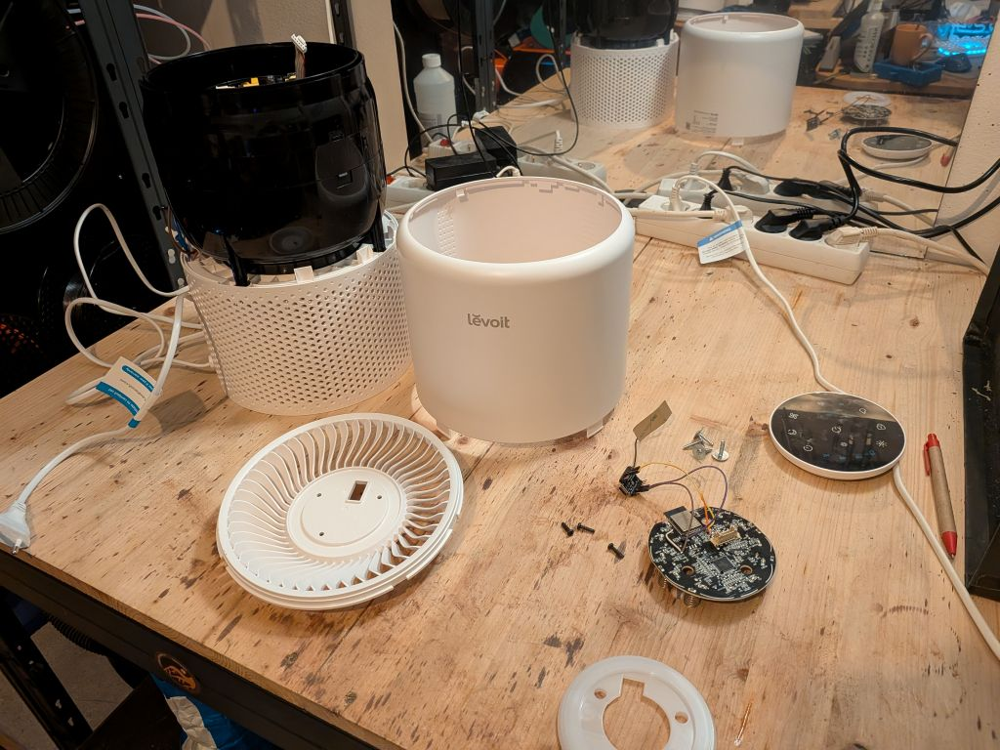
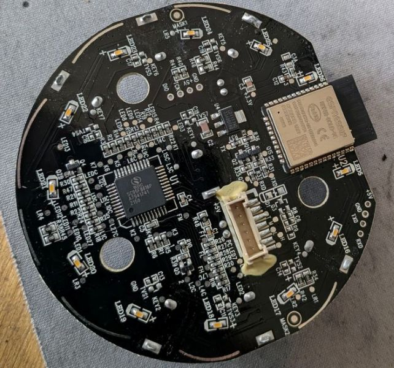
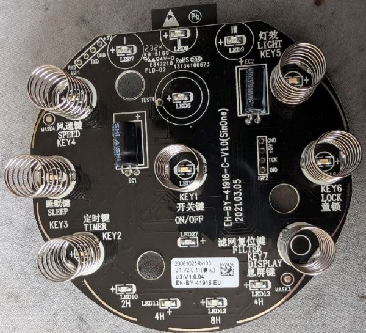
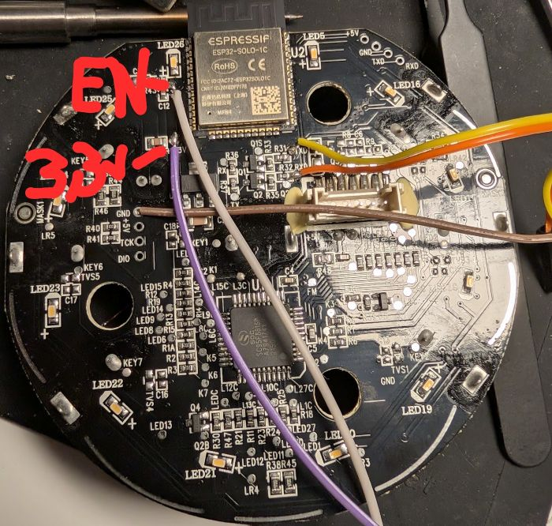
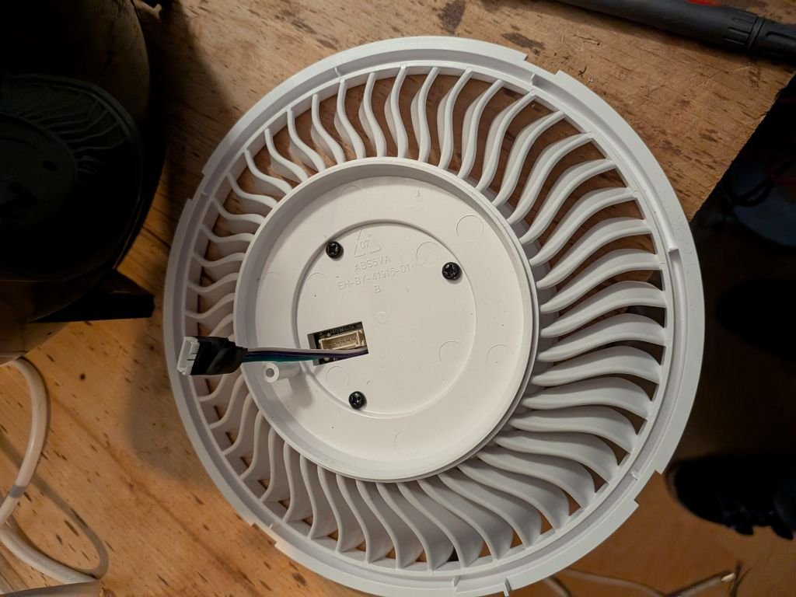
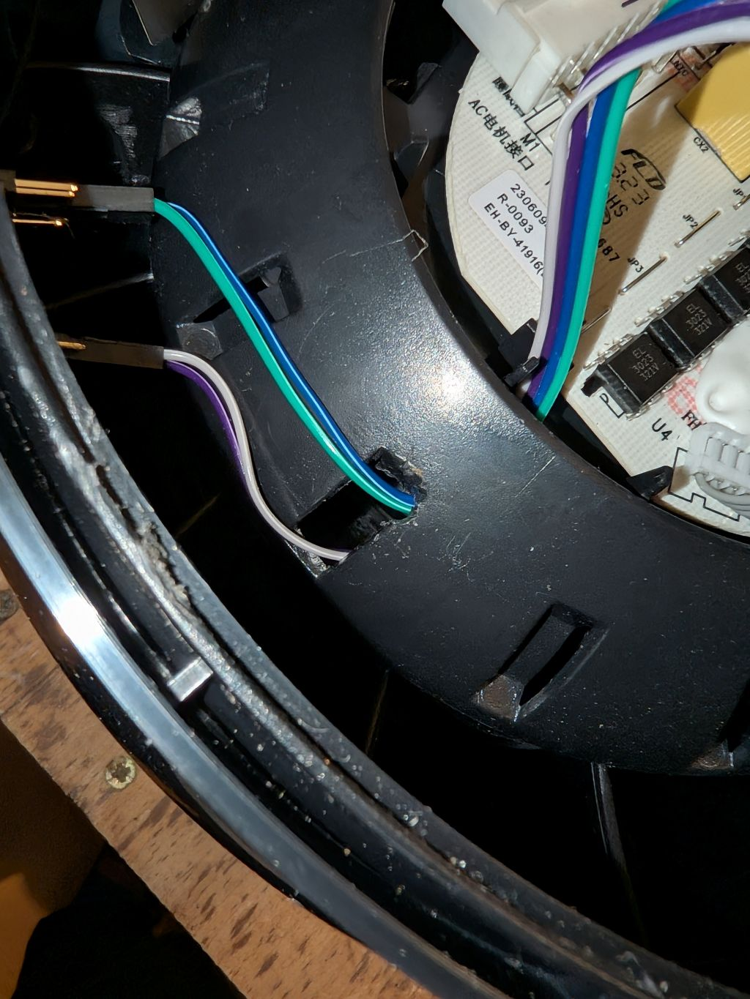
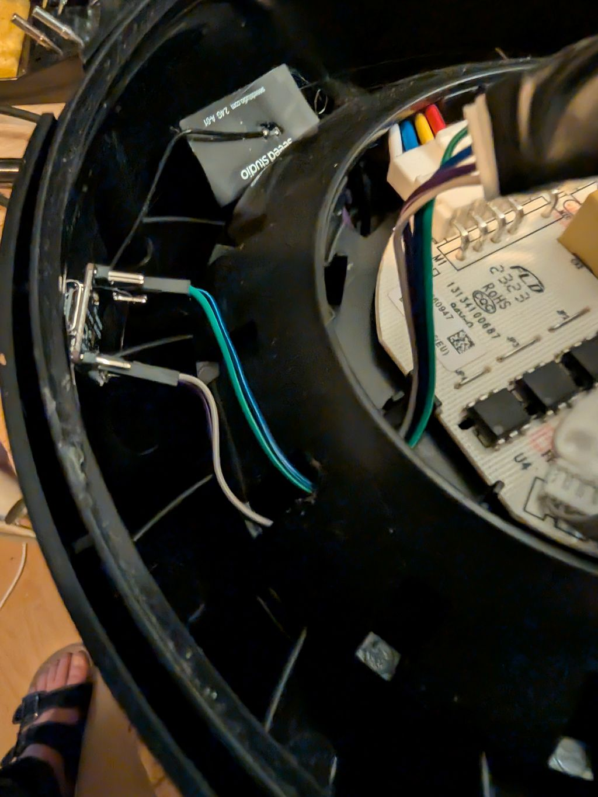
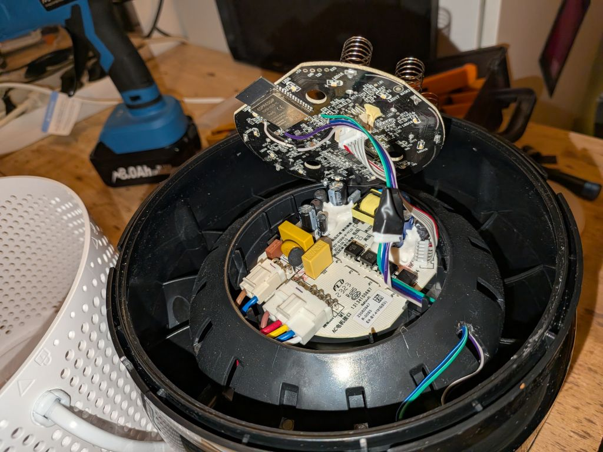
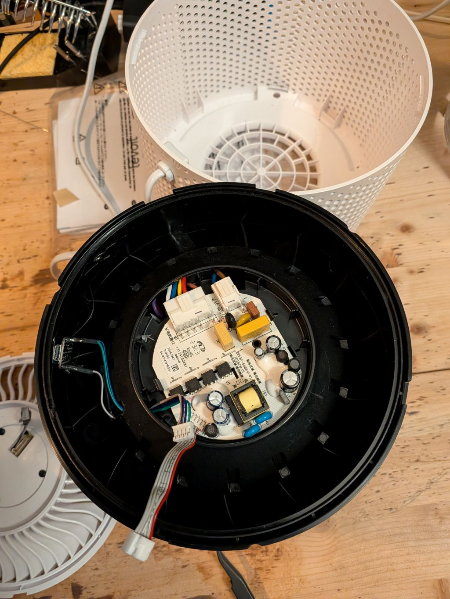
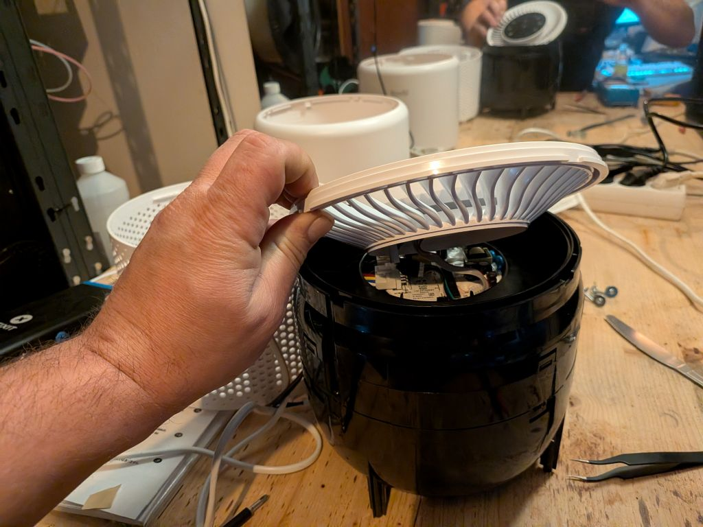

[← Back](../../README.md)

# Levoit Core 200S - Custom Firmware (ESPHome)

## Quick Facts

| Item | Value |
|------|-------|
| Model | Core 200S |
| Tested MCU FW | 2.0.11 |
| ESP Module | ESP32-SOLO-1C |
| Board | EH-BY-41916-C-V1.0 (SinOne) |
| Fan Speeds | 3 |
| CADR (spec) | 167 m³/h |
| Noise | 24–48 dB |
| Room Size | up to 40 m² (430 ft²) |
| ESPHome | 2026.5.3+ |
| PM Sensor | None  |

## Features

| Feature | Type | Notes |
|---------|------|-------|
| Fan | fan | 3 speeds, presets: Manual / Sleep |
| Display | switch | Toggle LED display |
| Child Lock | switch | |
| Night Light | select | Off / Mid / Full |
| Current CADR | sensor | m³/h, updated every 5s |
| Filter Life Left | sensor | % remaining |
| Filter Low | binary_sensor | On when < 5% |
| Filter Lifetime | number | Configurable in months |
| Reset Filter Stats | button | Resets CADR/runtime counters |
| Timer | number | Run timer in minutes |
| MCU Version | text_sensor | |

> No PM2.5 / AQI sensor on this model. No Auto mode.

## Teardown / Disassembly


* Place upside down, remove base cover and filter to expose screws 
* Remove all screws — they are soft metal, do not overtighten when reassembling
* Slide a pry tool between the tabs to separate base and top sleeve, the top should go inside
* Unscrew the logic board / top module 
* Unplug the logic board



## PCB





## UART Protocol

Captures live in [`uart/`](./uart), all taken from the **stock firmware** with a
logic analyser on the MCU ↔ Wi-Fi module link (115200 8N1). In every file
channel `Async Serial [1]` is the Wi-Fi module and `Async Serial` is the MCU.

| Capture | Contents |
|---------|----------|
| `startup.txt` | Module boot, handshake, power on, speed change |
| `filter_reset.txt` | Filter reset from the app (app showed 100%) |
| `filter_99.txt` | Module boot while the app showed **99%** filter life |
| `nightlight.txt` | Night light Off → Mid → Full → Mid → Off |
| `childlock.txt` | Child lock on → off → on |
| `display_on_off.txt` | Display on → off |
| `filter_from_device.txt` | Filter reset with the **button on the unit**, at 99% |

Frame layout is the common Levoit one:
`A5 | type | counter | len | 00 | cksum | mt0 mt1 mt2 | 00 | payload`, total
size `6 + len`. `type` is `0x22` request, `0x12` response, `0x52` ack.

### Status frame byte map

Message type `01 60 40` (MCU push) and `01 61 40` (reply to a query), 12-byte
payload. Every mapping below was confirmed by matching a command the stock app
sent against the status frame that followed it in the same capture.

| Byte | Meaning | Values | Confirmed by |
|------|---------|--------|--------------|
| 0–2 | MCU firmware version, patch/minor/major | `0B 00 02` → 2.0.11 | matches the version the app shows |
| 3 | Power | `00` / `01` | `01 00 A0` in `startup.txt` |
| 4 | Fan mode | `00` Manual, `01` Sleep (no Auto on the 200S) | `01` seen in `filter_from_device.txt` |
| 5 | Fan speed | `00`–`03` | `01 60 A2` in `startup.txt` |
| 6 | **Display brightness** | `00` off, `64` on | `01 05 A1` in `display_on_off.txt` |
| 7 | unresolved | `00` / `01` | see below |
| 8 | unused | `00` in every frame of every capture | — |
| 9 | unused | `00` in every frame of every capture | — |
| 10 | **Child lock** | `00` / `01` | `01 00 D1` in `childlock.txt` |
| 11 | **Night light** | `00` off, `32` mid, `64` full | `01 03 A0` in `nightlight.txt` |

### Filter life is not in the status frame

Worth recording because it cost a wrong release. Byte 6 sits at `0x64` (100) in
every frame, which makes it look exactly like a filter percentage — and the
stock app did show 100% at the time.

It is not. `filter_99.txt` was captured while the app displayed **99%**, and
covers a full module boot including the module's own `01 61 40` status query.
Byte 6 still came back `0x64`, the value `0x63` appears nowhere in the file, and
no other message in any capture carries a filter percentage or a runtime
counter. `display_on_off.txt` then showed byte 6 tracking the display command
directly.

So the percentage the app shows is kept by the **stock Wi-Fi module** and the
cloud, not by the MCU. ESPHome therefore computes its own the same way as on
every other model, from accumulated CADR.

The MCU is not oblivious, though — it just never reports a number. There are
**three independent filter counters** on this device:

| Counter | Owner | Visible as | Reset by |
|---------|-------|------------|----------|
| Percentage shown in the VeSync app | Stock Wi-Fi module + cloud | the app only | the app |
| Internal filter timer | **MCU** | the red filter light on the unit | the panel button, or `01 E4 A5 00` |
| CADR estimate | ESPHome | `filter_life_left` | Reset Filter Stats |

The MCU's own timer is confirmed by units running ESPHome rather than the stock
module: the red filter light still comes on after a few months, and ESPHome has
no code path that lights it — it only uses that LED to signal Wi-Fi state during
boot, and stops as soon as Wi-Fi connects. So the MCU decides on its own when
the filter is due. It reports that decision only as a lamp, never as a value on
the UART.

Reset Filter Stats clears both the ESPHome estimate and, via `01 E4 A5`, the
MCU's timer and its light.

### Commands seen from the stock module

Only the payloads in the middle column actually appear in the captures. Where a
command was seen in just one of its states, the meaning is inherited from the
component's existing command table rather than proven here — the distinction
matters, since assuming the unseen half is exactly how the byte 6 mistake
happened.

| Message type | Payloads observed | Meaning |
|--------------|-------------------|---------|
| `01 61 40` | *(empty)* | Query status |
| `01 00 A0` | `01` | Power on. `00` for off is assumed, not seen |
| `01 60 A2` | `00 01 02`, `00 01 03` | Set fan speed (`00 01 <speed>`) |
| `01 05 A1` | `00`, `64` | Display off / on — both states seen |
| `01 00 D1` | `00`, `01` | Child lock off / on — both states seen |
| `01 03 A0` | `00 00`, `00 32`, `00 64` | Night light off / mid / full — all three seen |
| `01 29 A1` | `00 F4 01 F4 01 00`, `01 7D 00 7D 00 00` | Wi-Fi LED, `<mode> <on_ms LE16> <off_ms LE16> 00`. Off with 500/500 ms and on with 125/125 ms; the blinking variant (`02 …`) was not seen |
| `01 E2 A5` | `00` | Named "filter LED off" in the component; only this payload was ever sent, always shortly after boot, so the name is unverified |
| `01 E4 A5` | `00` | Reset the MCU filter counter, sent when the filter was reset in the app. The MCU sends the same type back with `01` — see below |

### The MCU pushes a filter reset (`01 E4 A5`)

`01 E4 A5` travels **both ways**, and the reverse direction is the more
interesting one. From `filter_from_device.txt`, with the filter reset using the
button on the unit rather than the app:

```
12.755  MCU -> module   typ=22   01 E4 A5   01     unsolicited push
12.761  module -> MCU   typ=52   01 E4 A5          plain ack
```

So the MCU reports the event as a normal `0x22` request that the module
acknowledges like any other. ESPHome handles this: a panel filter reset clears
the ESP-side CADR counters too, so the sensor follows the button on the unit.

This is also the only filter-related message the MCU ever originates. It carries
no percentage — just the fact that a reset happened.

### Still unexplained

* **Byte 7.** In `display_on_off.txt` it moved together with byte 6 under
  `01 05 A1`, which made it look like a display flag. It is not that simple: in
  `filter_from_device.txt` byte 6 goes `00` → `64` while byte 7 stays `00`
  throughout, and `filter_99.txt` shows `64`/`00` as well. Byte 6 is the one the
  display command writes, so that is what drives the Display switch; byte 7 is
  left undecoded.
* **The `0B` on the reply** to a module-initiated `01 E4 A5`, where every other
  acknowledgement in every capture is empty.
* **Byte 6 changing with no command on the wire** — seen in
  `filter_from_device.txt` around the button presses, which is consistent with
  it reflecting the actual display state rather than a stored setting.

## Install New ESP32 (Recommended)

Replacing the original ESP32 lets you keep the original firmware intact and switch back easily.

**Wiring (ESP32-S3 example):**

| PCB | ESP32-S3 |
|-----|----------|
| EN | GND |
| 3.3V | 3.3V |
| GND | GND |
| RX | GPIO05 |
| TX | GPIO04 |



> Pull the `EN` pin of the original ESP32 to GND to disable it.

**Recommended modules:**
- Seeed XIAO ESP32-C3
- Seeed XIAO ESP32-S3

**Placement of new ESP**

No room to fit the esp32! i placed mine outside in the airstream. I had to break out a small part to get the wires through.














## Flash Original ESP32

### Prerequisites

Solder wires to **TXD0, RXD0, IO0, +3V3, GND** near the ESP32 on the logic board and connect to a USB-UART converter (3.3V TTL).

Connect **IO0 to GND before powering on** to enter bootloader mode.

### Backup Existing Firmware

```bash
esptool read_flash 0 ALL levoit-core200s-backup.bin
```

> Note: backup may fail on some boards — proceed at your own risk.

### Configure

1. Copy `secrets-example.yaml` → `secrets.yaml` and fill in your Wi-Fi and encryption key
2. Adjust the device name in the config if running multiple units
3. Check the [component README](../../components/levoit/README.md) for UART pin mapping per board

### Flash

```bash
esphome run levoit-core200s.yaml
```

Reassemble and enjoy!

### ESPHome Web Builder / Dashboard

Use the pre-generated builder yaml to flash without a local clone — all config is inlined, no `!include` or packages needed:

| File | Board |
|------|-------|
| `levoit-core200s-builder.yaml` | original ESP32-SOLO-1C |
| `levoit-core200s-builder-c3.yaml` | ESP32-C3 replacement |
| `levoit-core200s-builder-s3.yaml` | ESP32-S3 replacement |

Upload to the [ESPHome web builder](https://builder.esphome.io) or paste into the ESPHome dashboard. Regenerate with `.\make-builder-yaml.ps1` from the `devices/` folder.

### Restore Original Firmware

```bash
esptool erase_flash
esptool write_flash 0x00 levoit-core200s-backup.bin
```
