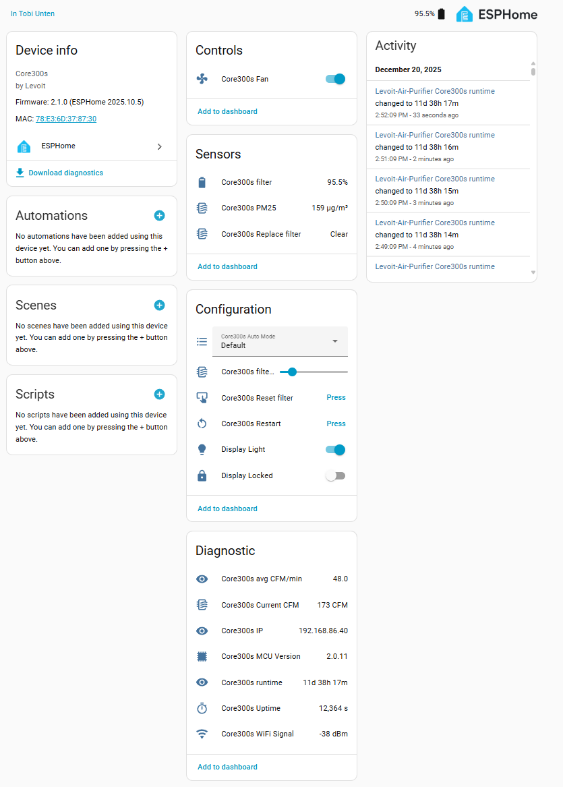
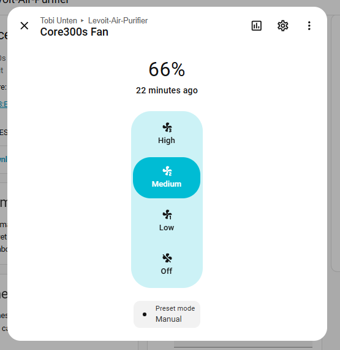
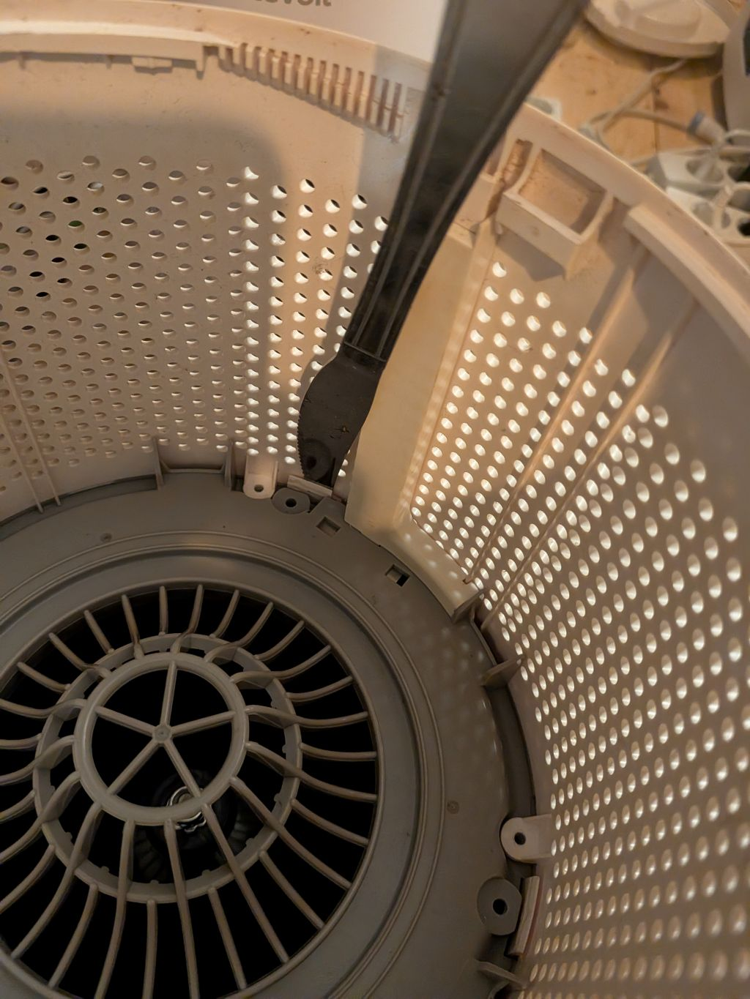
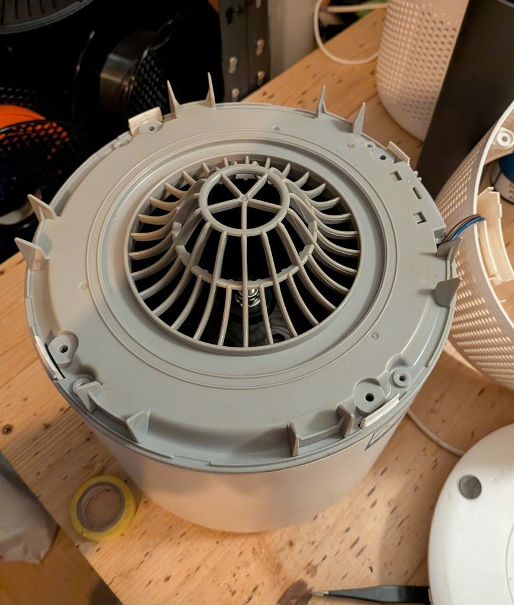
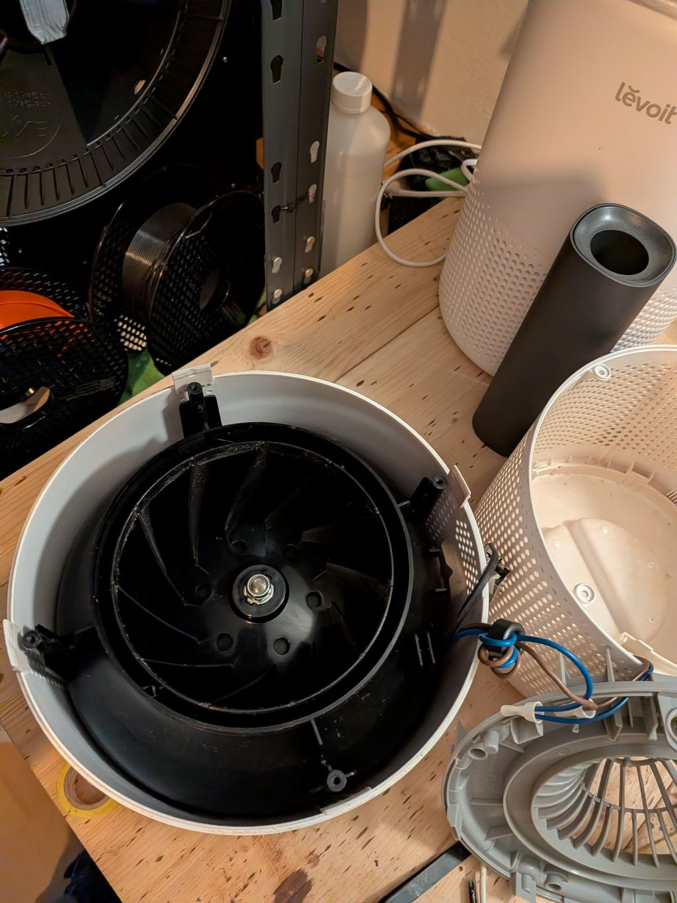
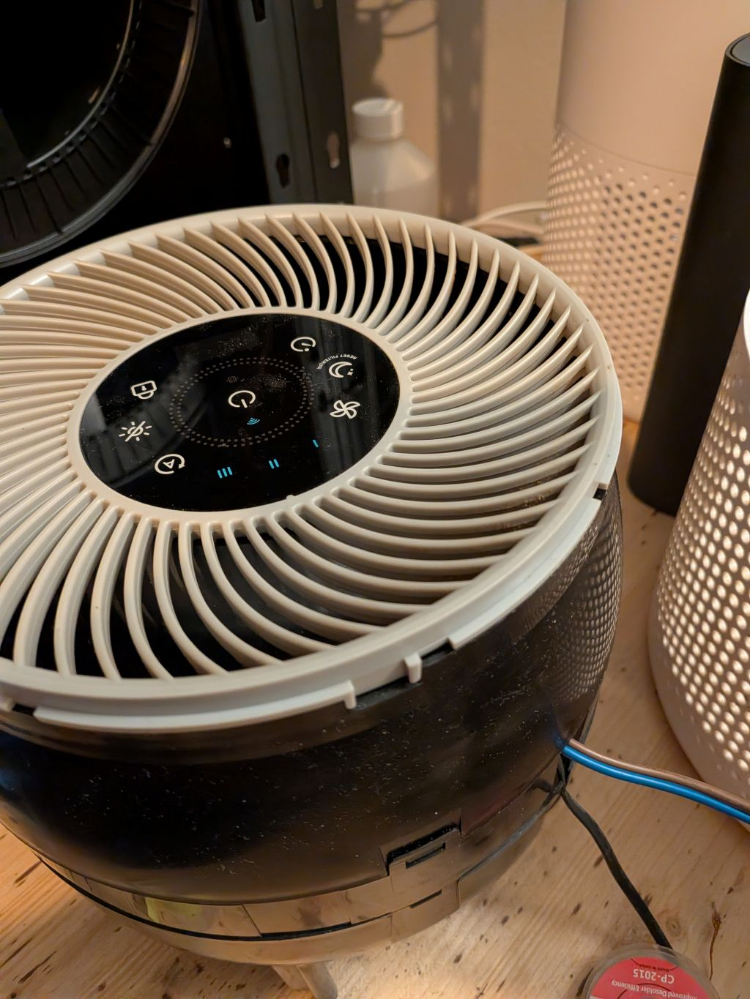
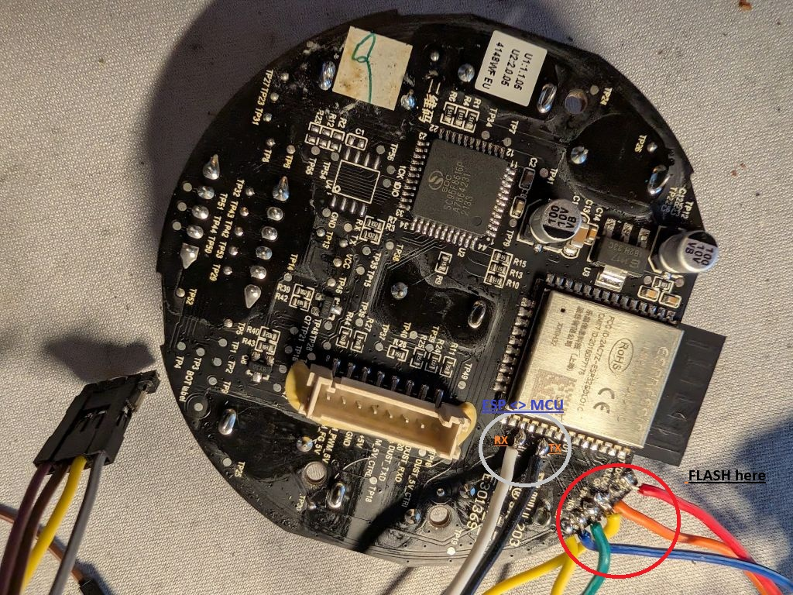
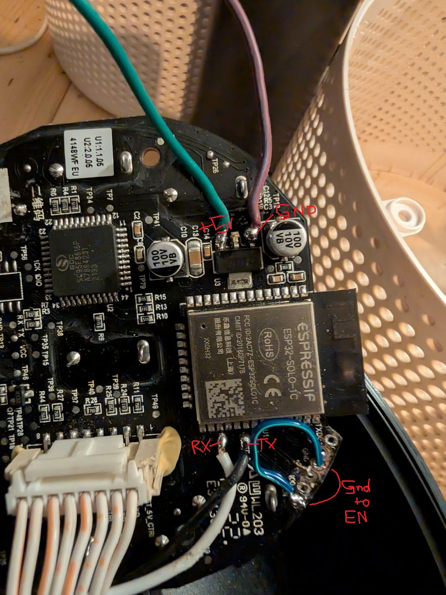
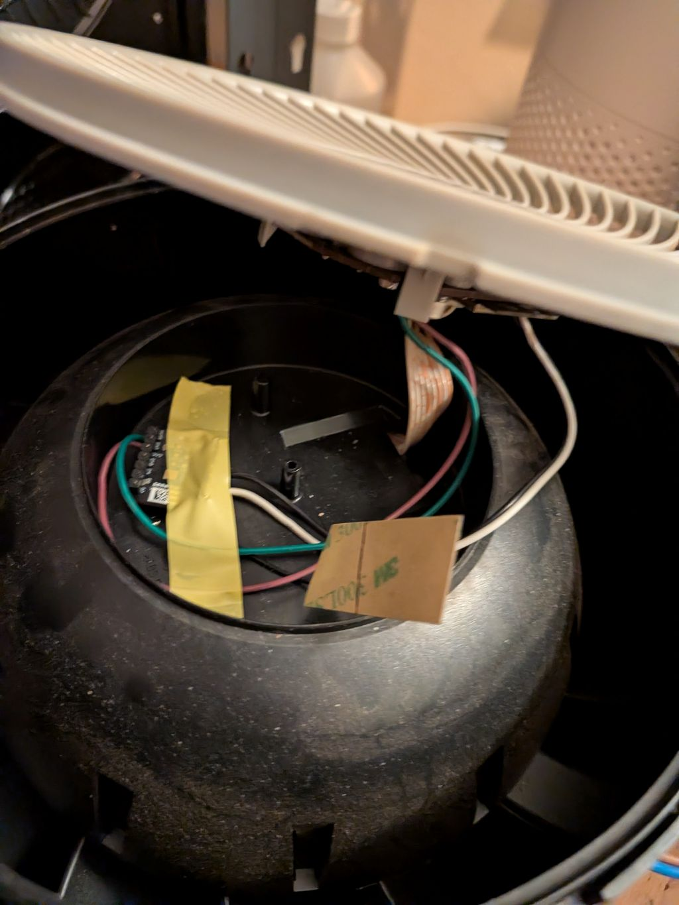

[← Back](../../README.md)

# Levoit Core 300S - Custom Firmware (ESPHome)

## Quick Facts

| Item | Value |
|------|-------|
| Model | Core 300S |
| Tested MCU FW | 2.0.7, 2.0.11 |
| ESP Module | ESP32-SOLO-1C |
| Board | CORE300S Ctrl Board V1.4.1 |
| Fan Speeds | 3 |
| CADR (spec) | 214 m³/h |
| Room Size | 9–50 m² (97–538 ft²) |
| ESPHome | 2026.1.2+ |
| PM Sensor | PM2008MS  |

## Features

| Feature | Type | Notes |
|---------|------|-------|
| Fan | fan | 3 speeds, presets: Manual / Auto / Sleep |
| Auto Mode | select | Default / Quiet / Room Size |
| Auto Mode Room Size | number | 9–50 m² |
| Display | switch | Toggle LED display |
| Child Lock | switch | |
| PM2.5 | sensor | µg/m³ |
| AQI | sensor | As reported by MCU |
| Current CADR | sensor | m³/h, updated every 5s |
| Filter Life Left | sensor | % remaining |
| Filter Low | binary_sensor | On when < 5% |
| Filter Lifetime | number | Configurable in months |
| Reset Filter Stats | button | Resets CADR/runtime counters |
| Timer | number | Run timer in minutes |
| MCU Version | text_sensor | |
| Error | text_sensor | "Ok" or "Sensor Error" |






## Teardown / Disassembly

* Place upside down, remove base cover and filter to expose 8 screws (4 have washers)
* Remove all 8 screws — they are soft metal, do not overtighten when reassembling
* Slide a pry tool between the tabs to separate base and top sleeve
* Unplug the logic board










## Flash Original ESP32

### Prerequisites

Solder wires to **TXD0, RXD0, IO0, +3V3, GND** near the ESP32 on the logic board and connect to a USB-UART converter. On some boards these are through-holes and soldering may not be needed.

Connect **IO0 to GND before powering on** to enter bootloader mode.



For flashing you only need to solder to the pin header, the black and white are connected to dump esp to mcu communication 

### Backup Existing Firmware

```bash
esptool read_flash 0 ALL levoit-core300s-backup.bin
```

> Note: backup may fail on some boards — proceed at your own risk.

### Configure

1. Copy `secrets-example.yaml` → `secrets.yaml` and fill in your Wi-Fi and encryption key
2. Adjust the device name in the config if running multiple units
3. Check the [component README](../../components/levoit/README.md) for UART pin mapping per board

### Flash

```bash
esphome run levoit-core300s.yaml
```

Reassemble and enjoy!

### ESPHome Web Builder / Dashboard

Use the pre-generated builder yaml to flash without a local clone — all config is inlined, no `!include` or packages needed:

| File | Board |
|------|-------|
| `levoit-core300s-builder.yaml` | original ESP32-SOLO-1C |
| `levoit-core300s-builder-c3.yaml` | ESP32-C3 replacement |
| `levoit-core300s-builder-s3.yaml` | ESP32-S3 replacement |

Upload to the [ESPHome web builder](https://builder.esphome.io) or paste into the ESPHome dashboard. Regenerate with `.\make-builder-yaml.ps1` from the `devices/` folder.

### Restore Original Firmware

```bash
esptool erase_flash
esptool write_flash 0x00 levoit-core300s-backup.bin
```

## Install New ESP32 (Recommended)

Replacing the original ESP32 allows switching back to original firmware without re-flashing and makes future updates easier.

**Recommended modules** (compact and reliable):
- Seeed XIAO ESP32-C3
- Seeed XIAO ESP32-S3 (overkill but works)

**Wiring:** 4 wires — `+3.3V`, `GND`, `RX`, `TX`

> The RX/TX pads are **not** on the pin header — use the test pads near the original ESP32 on the board.
> Pull the `EN` pin of the original ESP32 to GND to disable it.



**Placement of new ESP**

The small xiao seeeds fit into the small existing space, make sure to isolate and solder the connections.

I connected to 5V, cause i had issues on the 3.3v with my xioa seeed s3. It rebooted with brownout (power issues). I think my en to gnd connection might not have been stable but still decided to use 5V.

