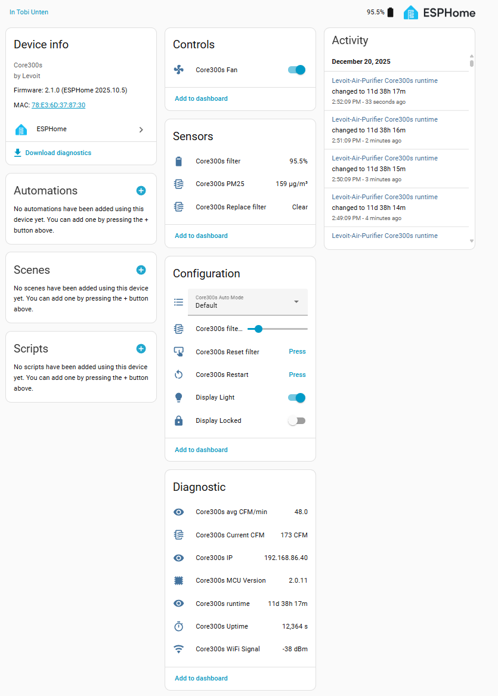
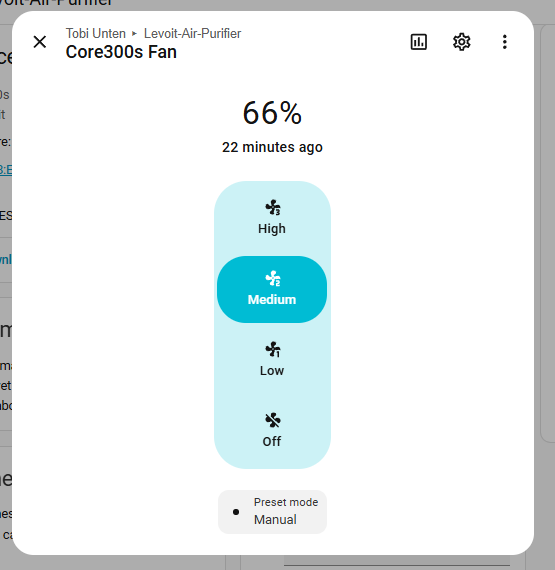
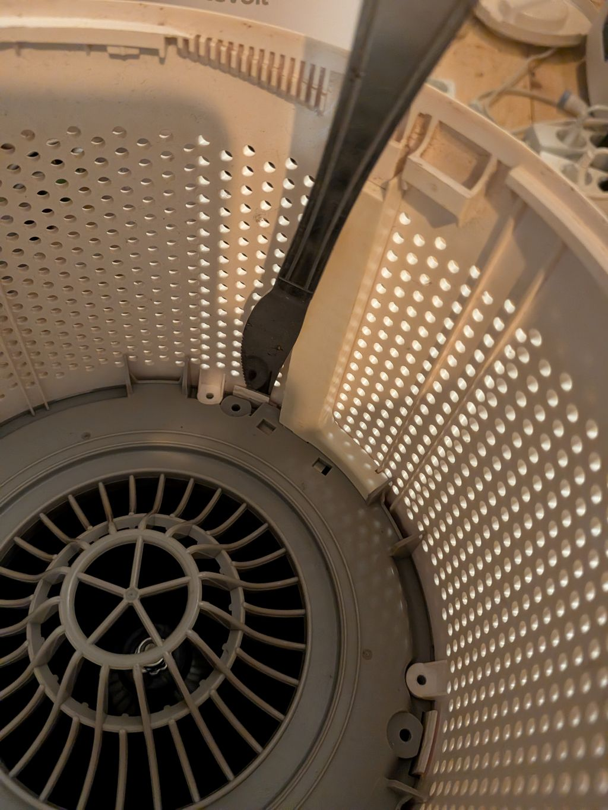
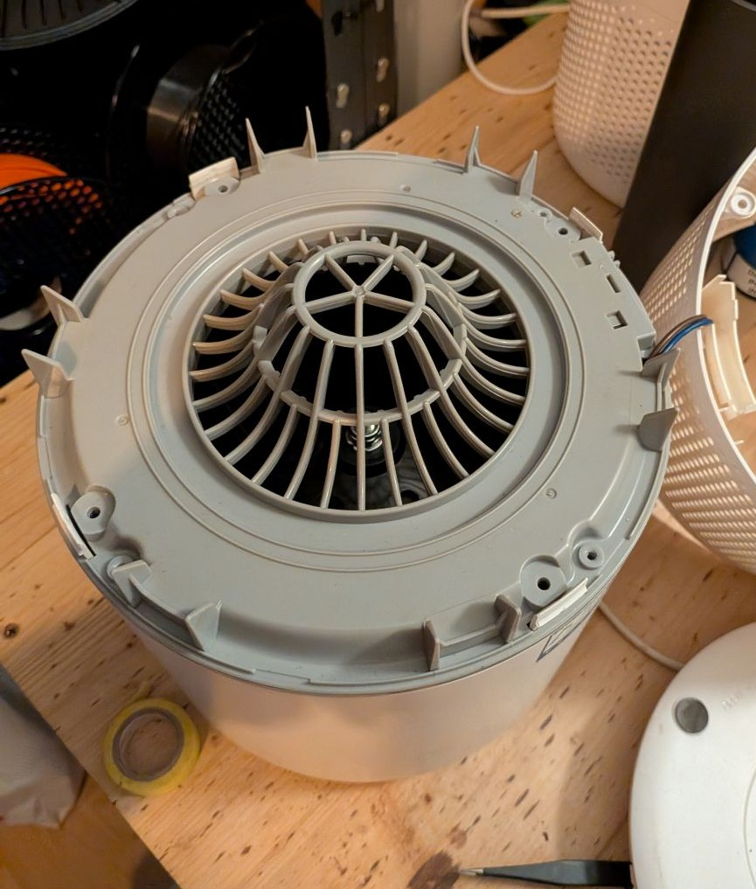
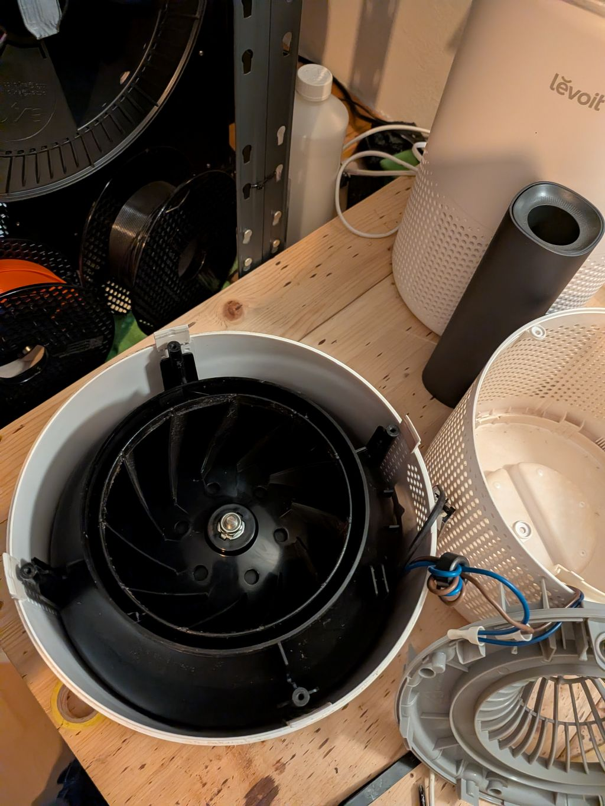
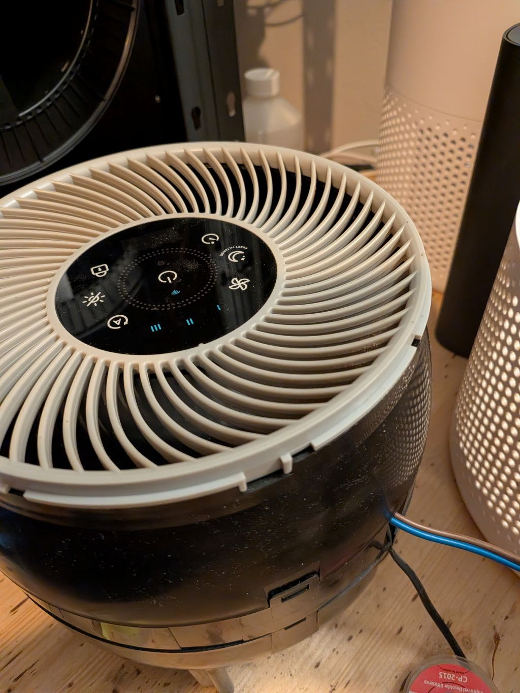
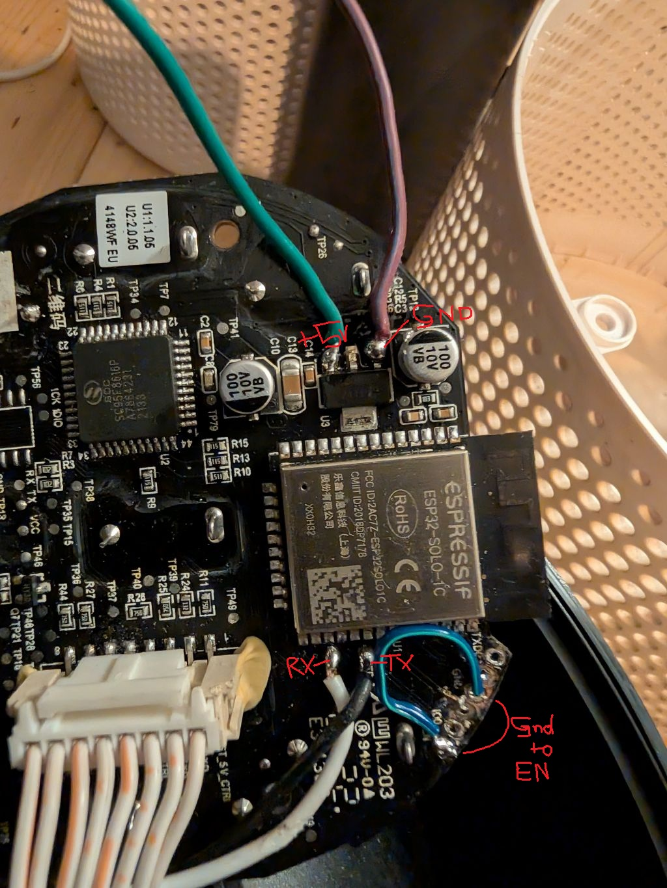
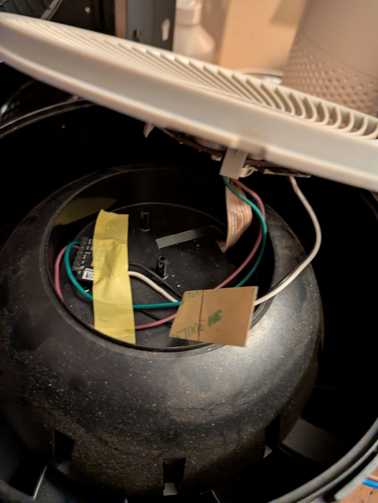
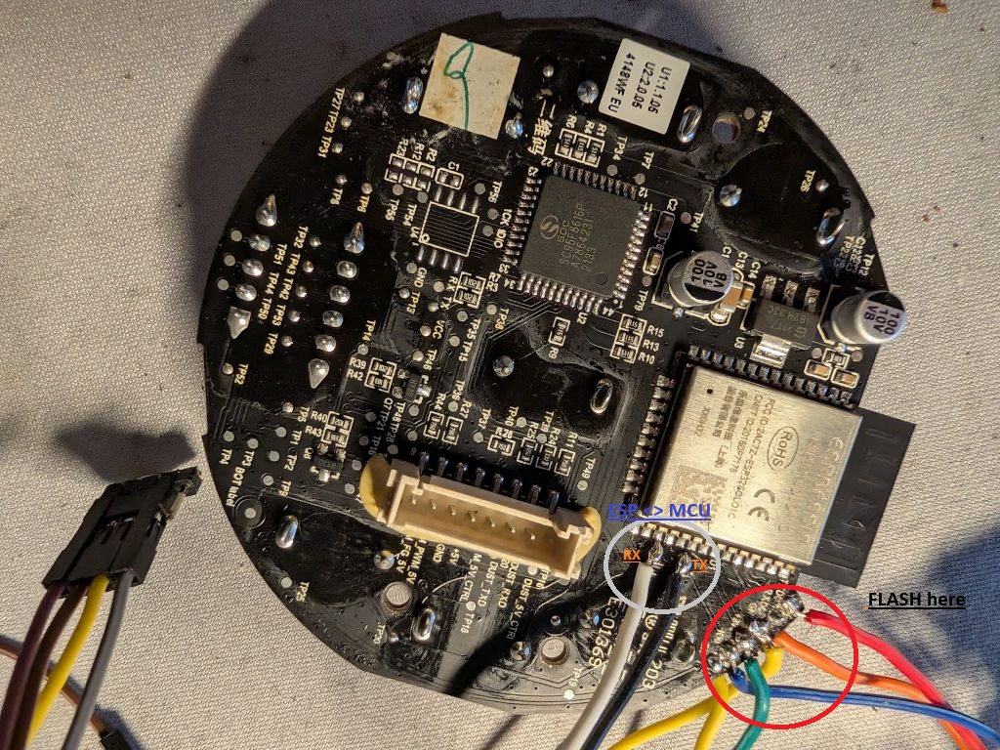

[← Back](../../README.md)

# Levoit Core 300S - Custom Firmware (ESPHome)

## Quick Facts

| Item | Value |
|------|-------|
| Model | Core 300S |
| Tested MCU FW | 2.0.7, 2.0.11 |
| ESP Module | ESP32-SOLO-1C |
| Board | CORE300S Ctrl Board V1.4.1 |
| Fan Speeds | 3 |
| CADR (spec) | 214 m³/h |
| Noise | 24–50 dB |
| Room Size | 9–50 m² (97–538 ft²) |
| ESPHome | 2026.5.3+ |
| PM Sensor | PM2008MS |

## Features

| Feature | Type | Notes |
|---------|------|-------|
| Fan | fan | 3 speeds, presets: Manual / Auto / Sleep |
| Auto Mode | select | Default / Quiet / Room Size |
| Auto Mode Room Size | number | 9–50 m² |
| Display | switch | Toggle LED display |
| Child Lock | switch | |
| PM2.5 | sensor | µg/m³ |
| AQI | sensor | As reported by MCU |
| Current CADR | sensor | m³/h, updated every 5s |
| Filter Life Left | sensor | % remaining |
| Filter Low | binary_sensor | On when < 5% |
| Filter Lifetime | number | Configurable in months |
| Reset Filter Stats | button | Resets CADR/runtime counters |
| Timer | number | Run timer in minutes |
| MCU Version | text_sensor | |
| Error | text_sensor | "Ok" or "Sensor Error" |






## Teardown / Disassembly

There are three ways onto this device, in rough order of how much you have to
take apart:

| Route | Teardown | Notes |
|-------|----------|-------|
| [Over the air](#flash-over-the-air--no-disassembly-third-party) | **none** | Third-party proof of concept, hijacks the stock OTA over the LAN |
| [Install a new ESP32](#install-new-esp32-recommended) | full | Recommended — keeps the original module intact and reversible |
| [Flash the original ESP32](#flash-original-esp32) | full + soldering | Smallest parts count, hardest to undo |

The rest of this section covers getting the unit open, needed for the latter two.

* Place upside down, remove base cover and filter to expose 8 screws (4 have washers)
* Remove all 8 screws — they are soft metal, do not overtighten when reassembling
* Slide a pry tool between the tabs to separate base and top sleeve
* Unplug the logic board









## Install New ESP32 (Recommended)

Replacing the original ESP32 allows switching back to original firmware without re-flashing and makes future updates easier.

**Recommended modules** (compact and reliable):
- Seeed XIAO ESP32-C3
- Seeed XIAO ESP32-S3 (overkill but works)

**Wiring:** 4 wires — `+3.3V`, `GND`, `RX`, `TX`

> The RX/TX pads are **not** on the pin header — use the test pads near the original ESP32 on the board.
> Pull the `EN` pin of the original ESP32 to GND to disable it.



**Placement of new ESP**

The small xiao seeeds fit into the small existing space, make sure to isolate and solder the connections.

I connected to 5V, cause i had issues on the 3.3v with my xioa seeed s3. It rebooted with brownout (power issues). I think my en to gnd connection might not have been stable but still decided to use 5V.



## Flash Over the Air — No Disassembly (third-party)

[**nico202/levoit-core300s-ota-wifi-flash**](https://github.com/nico202/levoit-core300s-ota-wifi-flash)
gets ESPHome onto the **stock ESP32 without opening the unit or soldering
anything**, by hijacking the device's own firmware update. It is the only route
documented for this model that needs no teardown at all.

It is a **proof of concept by a third party**, not tested by this project. It
worked on a Core 300S EU with stock `mainFw` 1.1.08, upgraded to 2.0.00.

### Why it works

* The purifier is told by the VeSync cloud to fetch an update, and then makes a
  **plain HTTP GET** for the firmware
* A VeSync OTA file is a **128-byte header** (MD5, name, version, region)
  followed by a raw ESP32 application image
* There is **no firmware signature and Secure Boot is disabled**, so an image
  wrapped in that container is accepted

### How it goes

1. Build an ESPHome image and wrap it in the VeSync OTA container
2. Serve it from a Linux box on the same subnet as the purifier
3. Redirect the device's HTTP firmware fetch to that server, and block its HTTPS
   to the vendor's firmware host so it cannot get the genuine binary. The device
   stays connected to the real cloud throughout
4. Trigger an update from the VeSync app or API
5. The purifier reboots into the ESPHome fallback access point; enter Wi-Fi
   credentials, and from then on updates are ordinary ESPHome OTA

### What you need

* A Linux machine with root on the same network — a Raspberry Pi is suggested
* Python 3, `iptables`, and `scapy` or `dsniff`/`arpspoof`
* ESPHome, via pip or Docker
* A VeSync account with the device added; `pyvesync` optionally, for CLI cloud
  queries

### Caveats

* **The version string in the header must match exactly** what the cloud
  announces, or the device aborts partway through the update
* **Intercepting network traffic you do not own may be illegal where you live.**
  Only do this to your own hardware
* It may void your warranty, and the author offers no warranty of their own
* A proof of concept — if it goes wrong mid-flash you are back to the soldered
  route below to recover

MIT licensed. Credits acvigue, mulcmu, tuct, epicRE, and the pyvesync and
ESPHome communities.

## Flash Original ESP32

### Prerequisites

Solder wires to **TXD0, RXD0, IO0, +3V3, GND** near the ESP32 on the logic board and connect to a USB-UART converter. On some boards these are through-holes and soldering may not be needed.

Connect **IO0 to GND before powering on** to enter bootloader mode.



For flashing you only need to solder to the pin header, the black and white are connected to dump esp to mcu communication 

### Backup Existing Firmware

```bash
esptool read_flash 0 ALL levoit-core300s-backup.bin
```

> Note: backup may fail on some boards — proceed at your own risk.

### Configure

1. Copy `secrets-example.yaml` → `secrets.yaml` and fill in your Wi-Fi and encryption key
2. Adjust the device name in the config if running multiple units
3. Check the [component README](../../components/levoit/README.md) for UART pin mapping per board

### Flash

```bash
esphome run levoit-core300s.yaml
```

Reassemble and enjoy!

### ESPHome Web Builder / Dashboard

Use the pre-generated builder yaml to flash without a local clone — all config is inlined, no `!include` or packages needed:

| File | Board |
|------|-------|
| `levoit-core300s-builder.yaml` | original ESP32-SOLO-1C |
| `levoit-core300s-builder-c3.yaml` | ESP32-C3 replacement |
| `levoit-core300s-builder-s3.yaml` | ESP32-S3 replacement |

Upload to the [ESPHome web builder](https://builder.esphome.io) or paste into the ESPHome dashboard. Regenerate with `.\make-builder-yaml.ps1` from the `devices/` folder.

### Restore Original Firmware

```bash
esptool erase_flash
esptool write_flash 0x00 levoit-core300s-backup.bin
```

## Related — the non-smart Core 300 variants

This guide covers the **Core 300S**, the Wi-Fi model with an ESP32 and a control MCU
on a UART link. The plain **Core 300** and **Core 300-P** have no Wi-Fi and no MCU
link, so the `levoit` component does not apply to them — they need the controller
replaced instead:

| Variant | Route | Link |
|---------|-------|------|
| Core 300-P | Ready-made ESP32-C6 replacement controller running ESPHome. Reuses the stock fan controller and power supply; adds 4-speed fan control, 14 WS2815B RGB LEDs and 3 spare GPIOs for air-quality or VOC add-ons. **Check the Intertek model number on the back (5014566 vs 5030453) before ordering** — the wrong variant may need the cable connections re-soldered. | [Silo City Labs ↗](https://shop.silocitylabs.com/products/core300-p) |
| Core 300 | DIY: an ESP32 wired straight to the fan-speed lines, exposed as 3 interlocked GPIO switches. No MCU, no UART, no sensors. | [Reddit write-up ↗](https://www.reddit.com/r/homeassistant/comments/1rqz9gq/turned_a_broken_dumb_air_purifier_into_a_smart/) |
