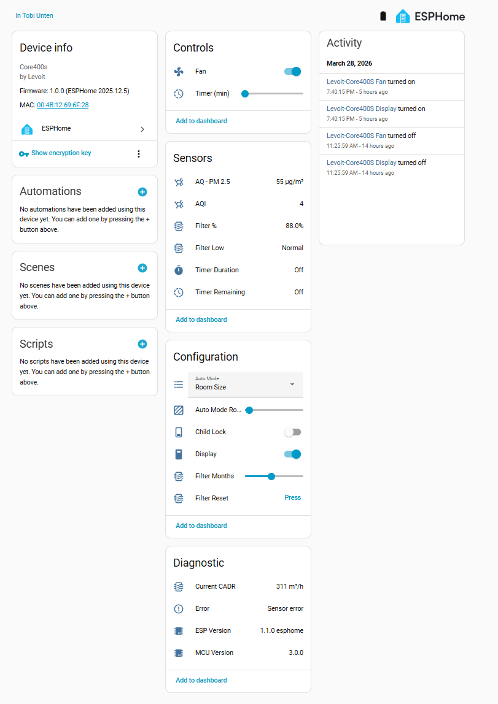
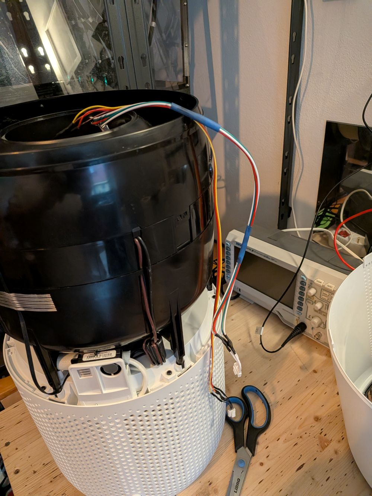
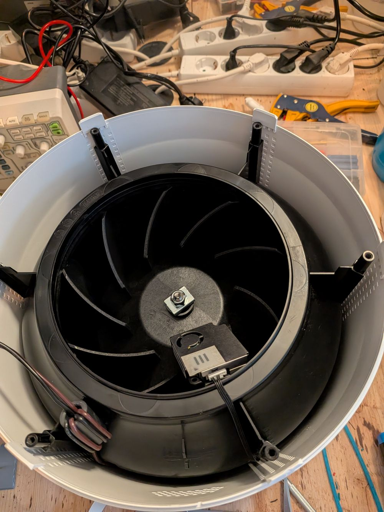
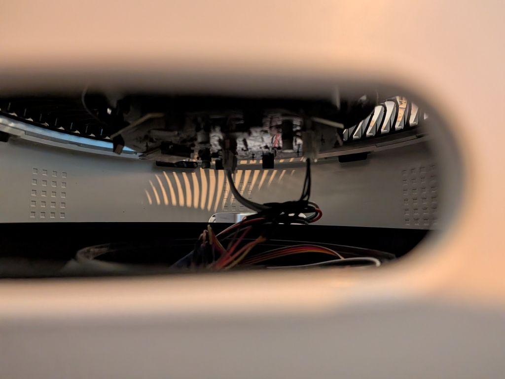
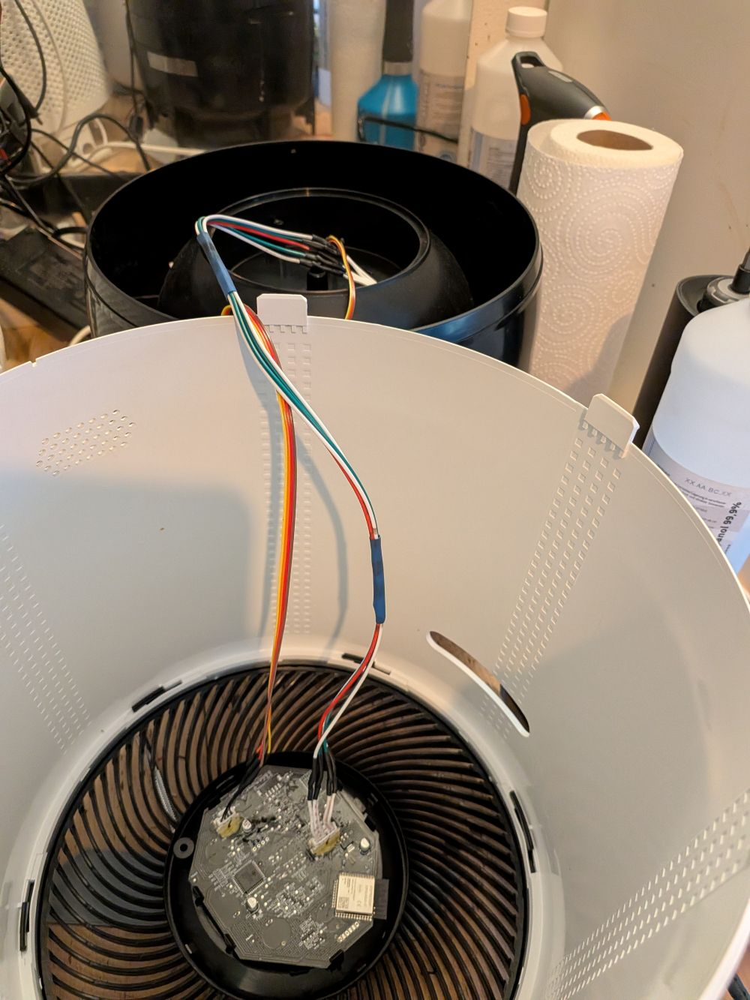
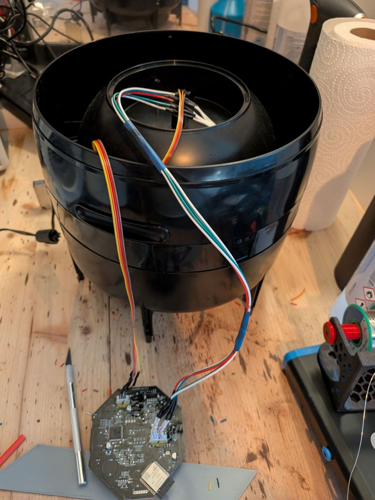

[← Back](../../README.md)

# Levoit Core 400S - Custom Firmware (ESPHome)

Started from community projects ([acvigue](https://github.com/acvigue/esphome-levoit-air-purifier), [mulcmu](https://github.com/mulcmu/esphome-levoit-core300s)) and evolved into a generic Levoit ESPHome component for Core/Vital models.

## Quick Facts

| Item | Value |
|------|-------|
| Model | Core 400S |
| Tested MCU FW | 3.0.0 |
| ESP Module | ESP32-SOLO-1C |
| Board | CORE400S Ctrl V1.2 |
| Fan Speeds | 4 |
| CADR (spec) | 415 m³/h |
| Room Size | 9–83 m² (97–894 ft²) |
| ESPHome | 2026.1.2+ |
| PM Sensor | PM2008MS  |

## Features

| Feature | Type | Notes |
|---------|------|-------|
| Fan | fan | 4 speeds, presets: Manual / Auto / Sleep |
| Auto Mode | select | Default / Quiet / Room Size |
| Auto Mode Room Size | number | 9–83 m² |
| Display | switch | Toggle LED display |
| Child Lock | switch | |
| PM2.5 | sensor | µg/m³ |
| AQI | sensor | As reported by MCU |
| Current CADR | sensor | m³/h, updated every 5s |
| Filter Life Left | sensor | % remaining |
| Filter Low | binary_sensor | On when < 5% |
| Filter Lifetime | number | Configurable in months |
| Reset Filter Stats | button | Resets CADR/runtime counters |
| Timer | number | Run timer in minutes |
| MCU Version | text_sensor | |
| Error | text_sensor | "Ok" or "Sensor Error" |



## Teardown / Disassembly

Very similar to Core 300S but the PCB needs to be unclipped from the carry holes after removing the filter and filter housing.

* Place upside down, remove base cover and filter to expose 8 screws (4 have washers)
* Remove all 8 screws — they are soft metal, do not overtighten when reassembling
* Slide a pry tool between the tabs to separate base and top sleeve
* Unplug the logic board (use a screwdriver or kitchen knife from the side)
* Remove the fan unit to access the logic board

I had to use extended wires for re-assembly, did not find another way!












### J1 Debug Header Pinout

| Pin | Signal |
|-----|--------|
| 1 | TX |
| 2 | RX |
| 3 | GND |
| 4 | 3.3V |
| 5 | IO0 |
| 6 | EN |


## Flash Original ESP32

### Prerequisites

Connect to the J1 debug header (or solder to TXD0/RXD0/IO0/+3V3/GND) with a USB-UART converter (3.3V TTL).

Connect **IO0 to GND before powering on** to enter bootloader mode.

### Backup Existing Firmware

```bash
esptool read_flash 0 ALL levoit-core400s-backup.bin
```

> Note: may fail if watchdog-protected. Try while the PCB is externally powered.

### Configure

1. Copy `secrets-example.yaml` → `secrets.yaml` and fill in your Wi-Fi and encryption key
2. Adjust the device name in the config if running multiple units
3. Check the [component README](../../components/levoit/README.md) for UART pin mapping per board

### Flash

```bash
esphome run levoit-core400s-c3.yaml
```

Reassemble and enjoy!

### Restore Original Firmware

```bash
esptool erase_flash
esptool write_flash 0x00 levoit-core400s-backup.bin
```

## Install New ESP32 (Recommended)

Replacing the original ESP32 lets you keep the original firmware intact and switch back easily.

**Recommended modules:**
- Seeed XIAO ESP32-C3
- Seeed XIAO ESP32-S3

**Wiring:** 4 wires — `+3.3V`, `GND`, `RX`, `TX`

> The RX/TX pads are **not** on the pin header — use the test pads near the original ESP32 on the board.
> Pull the `EN` pin of the original ESP32 to GND to disable it.

> TODO: add wiring photos and placement photos
