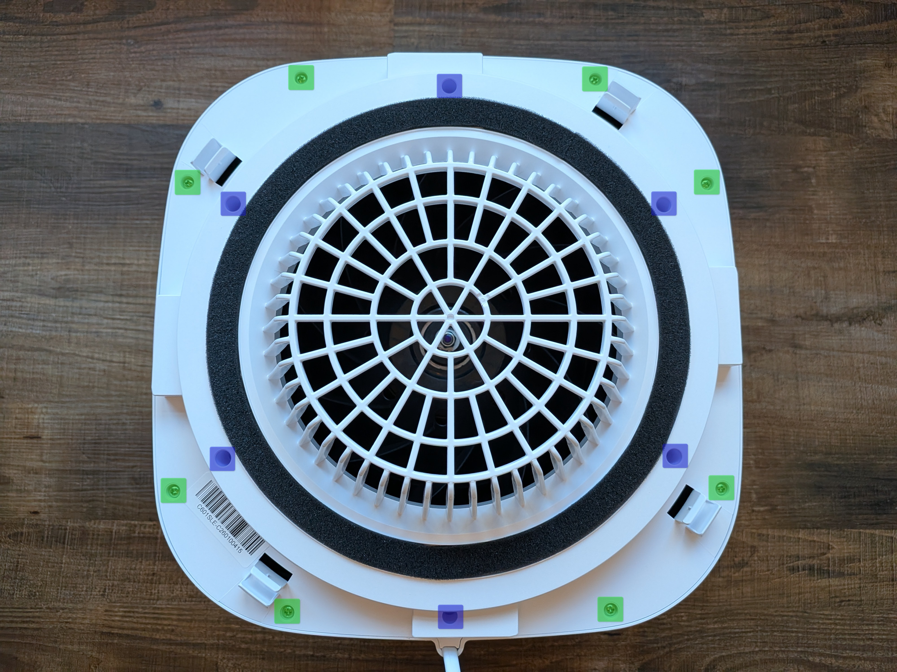
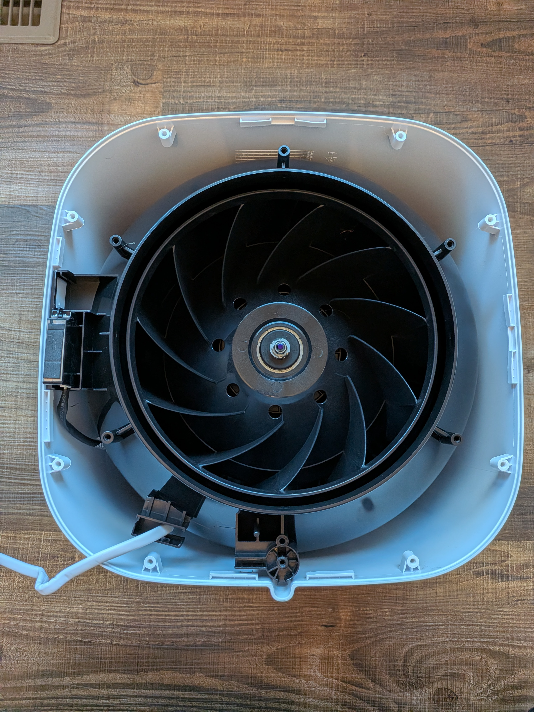
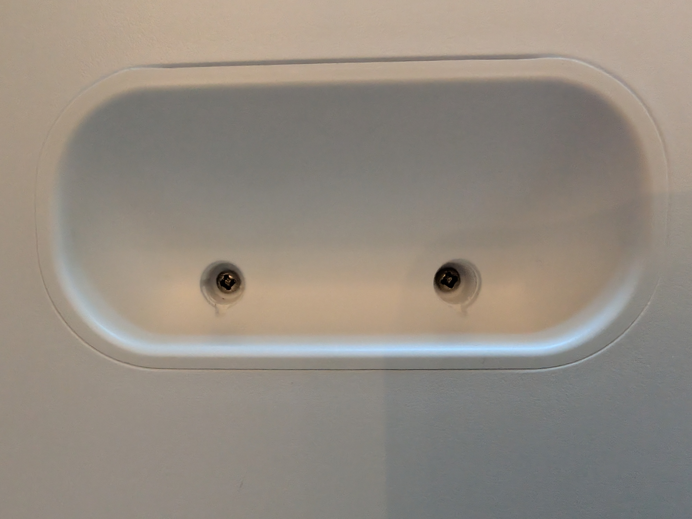
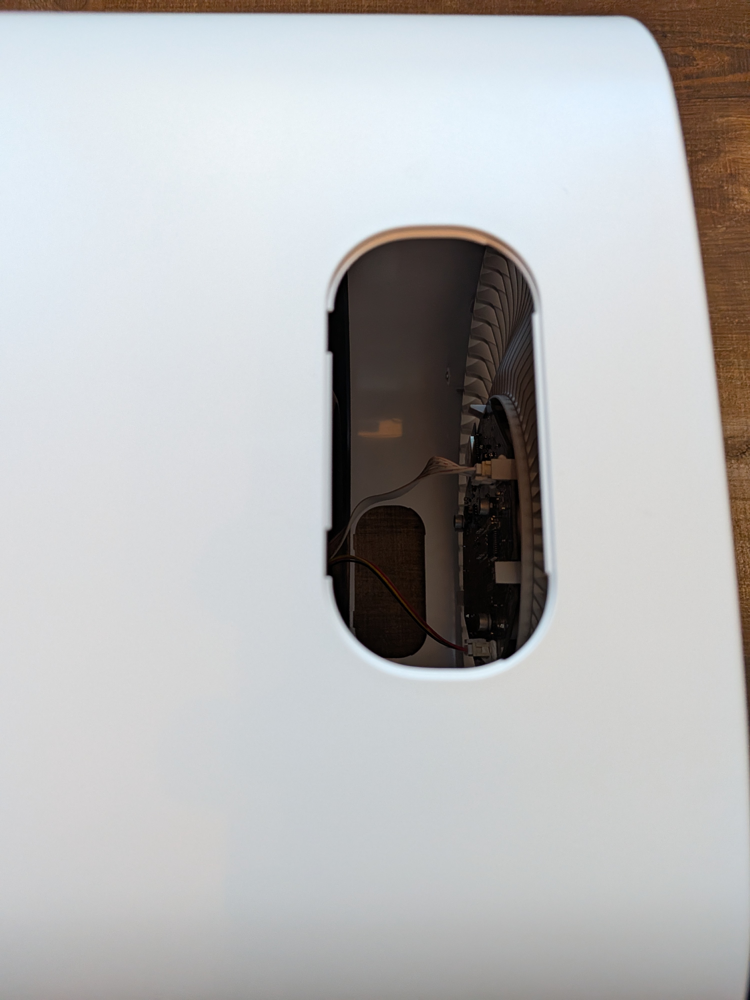
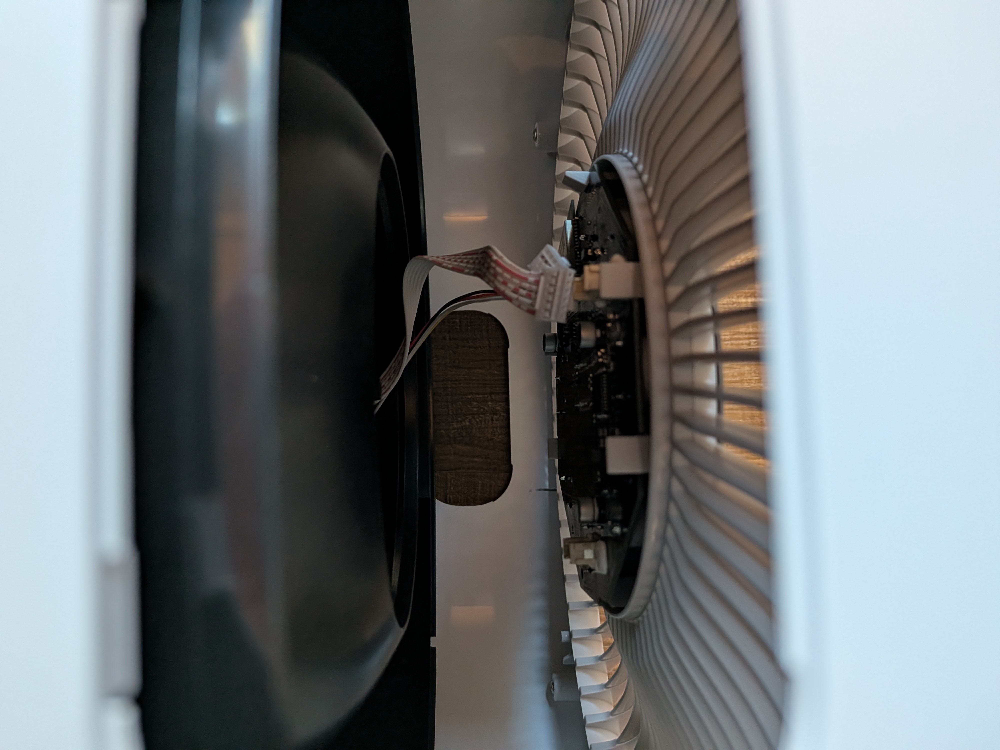
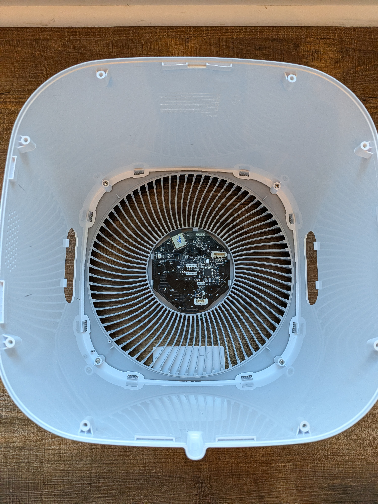
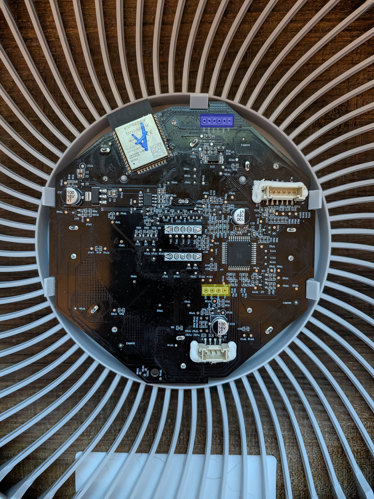

[← Back](../../README.md)

# Levoit Core 600S - Custom Firmware (ESPHome)

## Quick Facts

| Item | Value |
|------|-------|
| Model | Core 600S |
| Tested MCU FW | 2.0.01 |
| ESP Module | ESP32-C3-SOLO-1 |
| Fan Speeds | 4 |
| CADR (spec) | 641 m³/h |
| Room Size | 9–147 m² (97–1,582 ft²) |
| ESPHome | 2026.1.2+ |
| PM Sensor | Luftme LD15  |

## Features

| Feature | Type | Notes |
|---------|------|-------|
| Fan | fan | 4 speeds, presets: Manual / Auto / Sleep |
| Auto Mode | select | Default / Quiet / Room Size / ECO |
| Auto Mode Room Size | number | 9–147 m² |
| Display | switch | Toggle LED display |
| Child Lock | switch | |
| Light Detect | switch | Auto-dims display when ambient light is low |
| PM2.5 | sensor | µg/m³ |
| AQI | sensor | As reported by MCU |
| Current CADR | sensor | m³/h, updated every 5s |
| Filter Life Left | sensor | % remaining |
| Filter Low | binary_sensor | On when < 5% |
| Filter Lifetime | number | Configurable in months |
| Reset Filter Stats | button | Resets CADR/runtime counters |
| Timer | number | Run timer in minutes |
| MCU Version | text_sensor | |
| Error | text_sensor | "Ok" or "Sensor Error" |

## Teardown / Disassembly

> TODO: add teardown steps and photos

## Wiring New ESP

> TODO: add wiring photos and pin mapping

## Flash

### Prerequisites

The Core 600S uses an **ESP32-C3-SOLO-1** on the original board. It is recommended to replace it with a new ESP module.

**Recommended modules:**
- Seeed XIAO ESP32-C3
- Seeed XIAO ESP32-S3

### Configure

1. Copy `secrets-example.yaml` → `secrets.yaml` and fill in your Wi-Fi and encryption key
2. Choose the config matching your replacement module

### Flash

```bash
esphome run levoit-core600s-c3.yaml
```

```bash
esphome run levoit-core600s-s3.yaml
```

### ESPHome Web Builder / Dashboard

Use the pre-generated builder yaml to flash without a local clone — all config is inlined, no `!include` or packages needed:

| File | Board |
|------|-------|
| `levoit-core600s-builder-solo-1c.yaml` | original ESP32-SOLO-1C |
| `levoit-core600s-builder-c3.yaml` | ESP32-C3 replacement |
| `levoit-core600s-builder-s3.yaml` | ESP32-S3 replacement |

Upload to the [ESPHome web builder](https://builder.esphome.io) or paste into the ESPHome dashboard. Regenerate with `.\make-builder-yaml.ps1` from the `devices/` folder.

### Backup Existing Firmware

```bash
esptool read_flash 0 ALL levoit-core600s-backup.bin
```

### Restore Original Firmware

```bash
esptool erase_flash
esptool write_flash 0x00 levoit-core600s-backup.bin
```

## Teardown / Disassembly

Remove the base and filter from the upper assembly. Turn upside down.



Remove the screws highlighted in green. You can also remove the screws highlighted in blue to remove the fan grille and gasket piece to make removing the fan less unwieldy. In that case, the PM2.5 sensor will be lose so be careful.



To release the fan, remove the screws hidden behind plastic plugs in each of the handle.



Then pop the handles out and carefully slide the fan assembly out slightly. There are a couple of cables connecting to the control board which is clipped into the top fan grille. Luckily the holes left by the handles make it relatively easy to unplug these from the connectors on the control board.



Carefully unplug these cables before pulling the fan assembly out.



That will get you access to flash the ESP32.



They were nice enough to silkscreen the ESP32 programming header on both sides so you don't even need to remove the board from the case if you don't want to. Make note of which ESP32 you have if you're not going to replace it. **ESP32-C3-SOLO-1** and **ESP32-SOLO-1C** have been found so far.

The header for the ESP32 is highlighted in blue. Connect your UART adapter here, making sure you get TX and RX the right way around. TX and RX on this board are TX and RX of the ESP32. Sometimes they're labeled to match your adapter. Note that it's **3V3** *not 5V*.

The header for the microvontroller is highlighted in yellow. This is not what you're looking for if you're looking to flash esphome.



## Protocol Notes

Same UART protocol as Core 300S/400S with these differences:

- Status push: `CMD=01 40 41` (vs `B0 40` / `30 40` on 300S/400S)
- ACK uses `0x52` response type (not `0x12`) with trailing byte `0x01`
- Light Detect command: `CMD=01 E9 A5` PAY=`01`/`00`
- 4 Auto Mode options: Default (`00`), Quiet (`01`), Room Size (`02` + room_size LE), ECO (`03`)
- Status byte layout: display `[8]`, AQI `[11]`, PM2.5 `[12-13]`, child lock `[14]`, auto mode `[15]`, room size `[16-17]`, light detect `[21]`
- Room size encoding: raw = sq_ft × 3.15 (MCU uses scaled sq ft)
