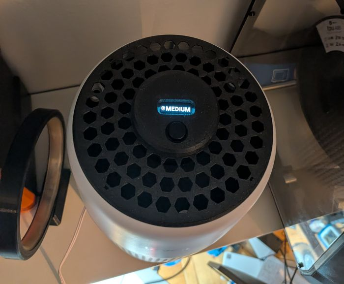
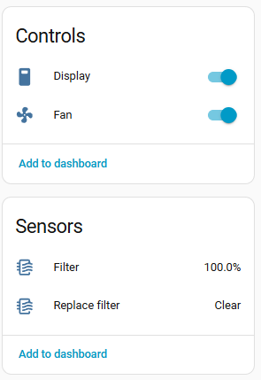
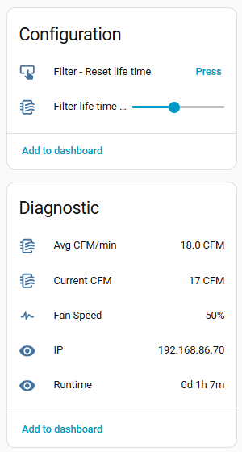
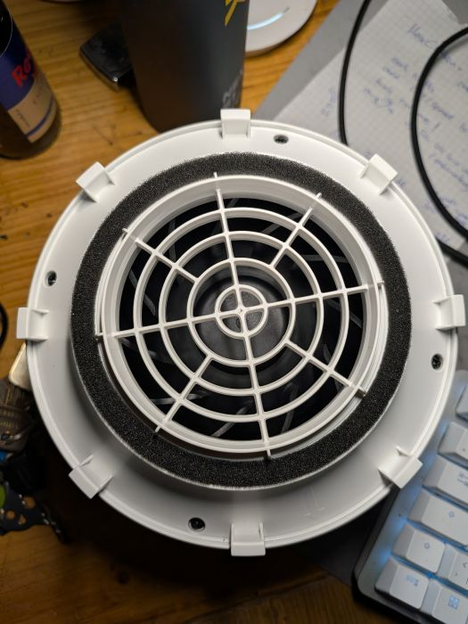
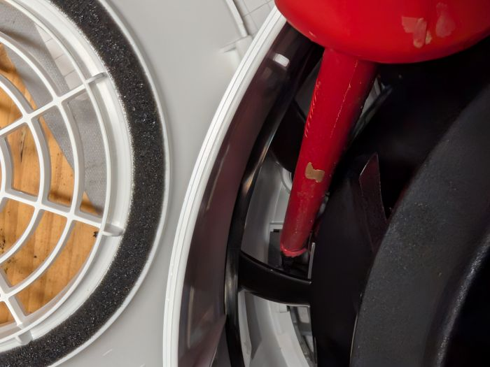
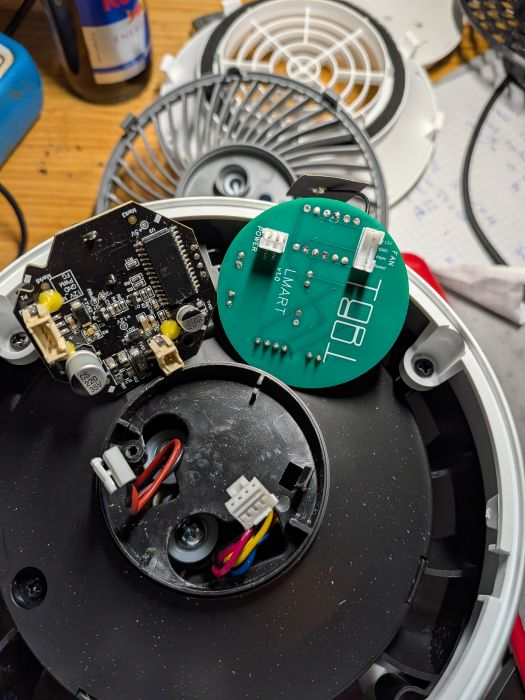
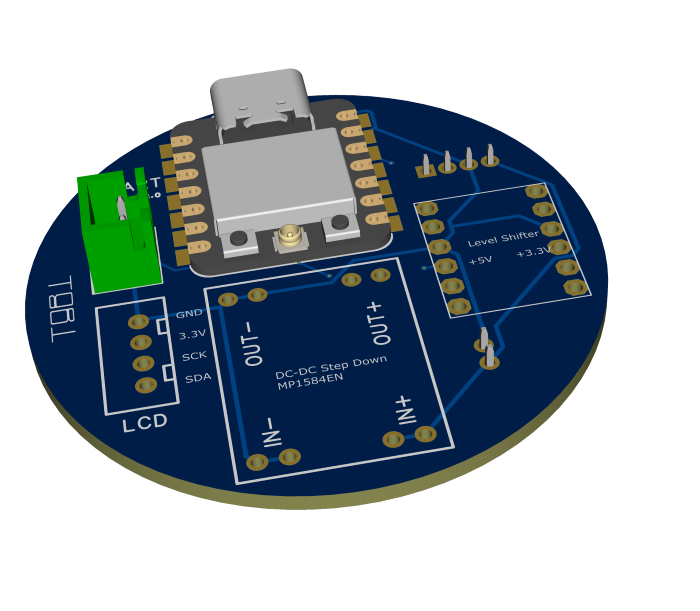
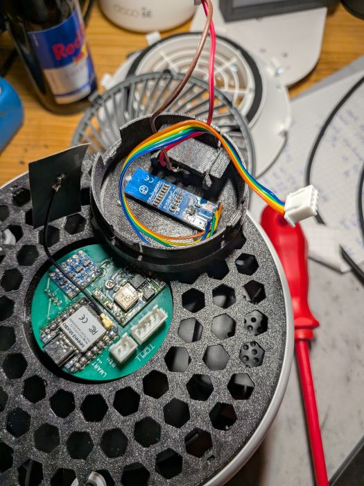
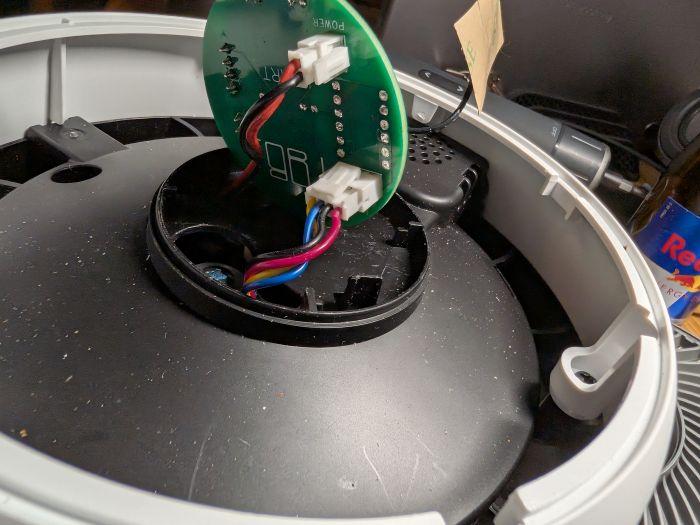
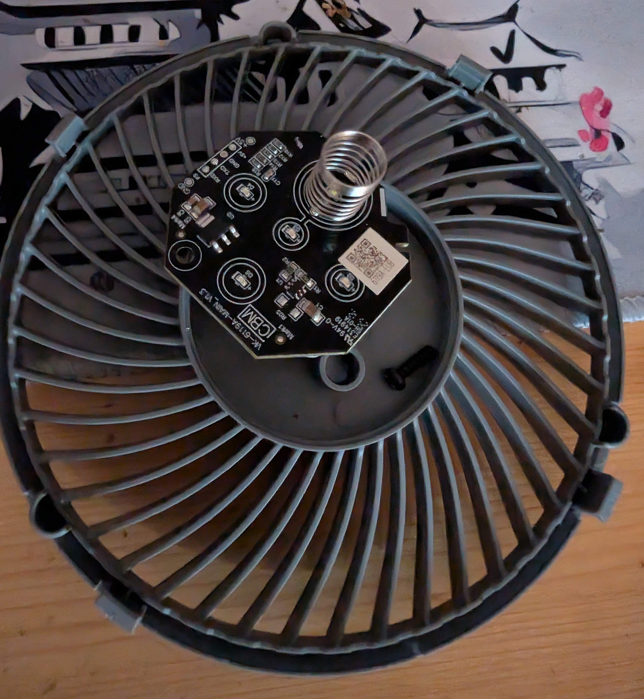

[← Back](../README.md)

# Levoit Mini - Custom PCB & ESPHome Firmware

Custom PCB, 3D-printed parts, and ESPHome-based firmware to add smart home integration to the Levoit Mini Air Purifier without destroying the original device.

## Features

* **Non-Destructive Modification** – Fully reversible; original PCB is completely bypassed, not removed
* **Home Assistant Integration** – Native fan integration with multiple speed presets
  * 3 speeds: 33%, 66%, 100%
  * Manual, Sleep (25% speed), and Auto (requires PM2.5 sensor for AQI feedback)
  * Configurable filter lifetime (1-12 months based on usage/pollution)
* **Performance Monitoring**
  * Real-time fan speed and CFM (cubic feet per minute)
  * Average CFM calculation
  * Filter replacement reminders
* **Compact & Custom** – Custom PCB with built-in components; 3D-printed enclosure parts for seamless integration

## Usage Instructions

Click Button One time, for at least 1/4s to turn on and cycle speeds.

Double click Button quickly, to turn on and cycle preset modes (Manual, Auto, Sleep).

Long Press Button, 2.5s+ to turn off the device.

Filter can be resetted via HomeAssistant integration

## Build instructions

### Disassembly 

* Remove the Air Filter
* Remove the 4 Screws 

  
* User a long Screwdriver or similar item to carfully lift the top, by pushing inwards and down, after the first one or two are open, continue from the outside 

  
* Unplug the original PCB 

  

### BOM

* Xiao Seeed Studio ESP32S3
* [LCD - 0.91 Inch OLED Display I2C SSD1306](https://www.amazon.de/-/en/dp/B07BY6QN7Q)
* [Level Shifter](https://www.amazon.de/-/en/4-Channel-Converter-BiDirectional-Raspberry-Microcontroller/dp/B07RY15XMJ) - 3.3 / 5v Bidirectional
* [DC-DC Stepdown Converter]( https://www.amazon.de/-/en/dp/B08K37TS6F?ref_=ppx_hzod_title_dt_b_fed_asin_title_0_0&th=1), MP1584EN 22mm x 17mm x 4mm
* [Button](https://www.amazon.de/RUNCCI-YUN-Momentary-Tactile-12x12x7-3mm-Switches/dp/B0BF51N8CK), 12 mm x 12 mm x 7.3 mm
* Sockets and Connectors
  * JST-XH 2.5, 2pin and 4pin
  * JST-PH 2.0, 2pin and 4pin 
* Wires
* Custom PCB
* 3D Printed parts

### Custom PCB

#### PCB Assembly 
I used poor man's smd soldering, but using pin header will also work - 
Add some solder to the bad with holes and then place the part on top and add solder to the top hole until it melts down, start with two opposite corners. Ensure connection is fine with Multimeter.

### 3D Printed Parts

**Button & LCD Assembly**

* Wire the LCD and button together using JST-XH connectors as shown in schematics
* Insert the button into the button holder and slide into place; secure with hot glue or super glue
* Glue the LCD into its mounting bracket using hot glue—**recommend powering on during gluing** to verify correct positioning

### Device Assembly

* Insert the replacement top housing (larger custom-printed part) and connect the new PCB to the device's internal connectors:
  

* Cross-reference the original connector positions and replicate the same connections:
  

* Connect the LCD and button assembly to the main PCB

* Position the button/LCD module into the device: the button should face the Levoit logo; slight twisting motion helps snap it into place

* **Verification:** Device should respond to button presses and LCD should display correctly

### Leftover Original Parts

The original ESP32 and peripheral components from the factory PCB are no longer needed.

