[← Back to Free Levoit Project](../README.md)

# Levoit Vital 100S - Custom Firmware (ESPHome)

Started from community projects and evolved into a generic Levoit ESPHome component for Core/Vital models.

See [Levoit Component](../../../components/levoit/README.md) for complete component documentation.

## Quick Facts

| Item | Value |
| --- | --- |
| Model | Vital 100S |
| Tested MCU FW | 1.0.5 |
| ESP | ESP32-C3-SOLO-1 |
| Board | Vital 100S-C_V1.3P1.4 20221027 |
| Speeds | 4 levels |
| CADR (spec) | ~400 m³/h |
| ESPHome | 2025.12.5+ |
| Entities | Fan (manual/auto/sleep), Current CADR, Filter Life Left, Filter Low (binary), Reset Filter Stats (button) |

## Features

* Fan component with modes (Manual, Auto, Sleep, Pet mode) and 5-speed control
* Current CADR sensor (m³/h), updated every few seconds; Filter Life Left (%) sensor
* Filter Low binary sensor (<5%)
* Reset Filter Stats button (resets CADR/runtime counters)
* Filter lifetime configurable (months), tracked from runtime and speed
* TLV-based protocol with extensible command/response structure
* Display control and brightness adjustment

## Disassembly


The Top needs to be removed in order to get access to the pcb.
Start by carfully opening the left side, i used a palstic plunger and kitchen knife:

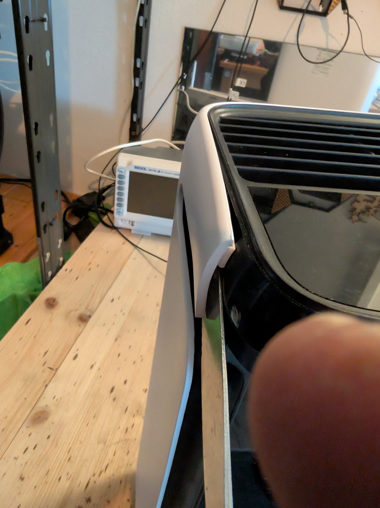

There are hooks on each side that you need to get out, will need some force, but be gentle!

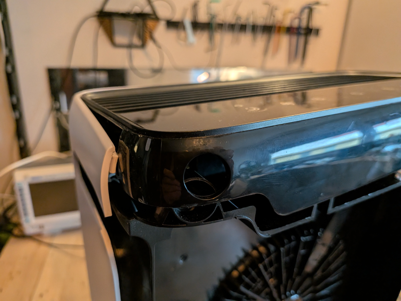

Open both sides and then pull gently but firm up and out, more up

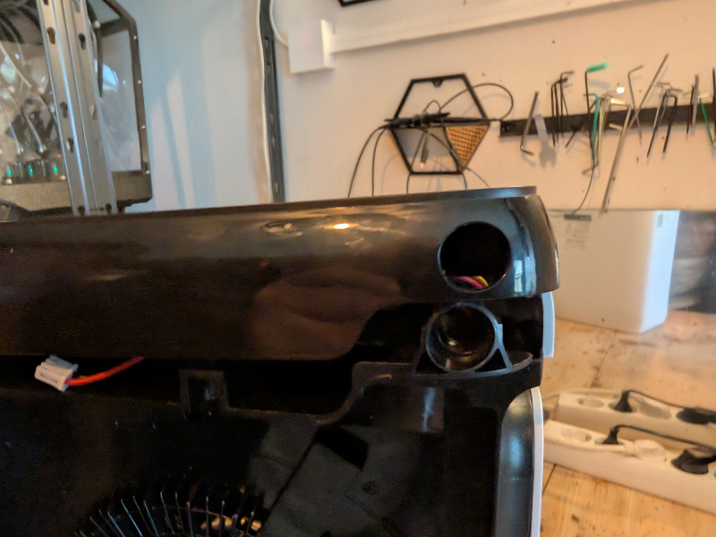

Be careful with the cables, you need to slide them out of the holder on the right side

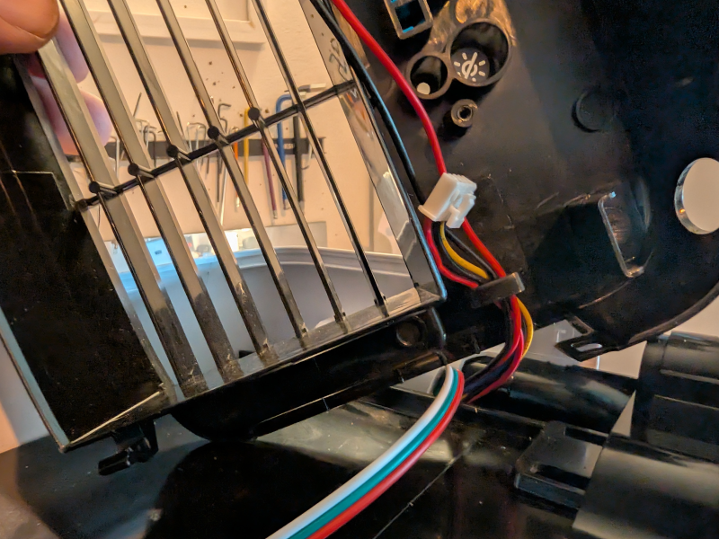

Now we have full access to the PCB!

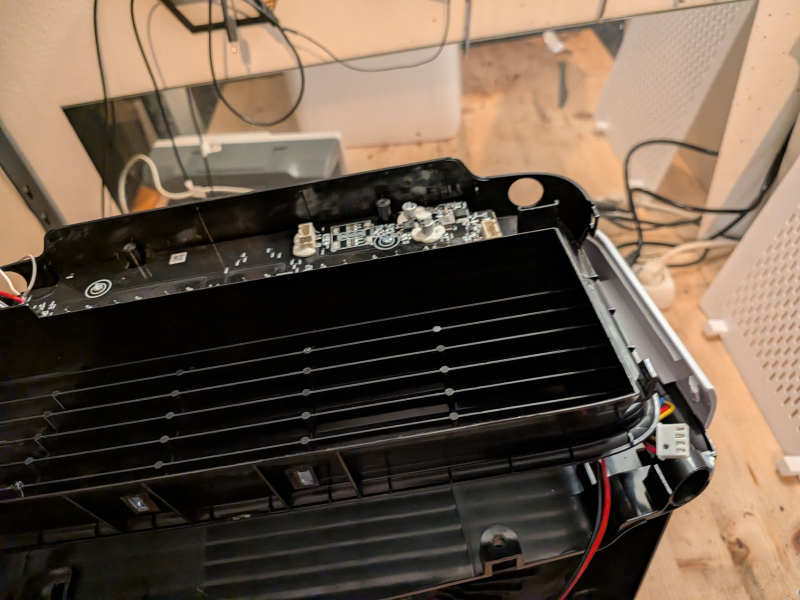


## Debug Header Pinout

The Vital series typically has a debug header or solder pads near the ESP32:

* Pin 1: EN (reset)
* Pin 2: GND 
* Pin 3: 3.3V
* Pin 4: TX
* Pin 5: RX
* Pin 6: IO0 (for bootloader mode)

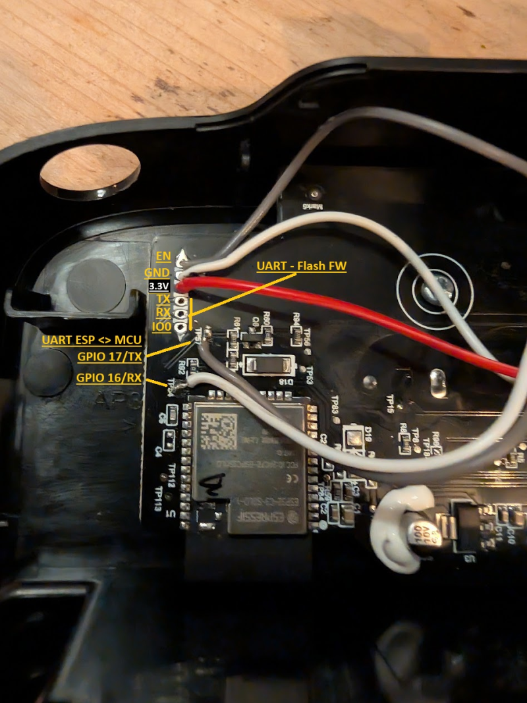

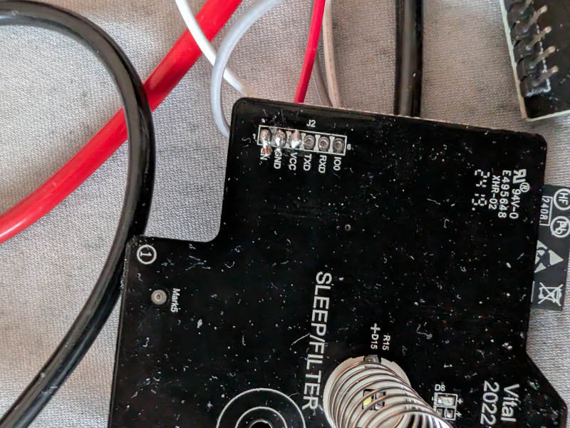
## Flash

* Solder wires to the debug header pins or use a pogo pin connector for easier access
* Connect to a USB-UART adapter (TTL 3.3V), making sure TX/RX are crossed:
  - Adapter TX → MCU RX
  - Adapter RX → MCU TX
* Connect IO0 to GND during power-up to enter bootloader mode
* Disconnect IO0 once in bootloader

### Backup Existing Firmware

```bash
esptool read_flash 0 ALL levoit_vital100s.bin
```

Note: Some devices may have watchdog protection. Try backing up while powered externally.

### Update Configuration and Secrets

Rename `secrets-example.yaml` to `secrets.yaml` and set your WiFi credentials and Home Assistant encryption key.

Adopt the device name in `levoit-vital100s.yaml` if you have multiple units.

See [Levoit Component](../../../components/levoit/README.md) for complete component documentation.

### Compile and Install New Firmware

```bash
esphome run levoit-vital100s.yaml
```

Once flashing completes, reassemble the device and enjoy!

#### Restore Original Firmware (if needed)

```bash
esptool erase_flash
esptool write_flash 0x00 levoit_vital100s.bin
```

## Protocol Notes

The Vital 100S uses the **TLV (Type-Length-Value)** protocol for communication:

* All responses use TLV blocks (ID, length, value pairs)
* Most commands also use TLV encoding for extensibility
* This differs from the fixed-field protocol used by Core models
* See [main project README](../README.md) for protocol details and TLV ID mappings


# Custom Hardware - What todo if you PCB/MCU is fried

I managed to fry my PCB for the Vital 100s, killed the 2nd MCU...

So i decided to repair my now broken Levoit 100S with some parts:

* 7 * [Touch buttons](https://amzn.to/4sZdCNO)
* 1* [4-Digit Display -> for the TM1637 ;)](https://www.az-delivery.de/products/4-digit-display)
* 16 Leds, 3mm white, 2,7V
* Diode 1N4000
* [ESP32 dev kit V4](https://amzn.to/4qLOvwh)
  
  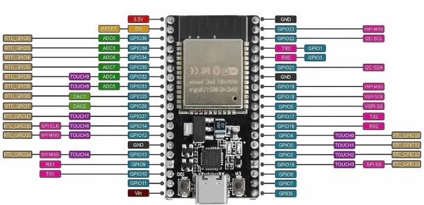
* Level Shifter
* DC-DC Converter MP1584


PWM info
PWR, GND, PWM, SPEED
24V
PWM: 5V, 1.6kHz, max 90% duty cycle, min 10% -> esphome ,min 0.1 to 0.9
Speed: 5V Frequency is speed - 0 = OFF, min 60Hz slowest speed max: 185

## Schematics

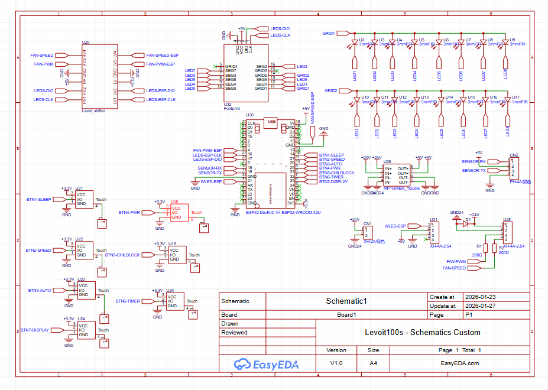

We are using a clock display from az-delivery which has a TM1637 to drive the 16 leds

SEG1 = LED1 (in schematics), SEG2 = LED2, ...

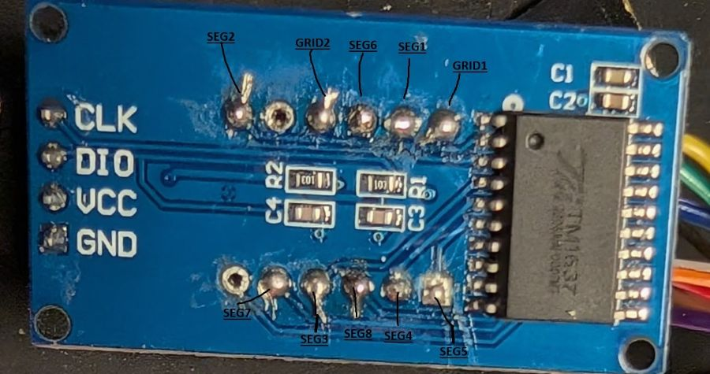

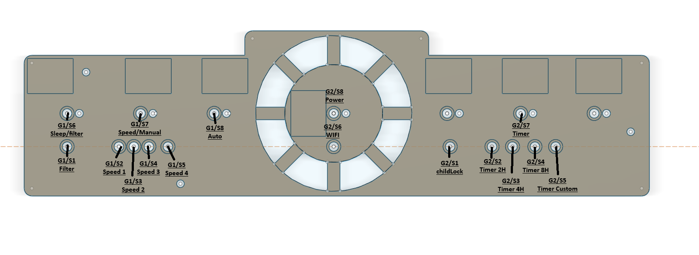


