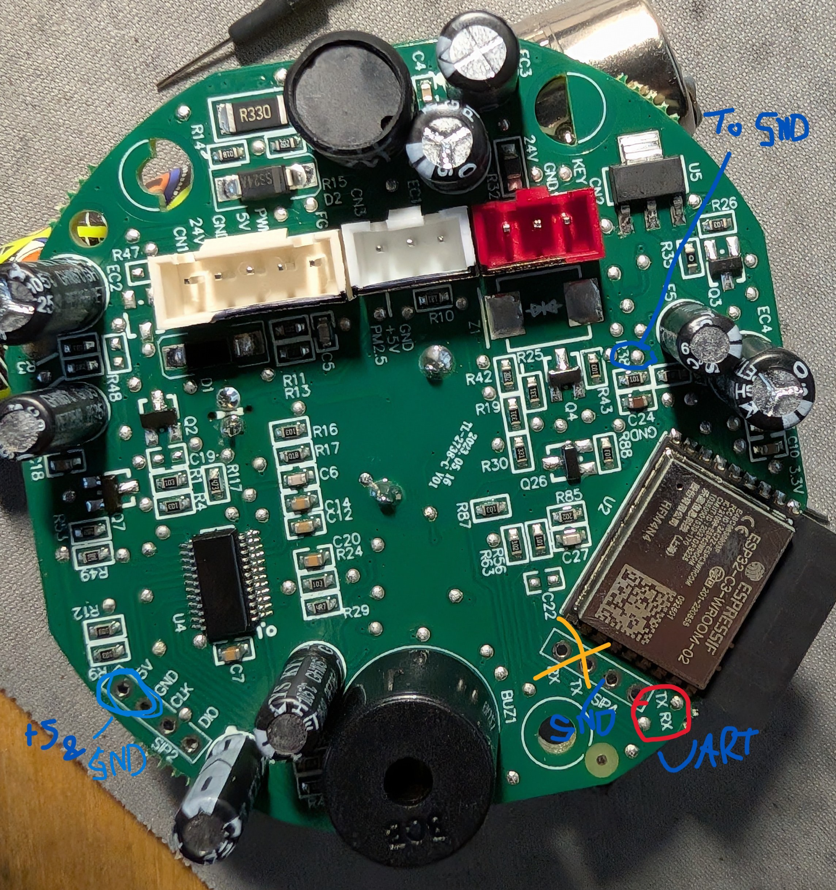
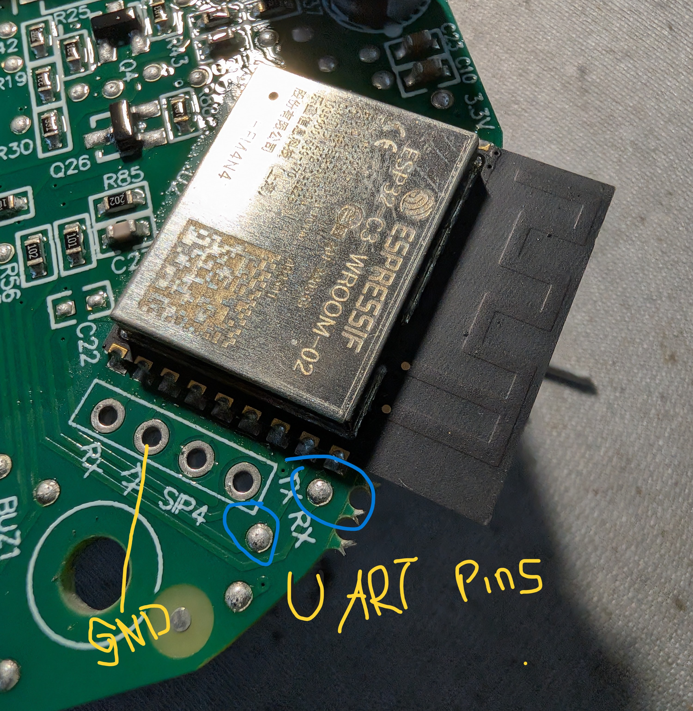
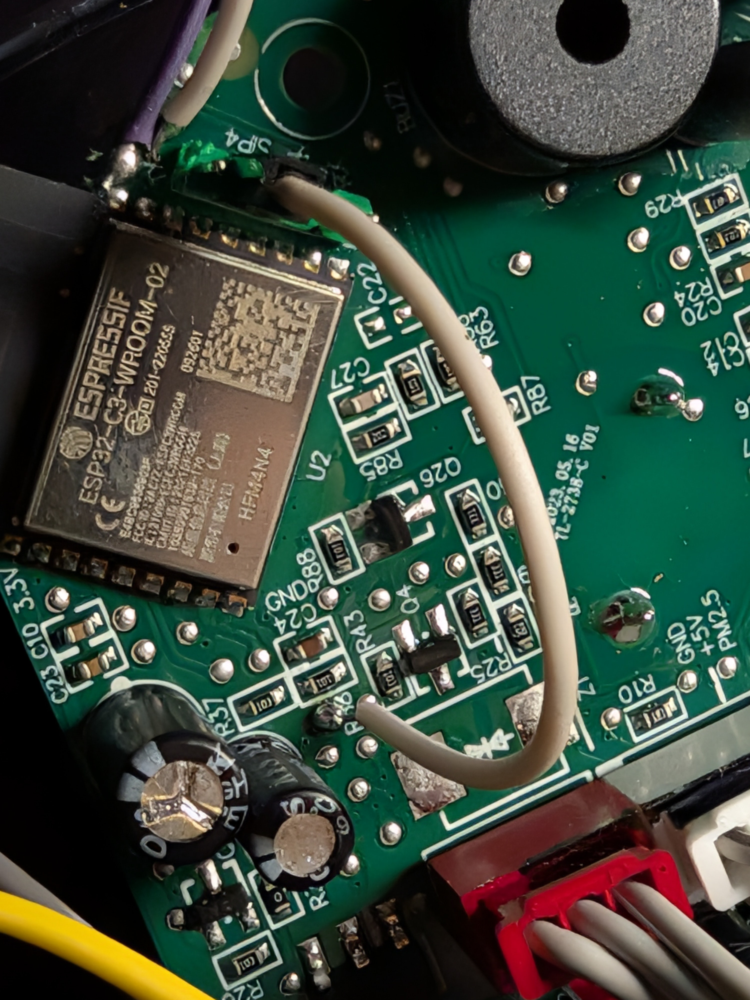
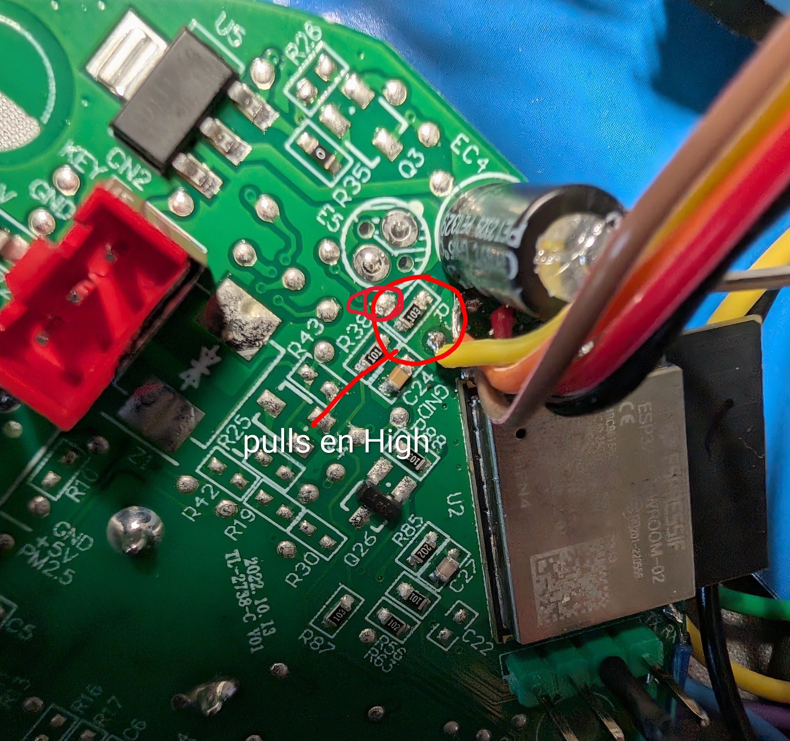

[← Back](../../README.md)
# Philips / MUJI 600-series Air Purifier — AC0650 / AC0651

A MUJI-branded, **Philips/Versuni-manufactured** air purifier driven by an ESPHome
[`philips`](../../components/philips) external component over the MCU↔module UART.
Two variants are supported via the `model:` option — both speak the identical
`FE FF` protocol:

- **AC0650/10** — base: fan + filters, no air-quality sensor.
- **AC0651/10** — adds a **PM1003 PM2.5 sensor**, allergen/AQI index, an **Auto**
  fan preset, and "standby sensor monitoring".


> 🔒 The stock ESP32-C3 module has **secure boot enabled & enforced**, so it
> cannot be reflashed. Wire your own ESP32-C3 to the MCU UART instead (see
> [Install New ESP32](#install-new-esp32)). Full protocol notes are below.

## Quick Facts

| Item | Value |
|------|-------|
| Models | AC0650/10, AC0651/10 |
| Brand | MUJI (Philips/Versuni OEM) |
| Tested MCU FW | 0.1.9 / 0.2.1|
| Stock ESP module | ESP32-C3-WROOM-02U (secure boot — locked) |
| Replacement module | Seeed XIAO ESP32-C3 (or any ESP32-C3) |
| MCU link | UART, 115200 8N1, `FE FF` protocol |
| Fan speeds | 3 (Sleep / Medium / Turbo) + Auto on 651 |
| PM sensor | PM1003 (AC0651 only) |
| ESPHome | 2026.5.3+ |

## Features

Entities exposed by the [`philips`](../../components/philips) component
(see [`common.yaml`](./common.yaml) + the per-model yamls):

| Feature | Type | Models | Notes |
|---------|------|--------|-------|
| Fan | `fan` | both | on/off = power; speeds 1=Sleep, 2=Medium, 3=Turbo; **Auto** preset on 651 |
| Pre-filter | `sensor` | both | `filter_clean` — % remaining |
| HEPA Filter | `sensor` | both | `filter_lifetime` — % remaining |
| Reset Pre-filter | `button` | both | resets the pre-filter counter |
| Reset HEPA Filter | `button` | both | resets the HEPA counter |
| MCU Version | `text_sensor` | both | MCU firmware version string |
| PM2.5 | `sensor` | 651 | µg/m³ (PM1003 sensor) |
| Allergen Index | `sensor` | 651 | 1–12 (tracks PM2.5) |
| Standby Sensor Monitoring | `switch` | 651 | keep the PM sensor running in standby |

## Teardown / Disassembly

> ⚠️ **Unplug the unit first.** You only need a Phillips screwdriver. The AC0650
> and AC0651 share the same chassis and PCB (the 651 just has extra components
> populated), so these steps apply to both.


**1. Open the bottom.** Remove the 3 screws on the base, then lift off the gray
cover and the black cable protector.


**2. Free the inner assembly.** Remove the next 3 screws and carefully slide the
internal assembly out of the housing.


**3. Reach the PCB.** Remove the top cap to expose the control PCB.


**4. Remove the PCB.** Take out the remaining 3 screws holding the PCB so you can
solder the wires for the new ESP32.


### Wiring the replacement ESP32

Solder 4 wires to the PCB test pads: **`+5V`, `GND`, `RX`, `TX`**. The RX/TX pads
are **not** on the pin header — use the test pads near the original ESP32.




**Park the stock module.** Pull the original ESP32's `EN` pin to `GND` so it stops
driving the UART bus, otherwise it will collide with your new module.




The finished install — new ESP32-C3 wired in alongside the parked stock module:


## Install New ESP32

The stock ESP32-C3 has secure boot enabled and enforced, so custom firmware can't
be flashed onto it — the only option is to **add your own ESP32-C3** on the MCU
UART and park the stock module.

**Recommended modules:**
- Seeed XIAO ESP32-C3
- Seeed XIAO ESP32-S3

**Wiring:** 4 wires — `+5V`, `GND`, `RX`, `TX`. In the example configs the C3 uses
`GPIO20` = RX (MCU TX → ESP RX) and `GPIO21` = TX (ESP TX → MCU RX).

> The RX/TX pads are **not** on the pin header — use the test pads near the original ESP32 on the board.
> Pull the `EN` pin of the original ESP32 to GND to disable it so it stops driving the bus.

### Flashing ESPHome

1. **Pick your config** by model:
   - **AC0650** → [`philips-ac0650.yaml`](./philips-ac0650.yaml) (`model: AC0650`)
   - **AC0651** → [`philips-ac0651-c3_dev.yaml`](./philips-ac0651-c3_dev.yaml)
     (`model: AC0651` — adds PM2.5, allergen index, Auto preset, standby sensor)

   Both pull in [`common.yaml`](./common.yaml) for the shared entities. The
   `model:` option toggles the 651-only datapoints, so the rest of the config is
   identical between variants.

2. **Create `secrets.yaml`** in this folder (see [`secrets copy.yaml`](./secrets%20copy.yaml))
   with your Wi-Fi and the ESPHome `api_key` / `ota_password` / `wifi_ap_password`.

3. **Check the UART pins** in the chosen yaml match your wiring
   (`rx_pin`/`tx_pin` substitutions — default `GPIO20`/`GPIO21` for the XIAO C3).

4. **Flash over USB the first time** (the C3 logs over its native USB serial, so
   the MCU UART pins stay free):

   ```bash
   esphome run philips-ac0651-c3_dev.yaml
   ```

   After the first flash, subsequent updates go over Wi-Fi via OTA.

> **Tip:** set `logger: level: VERBOSE` to watch the raw `FE FF` UART frames
> (`TX ->` / `RX <-`) while bringing the link up — handy for confirming the MCU
> is answering before any entities appear in Home Assistant.

#### Troubleshooting the UART link

- **Nothing at all (no RX, no TX working)?** Flip `rx_pin` and `tx_pin` — it's
  easy to swap them, and crossed RX/TX is the most common cause.
- **You can read the MCU but writes/commands don't take effect?** The stock
  module's `EN` pin most likely isn't actually pulled to `GND`, so it's still
  driving the bus and colliding with your SETs. Recheck the `EN → GND`
  connection (see [Wiring the replacement ESP32](#wiring-the-replacement-esp32)).


# Philips / MUJI 600-series Air Purifier — Reverse Engineering Notes

> This unit is **not** a Levoit and does not use the Levoit protocol — it's a
> Philips-made (Versuni) air purifier sold under the MUJI brand. The `FE FF`
> protocol is fully reverse-engineered and there's a **working ESPHome
> component** ([`components/philips`](../../components/philips)); these are the
> protocol notes behind it. Models **AC0650/10** and **AC0651/10** (with PM2.5).

## Device Identity

From the boot-time device-info report on the MCU↔Wi-Fi UART (see Protocol below):

| Field | Value |
|-------|-------|
| Device type | `AirPurifier` |
| Brand | `MUJI` |
| Model | `AC0650/10` |
| MCU firmware | `0.1.9` |
| (other version field) | `0.0.0` |

The `AC0650/10` model number and the `FE FF` UART protocol indicate this is a
**Philips/Versuni-manufactured** unit (MUJI-branded OEM).

### Models

| Model | Differences |
|-------|-------------|
| **AC0650/10** | base — fan (Sleep/Medium/Turbo), filters, no air-quality sensor |
| **AC0651/10** | same protocol **+ PM1003 PM2.5 sensor**, allergen/AQI index, **Auto** fan mode, "standby sensor monitoring" |

Both speak the identical `FE FF` protocol; the 651 just adds extra datapoints in
group `0x03` (see below). The component recognises them via the `model:` option.

## Hardware

| Item | Value |
|------|-------|
| Wi-Fi module | ESP32-C3-WROOM-02U |
| Module FW (banner) | `Custom user firmware: 1.1.8` |
| MAC | `e4:bc:96:16:6c:d7` |
| Secure boot | **Enabled & enforced** ("Valid secure boot key blocks: 0 1 2", "secure boot verification succeeded") |

> 🔒 **Secure boot is the blocker.** The ESP32-C3 verifies the app signature at
> boot, so **custom/unsigned firmware cannot be flashed** onto the stock module.
> Options are to **replace the ESP module** with our own, or to sit between the
> MCU and the module and speak its UART protocol.

### Serial interfaces

There are **two** separate serials — don't confuse them:

1. **ESP debug console (SIP4 header)** — 3.3 V / GND / TX / RX. This is the
   ESP32-C3 boot/log console (the `ESP-ROM:…` log below). **Not** the MCU link.
2. **MCU ↔ Wi-Fi-module UART** — carries the `FE FF` application protocol
   (datapoint reports + control). This is the one to tap for control.

### ESP boot log (debug console)

```
ESP-ROM:esp32c3-api1-20210207
Build:Feb  7 2021
rst:0x3 (RTC_SW_SYS_RST),boot:0xd (SPI_FAST_FLASH_BOOT)
Saved PC:0x4038064a
SPIWP:0xee
mode:DIO, clock div:2
Valid secure boot key blocks: 0 1 2
secure boot verification succeeded
load:0x3fcd6268,len:0xb84
load:0x403ce000,len:0x6a8
load:0x403d0000,len:0x42a4
entry 0x403ce000
Custom user firmware: 1.1.8
CUSTOM MAC Address: e4:bc:96:16:6c:d7
```

## ESPHome Component

A working `philips` external component drives the MCU over its UART. Since the
stock ESP32-C3 is locked by secure boot, **replace it with your own C3** wired to
the MCU link (hold the stock module's `EN` low — via a ~10k to GND — to park it).
Source: [`components/philips`](../../components/philips). Example configs:
[`philips-ac0650.yaml`](./philips-ac0650.yaml) (650) and
[`philips-ac0651-c3_dev.yaml`](./philips-ac0651-c3_dev.yaml) (651).

| Entity | Type | Models | Notes |
|--------|------|--------|-------|
| Fan | `fan` | both | on/off = power; **speed 1=Sleep, 2=Medium, 3=Turbo**; **Auto** preset on 651 |
| Pre-filter / HEPA Filter | `sensor` | both | `filter_clean` / `filter_lifetime` % |
| Reset Pre-filter / Reset HEPA | `button` | both | writes the reset SET to group `0x05` |
| PM2.5 | `sensor` | 651 | `pm2_5`, µg/m³ (group `0x03` DP `0x21`) |
| Allergen Index | `sensor` | 651 | `allergen_index`, 1–12 (group `0x03` DP `0x20`) |
| Standby Sensor Monitoring | `switch` | 651 | `standby_sensor` (group `0x03` DP `0x34`) |

The component is **lock-step** (one frame out, wait for the reply) like the stock
module — essential, or async SETs collide with the MCU's status traffic and get
dropped. It polls group `0x03` every 1 s and `0x05` every 10 s, handles the boot
handshake, and reports Wi-Fi `(4,1)`=connected to the panel.

## Protocol (MCU ↔ Wi-Fi module UART)

Binary, framed. Two directions in captures: module→MCU and MCU→module.

### Frame format

```
FE FF | cmd(LE16) | len(1) | data[len] | crc(BE16)
```

`len` is a **single byte** (the data length). `crc` is **CRC-16/CCITT-FALSE**
(poly `0x1021`, init `0xFFFF`, no reflection, no final XOR) computed over the
**`data` bytes only** (not the sync/cmd/len), transmitted **big-endian** (high
byte first).

```python
def crc16(data):              # CRC-16/CCITT-FALSE over the data payload
    crc = 0xFFFF
    for b in data:
        crc ^= b << 8
        for _ in range(8):
            crc = ((crc << 1) ^ 0x1021) & 0xFFFF if crc & 0x8000 else (crc << 1) & 0xFFFF
    return crc                 # send as: (crc >> 8), (crc & 0xFF)
```

| `cmd` | Direction | `data` | Meaning |
|-------|-----------|--------|---------|
| `0x0001` / `0x0002` | both | — | handshake / ack at boot |
| `0x0003` | module → MCU | `<group> <TLVs…> 00` | **control / set** datapoint(s) in a group |
| `0x0004` | module → MCU | `<group> 00` | **query** a datapoint group |
| `0x0007` | MCU → module | `00 <group> 01 02 00 00 <TLVs…> 00` | **status report** |

**Datapoints are addressed per group `(group, dpid)`** — the same `dpid` means
different things in different groups (e.g. `DP 0x02` is Wi-Fi status in group
`0x02` but power in group `0x03`). Inside `data`, datapoints are TLV tuples
`<dpid> <len> <value…>`; string fields use `len`-type `0x73` then ASCII.

The module **polls** groups `0x0C`, `0x02`, `0x04`, `0x03` (and `0x05` for air
quality) ~5×/second; the MCU answers with `cmd 0x0007` reports. **App** changes
arrive as `cmd 0x03` SETs; **physical-button** changes appear only in the status
reports (the MCU updates its own state, no SET).

### Example frames

```
query group 0x02 : FE FF 04 00 02 02 00 7B 6D          (cmd=04 len=02 data=02 00)
power off (g03)  : FE FF 03 00 05 03 02 01 00 00 25 86  (group 03, DP 02 = 0)
power on  (g03)  : FE FF 03 00 05 03 02 01 01 00 16 B7  (group 03, DP 02 = 1)
```

### Datapoints (in progress)

Addressed as `(group, dpid)`:

| Group | DP | Meaning | Values |
|-------|----|---------|--------|
| `0x02` | `0x02` | **Wi-Fi link** → LED blink pattern (module-written) | `1` = AP/pairing, `3` = connecting (blink), `4` = connected (solid) |
| `0x02` | `0x03` | **Wi-Fi colour / command** | `1` = white (cloud OK), `3` = yellow (setup/no-cloud), **`2` = MCU "reset Wi-Fi" request** (long-press) |
| `0x03` | `0x02` | **Power** (app: `cmd 0x03` SET; button: status only) | `0` = off, `1` = on |
| `0x03` | `0x0C` | **Fan mode request** (app-written) | **`0x00` = Auto (651)**, Sleep `0x11`, Medium `0x01`, Turbo `0x12` |
| `0x03` | `0x0D` | **Fan level** (MCU-set from `0x0C`; → `0` when powered off) | Sleep → `1`, Medium → `2`, Turbo → `0x12` |
| `0x03` | `0x20` | **Allergen / AQI index** (651) | `1`–`12` (tracks PM2.5, caps at 12) |
| `0x03` | `0x21` | **PM2.5** (651, PM1003 sensor) | 2-byte µg/m³, direct (e.g. `0x00AB` = 171) |
| `0x03` | `0x34` | **Standby sensor monitoring** (651, app SET) | `0` = off, `1` = on |
| `0x03` | `0x0A` / `0x2A`–`0x2C` / `0x40` | unknown (651 config? all constant) | — |
| `0x05` | `0x07` | **Pre-filter total** | `0x02D0` = 720 (≈30 days) |
| `0x05` | `0x0D` | **Pre-filter remaining** → `filter_clean %` = `0x0D / 0x07` | counts down; reset SET → 720 |
| `0x05` | `0x08` | **HEPA total** (4-byte) | `0x12C0` = 4800 (≈200 days) |
| `0x05` | `0x0E` | **HEPA remaining** (4-byte) → `filter_lifetime %` = `0x0E / 0x08` | counts down; reset SET → 4800 |
| `0x01` | `0x0F` | module SW version (string) | module writes `"0.0.0"` at boot |

> Filters are **MCU-managed**: the MCU stores & decrements the remaining
> counters and reports them in group `0x05`; the app **resets** by writing the
> total back (`cmd 0x03` SET to DP `0x0D` / `0x0E`). Units appear to be runtime
> hours (720 / 4800).

### Datapoint groups

| Group | Contents |
|-------|----------|
| `0x01` | **Device info** — `AirPurifier` / `MUJI` / `AC0650/10` / fw strings |
| `0x02` | **Wi-Fi state** — link (DP `0x02`) + colour/command (DP `0x03`); **bidirectional** (see note) |
| `0x03` | **Operating state** — power (`0x02`), fan mode (`0x0C`), level (`0x0D`); 651 adds allergen (`0x20`), PM2.5 (`0x21`), standby-sensor (`0x34`). LEN=20 on 650, **LEN=42 on 651** |
| `0x04` | small flags (DP `0x02`/`0x03`/`0x04`, all `0`) |
| `0x05` | **Filters** — pre-filter (`0x07` total / `0x0D` remaining) + HEPA (`0x08` total / `0x0E` remaining) |
| `0x08` | **network/Wi-Fi info** — fw string `0.1.9` + counters DP `0x04`/`0x05`/`0x07` |

> The module **polls** groups `0x0C`, `0x02`, `0x04`, `0x03`, and `0x05` ~5×/second;
> the MCU answers with `cmd 0x0007` status reports. App fan changes arrive as
> `cmd 0x03` writes to DP `0x0C`; the module reports its own Wi-Fi state via
> `cmd 0x03` writes to DP `0x02`.
>
> **Group `0x02` is bidirectional:** the module writes its Wi-Fi state, but the
> MCU pushes commands back by changing what it *reports* — a power-button
> **long-press** flips group `0x02` to `(DP02=1, DP03=2)`, and the module reads
> that as a "reset Wi-Fi" request and reboots into pairing.

### Boot handshake

```
module→MCU  HS1(0x0001) DATA=03 00
MCU→module  HS2(0x0002) DATA=00 03 00
module→MCU  QUERY GROUP=01           → device-info report
module→MCU  SET 01 0F 73 06 "0.0.0"  (module SW version)
module→MCU  QUERY GROUP=04 / GROUP=08
module→MCU  SET 02 02 01 03 …        (Wi-Fi status = connecting)
```

## Control example

With the CRC solved we can synthesize valid frames. Set fan mode (`cmd 0x03`,
DP `0x0C`):

```
Power off  : FE FF 03 00 05 03 02 01 00 00 25 86   (group 03, DP 02 = 0)
Power on   : FE FF 03 00 05 03 02 01 01 00 16 B7   (group 03, DP 02 = 1)
Fan Auto   : FE FF 03 00 05 03 0C 01 00 00 ..      (651, DP 0C = 0x00)
Fan Sleep  : FE FF 03 00 05 03 0C 01 11 00 B7 9E
Fan Medium : FE FF 03 00 05 03 0C 01 01 00 B4 ED
Fan Turbo  : FE FF 03 00 05 03 0C 01 12 00 E2 CD
Standby sensor ON  : FE FF 03 00 05 03 34 01 01 00 1D C7   (651, DP 34 = 1)
Standby sensor OFF : FE FF 03 00 05 03 34 01 00 00 2E F6   (651, DP 34 = 0)
Reset pre-filter : FE FF 03 00 06 05 0D 02 02 D0 00 FA 44
Reset HEPA       : FE FF 03 00 08 05 0E 04 00 00 12 C0 00 76 FE
```

## TODO

- [x] ~~Checksum~~ — CRC-16/CCITT-FALSE over data, big-endian
- [x] ~~Fan mode~~ — DP `0x0C`: Auto `0x00` (651) / Sleep `0x11` / Medium `0x01` / Turbo `0x12`
- [x] ~~Wi-Fi LED~~ — DP `0x02` blink + DP `0x03` colour; `(1,2)` = reset request
- [x] ~~Power on/off~~ — group `0x03` DP `0x02`
- [x] ~~Filters~~ — group `0x05`; MCU-managed, app resets
- [x] ~~PM2.5 + allergen index (651)~~ — group `0x03` DP `0x21` (µg/m³) / `0x20` (1–12)
- [x] ~~Standby sensor monitoring (651)~~ — group `0x03` DP `0x34`
- [x] ~~ESPHome component~~ — `components/philips` (fan, filters, PM2.5/allergen, switch)
- [ ] Identify the constant 651 DPs (`0x0A`, `0x2A`–`0x2C`) — Auto config / AQ thresholds?
- [ ] Child lock / timer / display — if exposed
- [ ] Wire the physical Wi-Fi LED (module-side GPIO) on the replacement ESP
