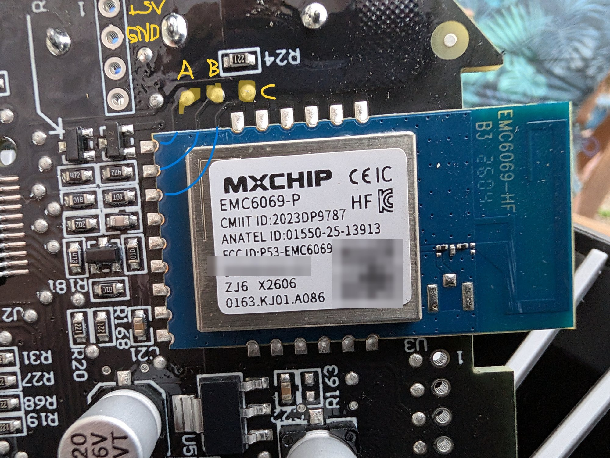
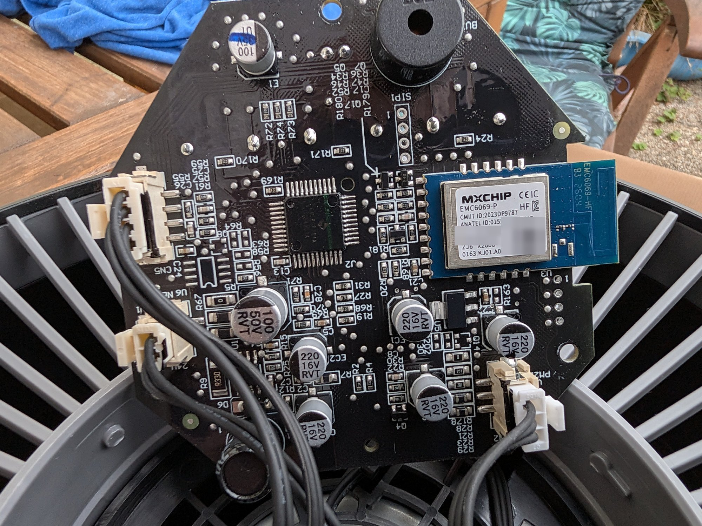
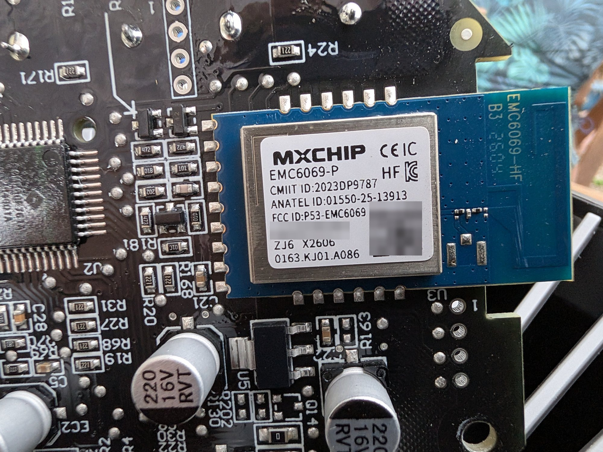
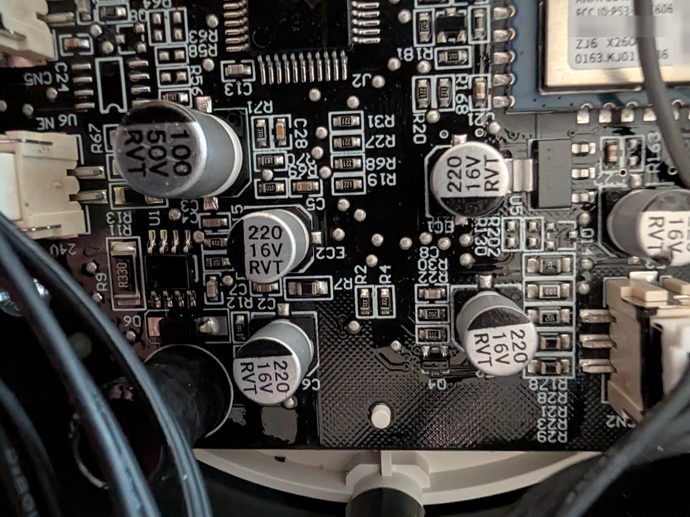
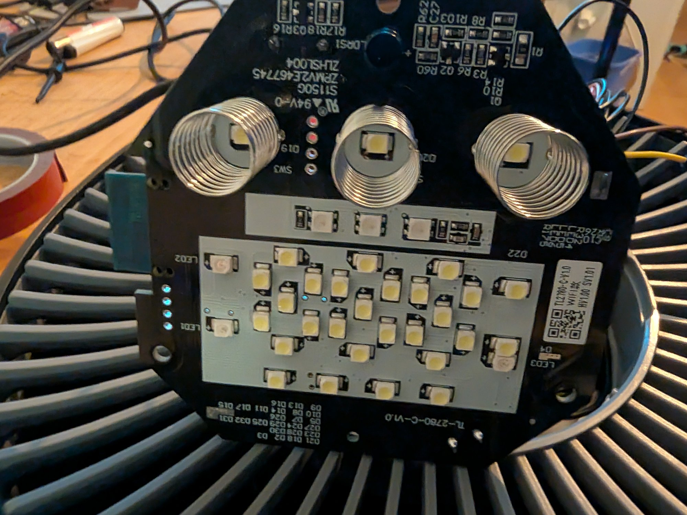
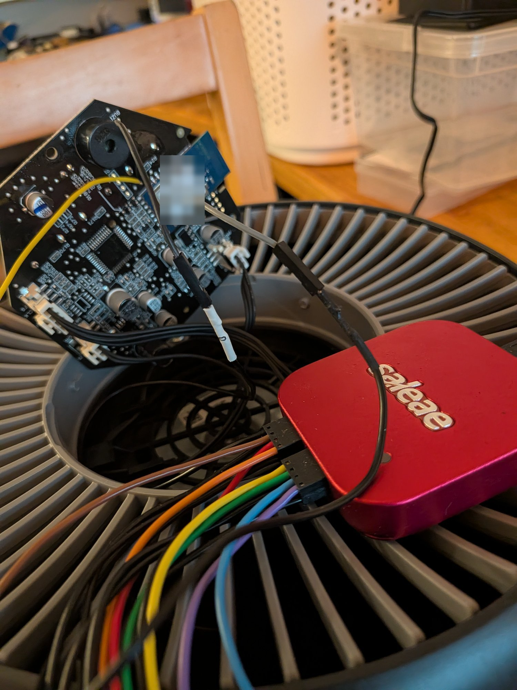
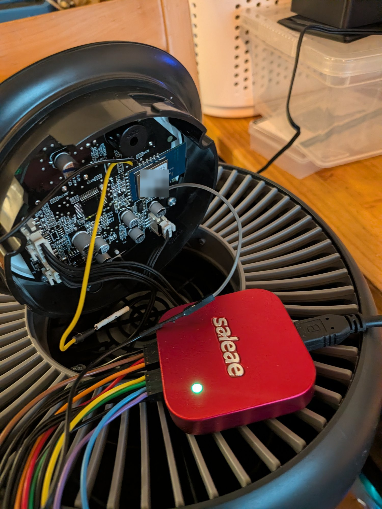

[← Back](../../README.md)
# Philips Series 900 Air Purifier — AC0950 / AC0951

> 🔬 **Protocol decoded, component support written, not yet run on hardware.**
> The board has been opened, the Wi-Fi module identified, and the MCU↔module
> link **captured and decoded**: it is the *same* protocol the
> [`philips`](../../components/philips) component already speaks for the
> AC0650/AC0651, at 115200 8N1, with an almost identical datapoint map. See
> [Protocol](#protocol--decoded-from-the-captures).
>
> `AC0950` / `AC0951` are now supported by the component, and every write frame
> it emits was checked byte-for-byte against the captures in
> [`captures/`](./captures). **But nothing here has been run against a real
> MCU yet** — the board YAMLs compile and the pads are identified, but the
> wiring in [Adding your own ESP32](#adding-your-own-esp32) is untested, and
> every capture is from an **AC0951** (the AC0950 has never been observed).

The goal for these units is the same move as the
[600-series](../philips-600-series): **disable the stock Wi-Fi module and drive
the purifier's MCU from your own ESP32** over the internal UART — fully local,
no cloud, no vendor firmware left in the loop.

Until that works, an AC0950/AC0951 on stock firmware can already be run
cloud-free over local CoAP — see
[Cloud-free without ESPHome](../../README.md#cloud-free-without-esphome--philips--versuni-over-local-coap)
in the root README.

## Quick Facts

| Item | Value |
|------|-------|
| Models | AC0950, AC0951 |
| Brand | Philips (Versuni) |
| Stock Wi-Fi module | **MXCHIP EMC6069-P** — 2.4 GHz Wi-Fi + BLE, FCC ID [`P53-EMC6069`](https://fccid.io/P53-EMC6069) |
| Module form | Blue castellated daughterboard (`EMC6069-HF`), soldered to the main PCB |
| Main MCU | Unmarked QFP, centre of the board — part number still unidentified |
| MCU link | ✅ UART, **115200 8N1**, **3.3 V** — verified; same `FE FF` framing as the 600 series |
| MCU firmware | `0.3.3` (module firmware `0.8.6`) |
| Internal model string | `AC0951/13`, codename **`Unicorn`** |
| ESPHome support | ⚠️ implemented in [`philips`](../../components/philips) (`model: AC0950` / `AC0951`), not yet hardware-tested |
| Stock local control | ✅ CoAP (`AWS_Philips_AIR`) without opening the case |

## Opening the unit

> ⚠️ **Unplug it first.** Part of the control board is on mains.

No screws to start with: **twist the top cap counter-clockwise** (to the left)
and lift it off — the same arrangement as the
[600 series](../philips-600-series#teardown--disassembly). That exposes the
control PCB.

## Adding your own ESP32

> ⚠️ **Unplug the unit first.** Part of the control board is on mains.
>
> ⚠️ **The component has not been run against this MCU yet.** The pads are
> identified from real probing and the protocol is decoded and implemented, but
> no ESPHome build has yet driven the purifier. Expect to debug.

The move is the same as the [600 series](../philips-600-series): park the stock
Wi-Fi module and let your own ESP32 talk to the purifier's MCU over the internal
UART.

All the connection points are on the **top edge of the MXCHIP module**:



| Marked | What it is | Goes to |
|--------|-----------|---------|
| `+5V` | 5 V rail, on the 4-pin through-hole header up and left of the module | ESP32 `5V` / `VIN` |
| `GND` | ground, same header | ESP32 `GND` |
| **A** | UART, **MCU → module** (carries `STATUS`) | ESP32 `RX` |
| **B** | UART, **module → MCU** (carries `HS1` / `QUERY` / `SET`) | ESP32 `TX` |
| **C** | module **reset / enable** | pull low to park the stock module |

### Which of A and B is which

Determined from the captures:

- **A carries MCU → module** — the `STATUS` (`cmd 0x0007`) frames. It is the
  **MCU's TX**, so it goes to the **ESP32's RX**.
- **B carries module → MCU** — `HS1` / `QUERY` / `SET` (`0x0001` / `0x0004` /
  `0x0003`). It is the **MCU's RX**, so it goes to the **ESP32's TX**.

If you want to re-confirm this on your own board — worth doing, since a
different revision could route them differently — probe both lines read-only
with the stock module still fitted and running (see
[Capturing the UART](#capturing-the-uart)) and look at the payloads rather than
the probe order: the line sending `STATUS` is always the MCU's TX. The order
genuinely cannot be trusted — `cap1` and `cap2` came out with the analyzer
channels swapped, which is why the decoder labels in `cap1.txt` are inverted.

### Parking the stock module

The ESP32 and the MXCHIP module cannot both drive the MCU's RX line. Pad **C** is
the module's reset/enable: **hold it low** so the module stays fitted but silent,
the same trick the 600 series uses on the original ESP32's `EN` pin.

**A plain wire to GND is what has been used here, and it works.** That is the
simplest option and needs nothing but a link to a ground point.

A resistor is the more cautious choice if you would rather not rely on that: a
hard tie is only safe as long as nothing on the board ever drives that net high,
and a resistor limits the current if something does. The 600 series documents
[~10k to GND](../philips-600-series#esphome-component) for the same job. If you go
that way, **1 kΩ is the better value** — against a typical 10k pull-up it holds
the pin near 0.3 V, whereas 10k against 10k would sit at ~1.65 V, squarely in the
indeterminate band where the module might not stay in reset.

Driving C from a spare ESP32 GPIO (output-low) works too, and lets you release
the module without unsoldering.

Until C is held low, keep your ESP32's TX disconnected and treat the setup as
receive-only — two drivers on the MCU's RX line is the one wiring mistake that
can damage something.

### Wiring

```
        ESP32-C3                 AC0951 control board
        --------                 --------------------
  5V / VIN  <--------------------  +5V  (4-pin header)
       GND  <-------------------->  GND  (4-pin header)
  RX GPIO20 <--------------------  A    (MCU TX — STATUS frames)
  TX GPIO21 -------------------->  B    (MCU RX)
                                    C  ---> GND  (parks the stock module)
```

On a **Seeed XIAO ESP32-C3** — the board the configs here assume:

| XIAO pad | GPIO | Purpose | Board pad |
|----------|------|---------|-----------|
| `5V` | — | supply in (through the onboard regulator) | `+5V` header |
| `GND` | — | ground | `GND` header |
| `D7` | `GPIO20` | UART **RX** | **A** (MCU TX) |
| `D6` | `GPIO21` | UART **TX** | **B** (MCU RX) |
| any free pad, e.g. `D0` | `GPIO2` | *optional* — hold **C** low from software | **C** |

Watch out that `D6` and `D7` are **not** adjacent: `D0`–`D6` run down one edge of
the board, while `5V`, `GND`, `3V3`, `D10`, `D9`, `D8` and `D7` run down the
other — so `D7` (RX) sits at the far corner from `D6` (TX).

These are the defaults in
[`philips-ac0951-c3_dev.yaml`](./philips-ac0951-c3_dev.yaml)
(`rx_pin: GPIO20` / `tx_pin: GPIO21`). Note that `GPIO20`/`GPIO21` are also the
C3's **default UART0 pins**, which is why [`common.yaml`](./common.yaml) moves the
logger to `USB_SERIAL_JTAG` — otherwise the log output would fight the MCU on the
same wires.

The optional GPIO for **C** is only needed if you want to release the stock module
without unsoldering; a wire straight to GND is what has been used so far.

**A and B are 3.3 V logic — measured, not assumed.** So they connect straight to
an ESP32-C3 GPIO with no level shifting. (Only the `+5V` header pad is 5 V, and
that goes to the XIAO's `5V` pin, never to a GPIO.)

### Then flash

1. Copy [`secrets-example.yaml`](./secrets-example.yaml) to `secrets.yaml` and
   fill in your Wi-Fi credentials.
2. Flash [`philips-ac0951-c3_dev.yaml`](./philips-ac0951-c3_dev.yaml) (or
   [`philips-ac0950.yaml`](./philips-ac0950.yaml) for the non-sensor model).
3. Watch the log. `MCU link up` means the handshake completed. If it does not
   appear, see [Boot sequence](#boot-sequence) — the stock module's *first*
   handshake attempt reliably fails and only the second, about two minutes later,
   succeeds, so the component retries rather than assuming the first `HS1` is
   answered.

## Reverse-engineering log

The running plan, roughly in order. `tbc` — this list grows as things are
learned.

**1. Get a device.** ✅ Done.

**2. Work out how to open it.** ✅ Done — twist the top to the left, same as the
600 series. See [above](#opening-the-unit).

**3. Identify the MCU, pull its datasheet.** ⬜ Open.
The large unmarked QFP in the centre of the board is the main MCU. Knowing the
part gives its pinout, which narrows down *which* pins carry the UART instead of
guessing from the module side alone.
- Read the top marking (angled light / a phone macro shot helps).
- With the datasheet in hand, map the peripheral pins to the traces heading
  toward the MXCHIP module.

**4. Sniff traffic on those pins.** ✅ Done — see
[Protocol](#protocol--decoded-from-the-captures) and [`captures/`](./captures).
- Both directions captured with a logic analyzer at **115200 8N1** (measured:
  86.4–86.6 µs per byte = 10 bit-times at 115200).
- The frames use **exactly the same `FE FF` framing** the
  [`philips`](../../components/philips) component already speaks, with the same
  CRC-16/CCITT-FALSE and the same command IDs. All 1026 frames across
  `cap2`/`cap3` verify against the existing `crc16_()` with zero mismatches.
- Still open: visually trace what *other* pins are in use — there may be more
  than a plain two-wire UART between MCU and module (reset, boot-mode, an
  enable line).

**5. Is the air-quality sensor wired to the MCU or to the MXCHIP?** ✅ Answered
— **the MCU owns the readings.** It reports PM2.5 (group `0x03` DP `0x21`) and
the allergen index (DP `0x20`) in its own status frames, and ramps the fan from
them in auto mode with no involvement from the module — nothing in the captures
ever *writes* those datapoints. So replacing the module does *not* mean picking
up the sensor as well. (The PCB trace has not been followed by eye, but the data
path is settled, which is what matters for the port.)

**Still to schedule:**
- Find how to **park the stock module** — the 600 series pulls the original
  ESP32's `EN` low; the equivalent pin on the EMC6069 needs identifying.
- Read the chip marking under the module can (or from the
  [FCC internal photos](https://fccid.io/P53-EMC6069)) to settle the
  reflash-vs-replace question for good.
- ~~Add `AC0950` / `AC0951` to the `philips` component~~ ✅ done — see
  [Component support](#component-support).
- **Run it against real hardware.** Nothing below the protocol work has been
  tested on a device yet.
- Find where the **ambient-light sensor** is reported, if it is reported at all
  — take a capture while changing only the light falling on the unit.
- Confirm whether the **AC0950** (no PM sensor) uses the same datapoint map as
  the AC0951 captured here. Everything below is from an AC0951.

## What the teardown answered

The root README's [open question](../../README.md#-open-question--can-the-mxchip-models-run-esphome-after-all)
asked *"which MXCHIP part is in there"* — for the 900 series it is now answered:

**MXCHIP `EMC6069-P`**, marked `EMC6069-HF` on the daughterboard silkscreen,
FCC ID `P53-EMC6069`, certified 2023-12-20 as a 2.4 GHz Wi-Fi/BLE combo module.

What that means for the reflash idea:

- It is **not** an EMW3080 / MX1290, so the known-good
  RTL8710BN → [LibreTiny](https://docs.libretiny.eu/) → ESPHome path does
  **not** automatically apply here.
- MXCHIP does not publish the EMC6069's silicon, and the FCC filing keeps the
  block diagram and schematics confidential — only the user manual, test
  reports and internal photos are public. The die/chip marking would have to be
  read off the module itself (or from the filing's internal photos) before
  anyone can say whether it is a LibreTiny target.
- So for now the working assumption is the 600-series one: **add an ESP32 and
  park the stock module**, rather than reflash it.

## Board observations

From the control-PCB photos (see [`images/`](./images)). All are of an AC0951.

### Component side







- The MXCHIP module sits on the right-hand side of the board, castellated pads
  along its top and bottom edges, with series resistors (`R168`–`R171`, `R20`,
  `R21`, `R24`, `R81`) clustered right at those pads — the usual place to find
  the UART lines and a convenient place to probe them.
- A large QFP in the centre of the board is the main MCU. **Its top marking is
  not legible in any photo taken so far** — it reads as blank under flat light,
  so step 3 of the log still needs an angled or macro shot.
- Piezo buzzer top-centre, several JST fan/motor connectors down the left edge.
- A small connector near the bottom-right is silkscreened **PM2.5** — where the
  AC0951's particulate sensor plugs in. The captures confirm the MCU owns those
  readings (see step 5 above).

### Display side



- The user-facing side of the same board carries the LED matrix — this is what
  DP `0x04` dims — plus separate status LEDs and an RGB strip.
- **Three button springs**, matching the three physical controls the captures
  exercise: power, speed and display. See
  [Physical buttons vs. the app](#physical-buttons-vs-the-app).
- Board markings `TL-2780-C-V1.0` (main) and `TLC2700-C-V1.0` (LED module).
- No ambient-light sensor has been identified here by eye, which is consistent
  with nothing light-related appearing on the wire.

## Protocol — decoded from the captures

**The 900 series speaks the same protocol as the AC0650/AC0651.** Framing, CRC,
command IDs, the status-report layout and most of the datapoint numbering are
identical, so the [600-series protocol
notes](../philips-600-series#protocol-mcu--wi-fi-module-uart) apply here
almost verbatim. Only the deltas are documented below.

```
FE FF | cmd(LE16) | len(1) | data[len] | crc(BE16, CRC-16/CCITT-FALSE over data)
115200 8N1
```

Every one of the 1026 frames in [`cap2.txt`](./captures/cap2.txt) and
[`cap3`](./captures/cap3) validates against the existing
[`crc16_()`](../../components/philips/philips.cpp), with no mismatches. Command
IDs are unchanged: `0x0001` HS1, `0x0002` HS2, `0x0003` SET, `0x0004` QUERY,
`0x0007` STATUS.

> **Reading the capture files:** the two logic-analyzer channels are *not* in
> the same order in every file. In [`cap1.txt`](./captures/cap1.txt) the
> `[MCU->module]` / `[module->MCU]` labels are **inverted**; in `cap2`/`cap3`
> they are correct. The reliable test is the payload, not the label — `HS1`,
> `QUERY` and `SET` are always module→MCU, `STATUS` is always MCU→module.
> `cap1.txt` also has a different column layout (7 columns) than `cap2`/`cap3`
> (5 columns), which matters if you script over them.

### Device info (group `0x01`)

| DP | Value on the captured unit | Notes |
|----|---------------------------|-------|
| `0x03` | `"Air Purifier"` | **device name — writable**; the app writes the user's name here |
| `0x04` | `"Unicorn"` | internal codename (the 600 series reports `MUJI`) |
| `0x05` | `"AC0951/13"` | model string |
| `0x0D` | 12-digit string | device / serial identifier |
| `0x0F` | `"0.0.0"` → `"0.8.6"` | **Wi-Fi module firmware** — the module writes its own version here at boot. The app shows this as its *Wi-Fi firmware* (`86`). |
| `0x12` | `"0.3.3"` | **Device (MCU) firmware** — the app shows this as its *device firmware*. |

The two version strings are **confirmed against the app UI**, which reports
exactly these two values — Wi-Fi firmware `86` (= `0x0F`, `0.8.6`) and device
firmware `0.3.3` (= `0x12`). So the split is not an inference: `0x0F` is the
module's own version and `0x12` is the MCU's.

### Datapoint groups

Same numbering as the 600 series, plus one new group:

| Group | Contents | vs. 600 series |
|-------|----------|----------------|
| `0x01` | Device info (above) | same |
| `0x02` | Wi-Fi state — DP `0x02` link, DP `0x03` colour/command | same, bidirectional |
| `0x03` | **Operating state** — see below. LEN=64 on the AC0951 | same DP numbering, more DPs |
| `0x04` | small flags (DP `0x02`/`0x03`/`0x04`, all `0`) | same |
| `0x05` | Filters — pre-filter `0x07`/`0x0D`, HEPA `0x08`/`0x0E` | same DPs, **different totals** |
| `0x08` | network info — fw string + counters | same, **plus a new `0x74` blob DP**; see the note below on which firmware its string holds |
| `0x0B` | **new** — MCU replies `LEN=3, DATA=03 0B 00` | not present on the 600 |

Group `0x0B` is polled about every 10 s and the MCU always answers with the same
3-byte frame, which does not even carry the normal 6-byte status header. It
reads like a "no such group" reply; nothing has been seen to use it.

Despite the group name inherited from the 600 series, **group `0x08`'s
firmware string is the MCU's, not the module's**: `DP 0x03` there reads
`"0.3.3"`, the same value as group `0x01` DP `0x12`, while the module's own
`0.8.6` appears only in group `0x01` DP `0x0F`. Do not treat group `0x08`
DP `0x03` as a Wi-Fi version.

Group `0x08` gained **DP `0x06`: a 128-byte blob with a new TLV type byte
`0x74`** (all zeros in every capture so far). It appears only after the second
boot attempt, growing the group `0x08` payload from 31 to 162 bytes. Note that
the existing parser only special-cases the `0x73` string type, so it will read
`0x74` as a 116-byte integer length and abandon the TLV walk. That is
bounds-checked and harmless today because nothing consumes group `0x08`, but it
must be handled before anything does.

### Datapoints (group `0x03`)

Confirmed by driving each control from the Philips app and watching the SET plus
the resulting status change ([`cap3`](./captures/cap3),
[`brighness_from_app.txt`](./captures/brighness_from_app.txt),
[`childlock_on_off.txt`](./captures/childlock_on_off.txt)):

| DP | Meaning | Values | Status |
|----|---------|--------|--------|
| `0x02` | power | `0` / `1` | same as 600 |
| `0x03` | **child lock** | `0` / `1` | ✅ new |
| `0x04` | **display brightness**, linked to `0x05` (also `0` when powered off) | `0` off / `0x73` low / `0x7B` bright | ✅ new |
| `0x05` | **display brightness**, mirrors `0x04` | follows `0x04` | ✅ new |
| `0x0C` | **fan mode** | see table below | numbering differs |
| `0x0D` | **current speed** | `1`–`4`, `0x12` turbo, `0` when powered off | same DP as 600 |
| `0x10` | **timer setting** (index, app-written) | `0` off, `2`–`13` = 1–12 h | ✅ new |
| `0x11` | **timer remaining**, minutes (2-byte, MCU-derived, counts down) | `0`–`720` | ✅ new |
| `0x20` | allergen index | `0`–`12` | same as 600 |
| `0x21` | PM2.5 µg/m³ | 2-byte BE; observed `0`–`317` | same as 600 |
| `0x30` | **beep / sound** | `0` off / `100` (`0x64`) on | ✅ new |
| `0x34` | standby sensor monitoring | `0` / `1` | same as 600 |
| `0x0A` `0x2A` `0x2B` `0x2C` `0x36` `0x40` | unknown, static in captures | | ❓ |

**Power — group `0x03` DP `0x02`** is written exactly as on the 600 series
([`power_from_app.txt`](./captures/power_from_app.txt)):

```
power off : FE FF 03 00 05 03 02 01 00 00   (SET group 03, DP 02 = 0)
power on  : FE FF 03 00 05 03 02 01 01 00   (SET group 03, DP 02 = 1)
```

so the existing `set_power()` needs no change. Powering off also drives
`DP 0x0D` to `0`; see [Physical buttons vs. the app](#physical-buttons-vs-the-app).

**Fan modes — group `0x03` DP `0x0C`.** Three of the four match the 600 series;
**medium does not**:

| App button | AC0951 value | AC0650/51 value |
|-----------|--------------|-----------------|
| Auto | `0x00` | `0x00` ✅ |
| Sleep | `0x11` | `0x11` ✅ |
| **Medium** | **`0x13`** | `0x01` ❌ |
| Turbo | `0x12` | `0x12` ✅ |

`DP 0x0D` reports the resulting speed: sleep → `1`, medium → `2`, auto → the
level the MCU picks itself (`1`–`4`, seen ramping with PM2.5), turbo → `0x12`,
which is deliberately outside the 1–4 range.

**`DP 0x04` / `DP 0x05` are the display brightness, as a linked pair**
([`brighness_from_app.txt`](./captures/brighness_from_app.txt)). The app offers
three positions and writes one fixed value per position:

| App position | Value written |
|--------------|---------------|
| off | `0x00` |
| low | `0x73` (115) |
| bright | `0x7B` (123) |

The app writes `0x04` and `0x05` as two separate SETs ~60 ms apart, but **the
MCU applies both on the write to `0x04`** — the following write to `0x05`
produces no state change at all. Writing `0x04` alone is enough.

The values are not a 0–100 percentage, and the two non-zero ones differ only in
bit 3 (`0b1110011` → `0b1111011`), so they may well be a bitfield rather than a
level. For driving the device it does not matter: treat them as three opaque
constants.

> The unit does appear to have an **ambient-light sensor** (auto-dimming), but
> nothing in any capture so far reports it. Across every capture the only
> datapoints that change without a preceding SET are PM2.5 (`0x21`), the
> allergen index (`0x20`), fan level (`0x0D`) and the Wi-Fi state — and the
> group `0x03` payload is a constant 64 bytes throughout, so no light-level DP
> appears and disappears either. Either the MCU keeps the reading to itself and
> only uses it internally, or it needs a capture taken while the light on the
> sensor is deliberately changed. That test is worth doing: change *only* the
> lighting and watch for any DP that moves on its own.

**The timer is two datapoints.** The app writes only `DP 0x10`, an index; the
MCU derives `DP 0x11`, the remaining time in minutes, and reports it back
~25 ms later. Every preset from 1 h to 12 h was captured in one run
([`timer_1_to_12_h.txt`](./captures/timer_1_to_12_h.txt)), and the
mapping is a straight formula:

```
minutes (DP 0x11) = (index (DP 0x10) - 1) * 60        index 2..13 = 1..12 h
```

| `0x10` | 0 | 2 | 3 | 4 | 5 | 6 | 7 | 8 | 9 | 10 | 11 | 12 | 13 |
|---|---|---|---|---|---|---|---|---|---|---|---|---|---|
| **`0x11`** | 0 | 60 | 120 | 180 | 240 | 300 | 360 | 420 | 480 | 540 | 600 | 660 | 720 |
| **hours** | off | 1 | 2 | 3 | 4 | 5 | 6 | 7 | 8 | 9 | 10 | 11 | 12 |

Index `1` is the one value never seen — the app jumps straight from off to
1 h. The formula would put it at 0 minutes, so it is probably unused.

`DP 0x11` is a **live countdown**, not just an echo of the setting: after the
12 h preset was selected it ticked `720 → 719 → 718` at ~60 s intervals. It
is MCU-derived and must never be written.

**`DP 0x30` is the beep**, written by the app as `0` (off) or `100` (`0x64`,
on). The 0–100 encoding suggests the MCU stores it as a volume percentage,
but the app exposes only the two endpoints and no intermediate value has ever
been seen. It never moves on its own, never responds to a physical button,
and is unaffected by power cycling.

### Physical buttons vs. the app

**Button presses never produce a SET.** All three `from_device_*` captures
contain zero `cmd 0x0003` frames — the MCU updates its own state and the
change is visible only in the next status report. This matches the 600
series, and it means anything replacing the module **must poll** group `0x03`
to notice physical interaction; there is no push to subscribe to.

The **speed button cycles** in a fixed order, writing the same `DP 0x0C`
values the app uses ([`from_device_speed_med_turbo_auto_sleep.txt`](./captures/from_device_speed_med_turbo_auto_sleep.txt)):

```
sleep (0x11) -> medium (0x13) -> turbo (0x12) -> auto (0x00) -> sleep ...
```

The **display button is a plain on/off toggle**
([`from_device_dsp_on_off.txt`](./captures/from_device_dsp_on_off.txt)): it
moves `DP 0x04`/`0x05` between `0` and `0x7B` only, and never selects the
`0x73` low setting that the app offers. So the three-position control is
app-only.

**Powering off changes more than `DP 0x02`**
([`from_device_power_off_on.txt`](./captures/from_device_power_off_on.txt)).
A single press of the power button moves three datapoints at once:

| | power off | power on |
|---|---|---|
| `0x02` power | `1` -> `0` | `0` -> `1` |
| `0x0D` speed | `1` -> `0` | `0` -> `1` |
| `0x04`/`0x05` display | `123` -> `0` | `0` -> `123` |

So `DP 0x04` = `0` does **not** by itself mean the user turned the display
off — it is also what a powered-off unit reports. Any brightness entity has
to be read together with `DP 0x02`.

Powering back on restores a **remembered brightness level**, and it is not a
fixed constant: `0x7B` came back in
[`from_device_power_off_on.txt`](./captures/from_device_power_off_on.txt) and
`0x73` in [`power_from_app.txt`](./captures/power_from_app.txt). Nor is it the
immediately preceding on-screen state — in the second capture the display read
`0` while the unit was still on, and power-on brought it back at `0x73` rather
than leaving it dark. The MCU therefore appears to keep a brightness
*preference* (`0x73` or `0x7B`) separately from the momentary display state,
and re-applies it on power-on. The exact persistence rule has not been pinned
down, so read the value rather than predicting it.

### Filters (group `0x05`)

Same datapoints as the 600 series, different capacity:

| DP | Meaning | AC0951 | AC0650/51 |
|----|---------|--------|-----------|
| `0x07` / `0x0D` | pre-filter total / remaining | `720` | `720` |
| `0x08` / `0x0E` | HEPA total / remaining | **`9600`** | `4800` |

Filters are **MCU-managed**, as on the 600 series: the MCU stores and
decrements the remaining counters, and a reset is the app **writing the total
back**. Both frames are confirmed on the wire
([`reset_from_app_clean_the_replace.txt`](./captures/reset_from_app_clean_the_replace.txt)):

```
reset pre-filter ("clean")   : FE FF 03 00 06 05 0D 02 02 D0 00 FA 44
reset HEPA       ("replace") : FE FF 03 00 08 05 0E 04 00 00 25 80 00 3B 07
```

Note the HEPA payload is `00 00 25 80` = 9600, **not** the 600 series'
`00 00 12 C0` = 4800 — this is the one place where the existing
`reset_filter()` would write the wrong value.

The app sends these even when the counters are already at maximum, which is
how they could be captured on a brand-new unit at all. A reset triggered
**from the unit itself** emits no SET (like every other physical action), so
it is invisible on the wire until the counters have actually decremented.

### Boot sequence

The first handshake attempt **reliably fails**, identically in both cold-start
captures:

```
module -> MCU   QUERY group 0x08          (before the handshake, unlike the 600)
MCU -> module   STATUS group 0x08
module -> MCU   SET group 0x08 DP 0x02 = 0
module -> MCU   HS1(0x0001) 03 00     x3  at +1.00 s, +1.00 s, +0.05 s
                ...no HS2. Both lines go low ~0.94 s after the last HS1.
                ...~124 s of complete silence...
module -> MCU   QUERY group 0x08          second attempt
module -> MCU   HS1(0x0001) 03 00
MCU -> module   HS2(0x0002) 00 03 00      link up
module -> MCU   QUERY group 0x01 -> device info
module -> MCU   SET group 0x01 DP 0x0F = "0.8.6"   (module SW version)
module -> MCU   QUERY groups 0x02 / 0x03 / 0x04 ...
```

The timing of the failed attempt is deterministic to the millisecond across
captures (last HS1 → lines low: 0.939 s in `cap1`, 0.945 s in `cap2`), so it is
the module's own behaviour, not a capture artefact. Anything driving this MCU
should expect to retry the handshake rather than assume the first `HS1` is
answered.

Two further behaviours worth relying on:

- The module **polls at ~1 Hz** (groups `0x02`/`0x03`/`0x04` every second,
  `0x01`/`0x05`/`0x0B` every ~10 s) — noticeably slower than the 600 series'
  ~5 Hz.
- The MCU **pushes an unsolicited STATUS ~25 ms after every SET**, in addition
  to the poll. No need to re-poll after a write.

A factory-fresh unit announces itself: the first group `0x02` read returns
`(DP02=1, DP03=2)`, which is the same "reset Wi-Fi / enter pairing" signal
[documented for the 600 series](../philips-600-series#datapoint-groups).

## Component support

`AC0950` / `AC0951` are implemented in
[`components/philips`](../../components/philips) — set `model:` and the rest is
shared with the 600 series. Every write frame the component emits has been
checked byte-for-byte against the captures in [`captures/`](./captures); **none
of it has been run against a real MCU yet.**

### What differs from the 600 series

| | 600 series | 900 series |
|---|---|---|
| Medium fan mode (DP `0x0C`) | `0x01` | **`0x13`** |
| HEPA total (filter reset) | `4800` (`00 00 12 C0`) | **`9600`** (`00 00 25 80`) |
| Extra datapoints | — | child lock, beep, display brightness, sleep timer |
| Status TLV types | `0x73` string | `0x73` string **+ `0x74` blob** |

Everything else — framing, CRC, command IDs, power, sleep/turbo/auto, filters,
PM2.5, allergen index, standby sensor — is identical.

### Entities the 900 adds

| Platform | `type` | Datapoint |
|----------|--------|-----------|
| `switch` | `child_lock` | `0x03` |
| `switch` | `beep` | `0x30` (written as `0` / `100`, not `0` / `1`) |
| `select` | `display_brightness` | `0x04` — `off` / `low` / `bright` |
| `number` | `timer` | `0x10` — hours, `0` (off) to `12` |
| `sensor` | `timer_remaining` | `0x11` — minutes left, MCU-counted, read-only |

Two behaviours are worth knowing when reading those entities back:

- **Display brightness reads `off` whenever the unit is powered off**, because
  the MCU zeroes DP `0x04` along with the power. It only means "the user turned
  the display off" while DP `0x02` is `1`.
- **Physical button presses never produce a SET**, so the component has to poll
  group `0x03` to notice them — there is nothing to subscribe to.

### Still unknown

- Whether the **AC0950** differs beyond simply not reporting `0x20`/`0x21`.
  Every capture is from an AC0951; the AC0950 support is an assumption modelled
  on the AC0650/AC0651 split.
- What `DP 0x0A`, `0x2A`–`0x2C`, `0x36` and `0x40` are. They never move, so they
  may be config constants and may not be identifiable by observation at all.
- Where the **ambient-light sensor** is reported, if it is reported at all.

## Capturing the UART

The captures so far were taken with a **logic analyzer** on both lines, exported
from Saleae Logic as an analyzer table. That is the recommended route — it gives
exact timing (which is how the baud rate and the boot behaviour were pinned
down) and it cannot drop bytes.





1. Probe both UART lines plus GND, with the stock MXCHIP module left powered and
   running — the point is to record its conversation with the MCU.
2. Run the built-in **Async Serial** analyzer on both channels at **115200 8N1**,
   then a `philips_uart` frame decoder on top.
3. Export the analyzer table to [`captures/`](./captures), and put a one-line
   note at the top saying what you did (`cap3` does this — it makes the file
   readable months later).
4. Prefer **one action per capture**. `cap3`'s value comes from being five short
   segments that each change exactly one thing.

The ESPHome alternative is [`philips-900-uart-sniffer.yaml`](./philips-900-uart-sniffer.yaml):
copy [`secrets-example.yaml`](./secrets-example.yaml) to `secrets.yaml`, wire an
ESP32-C3 to the board **read-only** (GND plus one GPIO per direction, no TX),
flash it, and watch the logs. It needs no analyzer hardware, but it gives no
timing detail.

## Files

| File | Status | Purpose |
|------|--------|---------|
| [`philips-900-uart-sniffer.yaml`](./philips-900-uart-sniffer.yaml) | ✅ usable | Passive both-direction UART capture — the only flashable config here |
| [`common.yaml`](./common.yaml) | ⚠️ WIP | Shared entity config for the eventual component support |
| [`philips-ac0950.yaml`](./philips-ac0950.yaml) | ⚠️ WIP | AC0950 board config |
| [`philips-ac0951-c3_dev.yaml`](./philips-ac0951-c3_dev.yaml) | ⚠️ WIP | AC0951 board config, adds PM2.5 entities |
| [`secrets-example.yaml`](./secrets-example.yaml) | ✅ | Template — copy to `secrets.yaml` |
| [`captures/`](./captures) | — | UART captures — see below |
| [`images/`](./images) | — | Teardown / PCB photos |

### Captures

| File | Contents |
|------|----------|
| [`captures/cap1.txt`](./captures/cap1.txt) | First cold start. Failed handshake only, then power drop. **Direction labels are inverted** and the column layout differs from the others. |
| [`captures/digital_initial.csv`](./captures/digital_initial.csv) | Raw logic levels for `cap1` — this is what shows the lines idle low before power-up and dropping again at the end. |
| [`captures/cap2.txt`](./captures/cap2.txt) | Cold start through to a working link: failed first handshake, 124 s gap, successful handshake, device info, **Wi-Fi provisioning** and device rename, then auto-mode fan ramp as PM2.5 rises 0 → 98. 509 frames. |
| [`captures/digital.csv`](./captures/digital.csv) | Raw logic levels for `cap2`. |
| [`captures/cap3`](./captures/cap3) | Five concatenated segments, one control each, driven from the app: **fan modes** (`0x0C`), **brightness** (`0x04`/`0x05`), **child lock** (`0x03`), **beep** (`0x30`), **standby sensor** (`0x34`). Each segment is preceded by a plain-text label line naming the control. 517 frames. |
| [`captures/brighness_from_app.txt`](./captures/brighness_from_app.txt) | **Display brightness** from the app: off → low → bright. Cleaner than the matching `cap3` segment — it shows that writing `DP 0x04` alone already applies to `0x05`. 104 frames. |
| [`captures/childlock_on_off.txt`](./captures/childlock_on_off.txt) | **Child lock** on, then off — `DP 0x03` = `1` / `0`. 49 frames. |
| [`captures/timer_from_app.txt`](./captures/timer_from_app.txt) | **Timer** set to 1 h then 2 h — shows `DP 0x10` written by the app and `DP 0x11` (minutes) derived by the MCU. 121 frames. |
| [`captures/timer_1_to_12_h.txt`](./captures/timer_1_to_12_h.txt) | **Timer, every preset 1 h → 12 h** in one run, plus two minutes of countdown on `DP 0x11`. Completes the `DP 0x10` index map. 1169 frames. |
| [`captures/sensor_monitoring_on_off_on.txt`](./captures/sensor_monitoring_on_off_on.txt) | **Standby sensor monitoring** toggled from the app — `DP 0x34`. 72 frames. |
| [`captures/power_from_app.txt`](./captures/power_from_app.txt) | **Power from the app** — the `DP 0x02` SET frames, identical in form to the 600 series. Also shows the remembered brightness level being re-applied on power-on. 44 frames. |
| [`captures/from_device_power_off_on.txt`](./captures/from_device_power_off_on.txt) | **Power button on the unit.** No SET frames; shows `0x02`, `0x0D` and the display DPs all moving together. 43 frames. |
| [`captures/from_device_speed_med_turbo_auto_sleep.txt`](./captures/from_device_speed_med_turbo_auto_sleep.txt) | **Speed button on the unit**, cycling medium -> turbo -> auto -> sleep. No SET frames; same `DP 0x0C` values as the app. 103 frames. |
| [`captures/from_device_dsp_on_off.txt`](./captures/from_device_dsp_on_off.txt) | **Display button on the unit**, toggled repeatedly — `0` / `0x7B` only, never `0x73`. No SET frames. 63 frames. |
| [`captures/reset_from_app_clean_the_replace.txt`](./captures/reset_from_app_clean_the_replace.txt) | **Filter reset from the app**, pre-filter then HEPA — the two group `0x05` SET frames. 192 frames. |
| [`captures/from_device_filter_reset.txt`](./captures/from_device_filter_reset.txt) | Filter reset attempted **on the unit**. Deliberately kept as a negative result: no SET, and no status change because the counters were already full. 69 frames. |

> `cap3` holds five separate captures in one file, so its timestamps restart at
> each segment boundary — split on a decreasing timestamp before analysing it.
