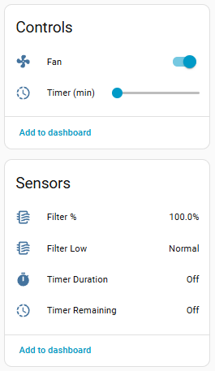

## Description

A compact smart air purifier with 3-stage filtration, three fan speeds and no
air-quality sensor. The Wi-Fi module and the purifier's own control MCU are separate
chips joined by a 115200 8N1 UART link, so flashing ESPHome onto the stock Wi-Fi
ESP32 keeps every hardware function working — the
[`levoit`](https://github.com/tuct/levoit/tree/main/components/levoit) external
component speaks the MCU's binary protocol.

Tested against MCU firmware 2.0.11. The stock module is an ESP32-SOLO-1C on an
EH-BY-41916-C-V1.0 (SinOne) board.

This model has no PM2.5 / AQI sensor and no Auto mode — the hardware has neither.

Manufacturer: [Levoit](https://www.levoit.com)



## Features

* Fan with 3 speeds and Manual / Sleep presets
* Display and Child Lock switches
* Night Light select — Off / Mid / Full
* Current CADR sensor in m³/h, updated every 5 s
* Filter life remaining sensor and a Filter Low binary sensor that trips under 5 %
* Configurable filter lifetime in months, with a counter reset button
* Run timer in minutes
* MCU firmware version text sensor

## Flashing

The stock ESP32 can be flashed directly over its UART pads. The device
[guide](https://github.com/tuct/levoit/tree/main/devices/levoit-core200s) covers the
teardown, the pad locations and the alternative of wiring in a replacement ESP32,
which keeps the original module and its firmware intact.

Take a backup of the stock firmware before writing anything over it.

## Basic Configuration

```yaml file=config.yaml
```

## Details and instructions

Full teardown, PCB photos, wiring and the complete entity list:
[tuct/levoit — Levoit Core 200S](https://github.com/tuct/levoit/tree/main/devices/levoit-core200s).
