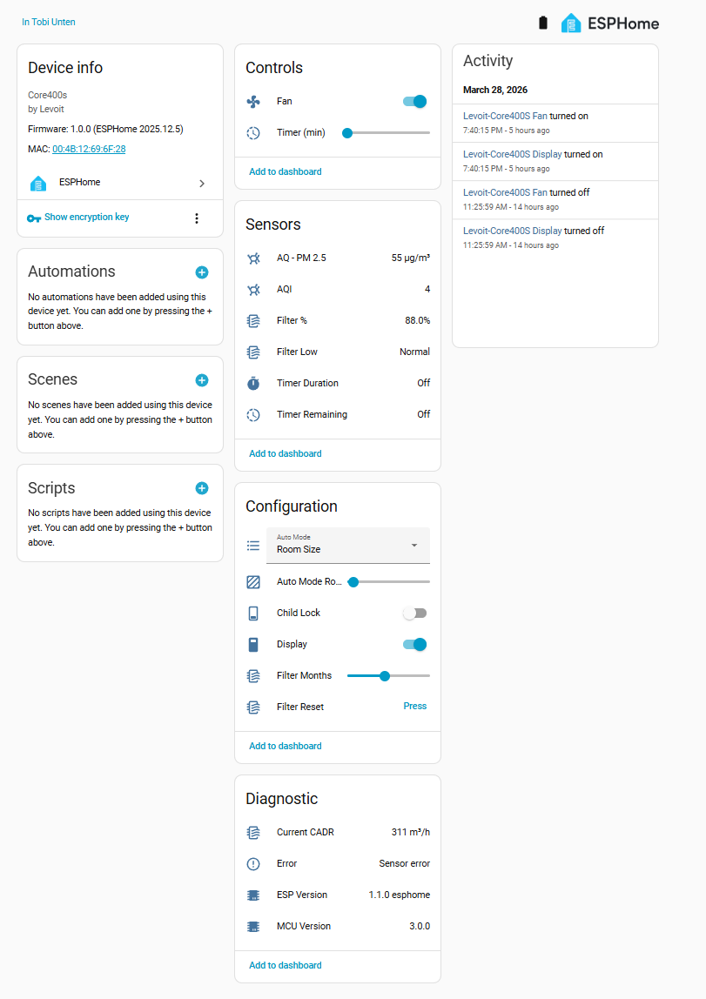

## Description

A smart air purifier with 4-stage filtration, four fan speeds and a PM2008MS
particulate sensor, rated at 442 m³/h. The Wi-Fi module and the purifier's own
control MCU are separate chips joined by a 115200 8N1 UART link, so flashing ESPHome
onto the stock Wi-Fi ESP32 keeps every hardware function working — the
[`levoit`](https://github.com/tuct/levoit/tree/main/components/levoit) external
component speaks the MCU's binary protocol.

Tested against MCU firmware 3.0.0. The stock module is an ESP32-SOLO-1C on a
CORE400S Ctrl V1.2 board.

The component started from two community projects —
[acvigue's esphome-levoit-air-purifier](https://github.com/acvigue/esphome-levoit-air-purifier)
and [mulcmu's esphome-levoit-core300s](https://github.com/mulcmu/esphome-levoit-core300s)
— and grew into a generic component covering the Core, Vital and Everest ranges.

Manufacturer: [Levoit](https://www.levoit.com)



## Features

* Fan with 4 speeds and Manual / Auto / Sleep presets
* Fan Operating Mode select — the active mode as a plain select, for dashboards that don't render fan presets
* Auto Mode select — Default / Quiet / Room Size
* Auto Mode Room Size number, 9–38 m²
* Display and Child Lock switches
* PM2.5 and AQI sensors
* Current CADR sensor in m³/h, updated every 5 s
* Filter life remaining sensor and a Filter Low binary sensor that trips under 5 %
* Configurable filter lifetime in months, with a counter reset button
* Run timer in minutes
* MCU firmware version and error-status text sensors

## Flashing

The stock ESP32 can be flashed directly over its UART pads. The device
[guide](https://github.com/tuct/levoit/tree/main/devices/levoit-core400s) covers the
teardown, the pad locations and the alternative of wiring in a replacement ESP32,
which keeps the original module and its firmware intact.

Take a backup of the stock firmware before writing anything over it.

## Basic Configuration

```yaml file=config.yaml
```

## Details and instructions

Full teardown, PCB photos, wiring and the complete entity list:
[tuct/levoit — Core 400S](https://github.com/tuct/levoit/tree/main/devices/levoit-core400s).
