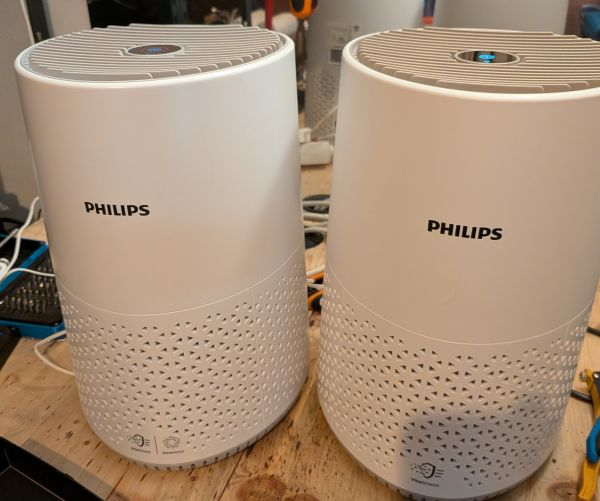

## Description

A compact air purifier manufactured by Philips / Versuni and sold under the MUJI
brand. It comes in two builds that speak an identical protocol: a base model with
just fan and filters, and a sensor model that adds a PM1003 particulate sensor, an
allergen index and an Auto fan preset.

As with the Levoit units, the Wi-Fi module and the purifier's control MCU are
separate chips on a 115200 8N1 UART link. The difference is that the stock module
cannot be reflashed — it is an ESP32-C3-WROOM-02U with secure boot enabled and
enforced. The conversion is therefore to wire in your own ESP32-C3 on the same UART
and park the original module by holding its `EN` pin low. Nothing is removed, so the
change is fully reversible.

The [`philips`](https://github.com/tuct/levoit/tree/main/components/philips) external
component implements the MCU's `FE FF` framed binary protocol.

Tested against MCU firmware 0.1.9 and 0.2.1.

Manufacturer: [Philips](https://www.philips.com) / [Versuni](https://www.versuni.com)



## Features

* Fan — on/off plus 3 speeds (Sleep / Medium / Turbo), with an Auto preset on the sensor model
* Pre-filter and HEPA filter life sensors, in % remaining
* Reset buttons for the pre-filter and HEPA counters
* MCU firmware version text sensor
* PM2.5 sensor and allergen index, 1–12, on the sensor model
* Standby sensor monitoring switch on the sensor model — keeps the particulate
  sensor running while the unit is in standby

## Wiring

The stock module cannot be reflashed, so an ESP32-C3 of your own goes on the MCU UART
alongside it. A Seeed XIAO ESP32-C3 fits the space well.

Four wires — `+5V`, `GND`, `RX`, `TX`. The RX/TX points are test pads near the
original module, not the pin header. Pull the original module's `EN` pin to `GND` so
it stops driving the bus, otherwise the two modules collide.

The device
[guide](https://github.com/tuct/levoit/tree/main/devices/philips-600-series) has
photographs of the teardown, the pads, and the `EN`-to-`GND` link.

## Basic Configuration

> The configuration below is hardware-only, which is what this site's pages carry.
> It has no `wifi:` credentials and no `api:` or `ota:` blocks, so add your own before
> flashing — without them the device will not reach Home Assistant or accept OTA
> updates.

```yaml file=config.yaml
```

## Sensor Model

On the sensor-equipped build, change `model: AC0650` to `model: AC0651` in the
`philips:` block of `config.yaml` — that alone adds the Auto fan preset.

Then add the entities below. **Merge the list items into the `sensor:` and `switch:`
blocks that `config.yaml` already has** — do not append this file whole. A second
top-level `sensor:` key would replace the base filter sensors rather than add to
them.

```yaml file=sensor-model.yaml
```

## Details and instructions

Full teardown, PCB photos, wiring and protocol notes:
[tuct/levoit — Philips 600 series](https://github.com/tuct/levoit/tree/main/devices/philips-600-series).
