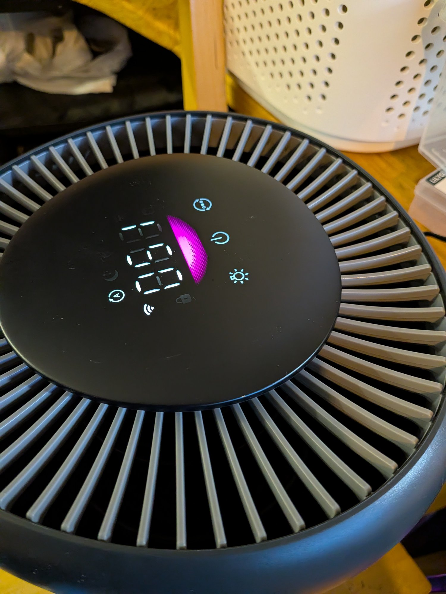
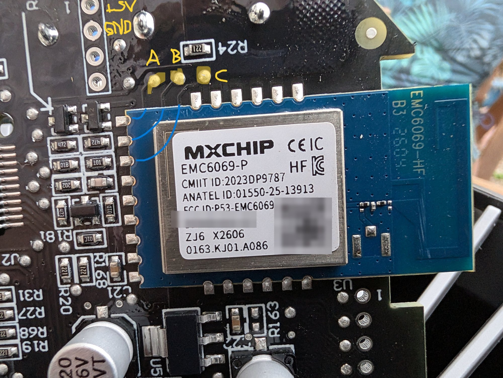

## Description

A Philips / Versuni air purifier with a particulate sensor, an auto mode and a
7-segment status display. It runs fully local on ESPHome through the
[`philips`](https://github.com/tuct/levoit/tree/main/components/philips) external
component, which speaks the MCU's `FE FF` framed binary protocol.

The stock Wi-Fi module is an **MXCHIP EMC6069-P** (FCC ID
[`P53-EMC6069`](https://fccid.io/P53-EMC6069)) — not an ESP32 at all, and not a
LibreTiny target, so it cannot be reflashed. The conversion is instead to **wire your
own ESP32-C3 onto the MCU's UART and park the stock module** by holding its reset pad
low. The module stays fitted and nothing is cut, so the change is reversible.

The MCU link turned out to be the same protocol the component already spoke for the
[Series 600](https://github.com/tuct/levoit/tree/main/devices/philips-600-series) —
115200 8N1, near-identical datapoint map
— decoded from logic-analyzer captures with every write frame checked against them.

Verified on an **AC0951** running MCU firmware `0.3.3` (internal model string
`AC0951/13`). The **AC0950** uses the same configuration with `model: AC0950` and
without the particulate entities, but has never been observed on hardware — treat it
as untested.

On stock firmware these units can also be driven locally over encrypted CoAP without
opening the case, using the
[ha-philips-airpurifier](https://github.com/ruaan-deysel/ha-philips-airpurifier)
custom component.

Manufacturer: [Philips](https://www.philips.com) / [Versuni](https://www.versuni.com)



## Features

* Fan — on/off plus speeds, with an Auto preset on the AC0951
* Pre-filter and HEPA filter life sensors, in % remaining
* Reset buttons for the pre-filter and HEPA counters
* Child Lock and Beep switches
* Display Brightness select — off / low / bright
* Sleep Timer number, 0–12 hours, with a Timer Remaining sensor
* MCU firmware version text sensor
* PM2.5 sensor and allergen index on the AC0951
* Standby sensor monitoring switch on the AC0951 — keeps the particulate sensor
  measuring with the fan off

## Wiring

> **Unplug the unit first.** Part of the control board is on mains.

Twist the top cap counter-clockwise and lift it off — no screws — to reach the
control PCB. Every connection is on the top edge of the MXCHIP module.



| Pad | What it is | Goes to |
|-----|-----------|---------|
| `+5V` | 5 V rail, on the 4-pin through-hole header beside the module | ESP32 `5V` / `VIN` |
| `GND` | ground, same header | ESP32 `GND` |
| **A** | UART, MCU → module (carries `STATUS`) | ESP32 `RX` — `GPIO20` |
| **B** | UART, module → MCU | ESP32 `TX` — `GPIO10` |
| **C** | module reset / enable, 10 k pull-up on the PCB | tie to `GND` to park the module |

On a Seeed XIAO ESP32-C3 all four land on one edge: `5V`, `GND`, `D7` (`GPIO20`, RX)
and `D10` (`GPIO10`, TX).

Two things worth getting right:

* **Park the module before connecting TX.** The ESP32 and the MXCHIP cannot both
  drive the MCU's RX line. Until pad **C** is held low, leave your TX disconnected
  and treat the setup as receive-only.
* **Tie C straight to GND, or use ≤ 3.3 kΩ.** The pad already has a 10 k pull-up, so
  a hard tie sinks only ~0.33 mA. A 10 k series resistor — the value the Series 600
  uses on its ESP32's `EN` pin — would form an even divider and leave C at ~1.65 V,
  in the indeterminate band where the module may not stay in reset.

Driving C from a spare GPIO held low works too, and lets you release the module
again without unsoldering.

## Basic Configuration

> The configuration below is hardware-only, which is what this site's pages carry.
> It has no `wifi:` credentials and no `api:` or `ota:` blocks, so add your own before
> flashing — without them the device will not reach Home Assistant or accept OTA
> updates.

```yaml file=config.yaml
```

## Details and instructions

Teardown photos, the annotated pads, the decoded protocol and the logic-analyzer
captures:
[tuct/levoit — Philips 900 series](https://github.com/tuct/levoit/tree/main/devices/philips-900-series).
