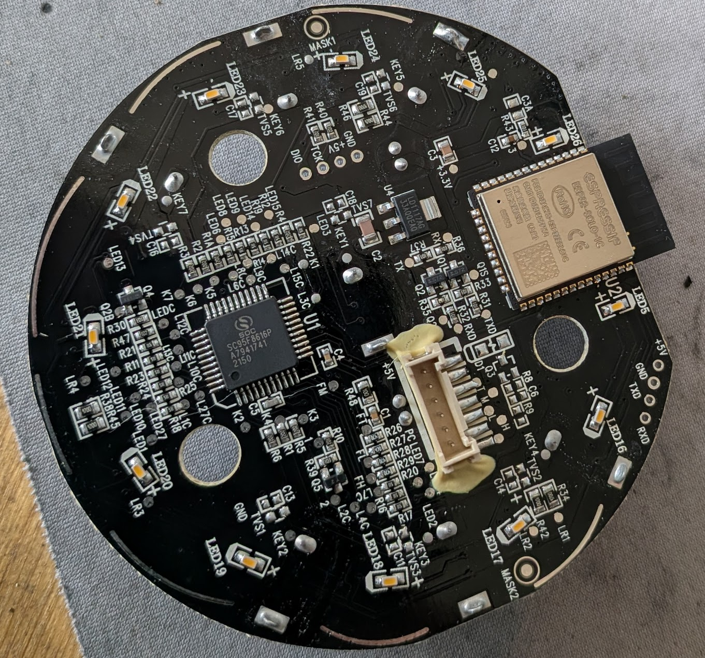

[← Back to Free Levoit Project](../README.md)

# Levoit Core 200S - Custom Firmware (ESPHome)

##WIP !!

See [Levoit Component](../../../components/levoit/README.md) for complete component documentation.

## Quick Facts

| Item | Value |
| --- | --- |
| Model | Core 200S |
| Tested MCU FW | 2.0.11 |
| ESP | ESP32-SOLO-1C |
| Board | EH-BY-41916-C-V1.0(SinOne) |
| Speeds | 3 levels |
| CADR (spec) | 167 m³/h |
| ESPHome | 2026.1.2+ |
| Entities | Fan (manual/sleep), Current CADR, Filter Life Left, Filter Low (binary), Reset Filter Stats (button) |


## Features

* Fan component with modes (Manual, Sleep) and correct 3-speed model limits
* Current CADR sensor (m³/h), updated every few seconds; Filter Life Left (%) sensor
* Filter Low binary sensor (<5%)
* Reset Filter Stats button (resets CADR/runtime counters)
* Filter lifetime configurable (months), tracked from runtime and speed
* Display run time in Home Assistant


Supported / Tested MCU Version: 2.0.11
ESPHome: 2026.1.2+

## Disassembly

TBD

## PCB




## Flash

* Solder wires to pins TXD0, RXD0, IO0, +3V3, and GND near the ESP32 on the logic board, and connect these to a USB-UART converter. On some boards, if these are through holes, soldering may not be necessary.
* Connect IO0 to ground during power before connecting USB-UART to boot to bootloader. On some boards, IO0 may not have it's own debug pin and the ESP32 GPIO0 pin on the esp can be used.

### Backup Existing Firmware
```
esptool read_flash 0 ALL levoit.bin
```

This did not work for me, always ended in an error, so i yoloed it and continued without a backup of the original FW

### Update name and set secrets

Rename `secrets-example.yaml` to `secrets.yaml` and set your wifi and encryption key, ...

Adopt device name if needed in `core200s.yaml` (multiple units!)

See [Levoit Component](../../../components/levoit/README.md) for more details! -> adopt esp32 to used esp32!

### Compile and Install New Firmware

```
esphome run levoit-core200s.yaml
```

Reassemble and enjoy!

#### Restore Original Firmware (if needed)

```bash
esptool erase_flash
esptool write_flash 0x00 levoit.bin
```


